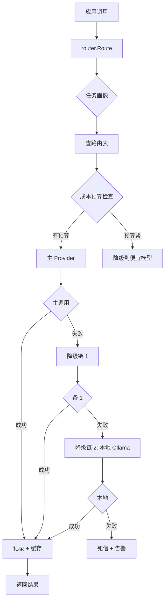

# AI 路由（核心创新）

> **多模型自动路由** —— 让 AI 调用在成本、质量、稳定性间达到最优。

## 为什么需要 AI 路由

### 问题

- 不同 AI 模型擅长不同任务
  - Claude Sonnet 4：综合强、推理好、贵
  - GPT-4o：稳定、中等价格
  - DeepSeek Chat：便宜、中文好
  - Ollama 本地：零成本、隐私、慢
- 同一任务不同模型成本差 10-100 倍
- 单 Provider 故障风险

### 目标

✅ **质量优先** —— 关键任务用最强模型
✅ **成本可控** —— 普通任务用便宜模型
✅ **高可用** —— 主失败自动降级
✅ **数据驱动** —— 路由根据真实反馈优化
✅ **可观测** —— 每次调用都可追溯

---

## 路由架构



---

## 路由决策

### 决策公式

```
selected = f(
    task_profile,        # 任务画像
    routes_table,        # 路由表
    cost_budget,         # 成本预算
    historical_quality,  # 历史质量（M3+）
    fallback_chain       # 降级链
)
```

### 任务画像

```go
type TaskProfile struct {
    Task          string   // rfp_parse | outline_generate | content_generate | audit | image
    Quality       string   // high | medium | low
    LatencyBudget time.Duration
    PrivacyLevel  string   // public | private | sensitive
    OutputFormat  string   // json | markdown | text
}

func profileTask(task string) TaskProfile {
    switch task {
    case "rfp_parse":
        return TaskProfile{Quality: "high", LatencyBudget: 60s}
    case "outline_generate":
        return TaskProfile{Quality: "medium", LatencyBudget: 30s}
    case "content_generate":
        return TaskProfile{Quality: "high", LatencyBudget: 120s}
    case "audit_normal":
        return TaskProfile{Quality: "high", LatencyBudget: 60s}
    case "audit_agent":
        return TaskProfile{Quality: "highest", LatencyBudget: 600s}
    }
    return TaskProfile{Quality: "medium", LatencyBudget: 60s}
}
```

---

## 路由表

```yaml
# configs/routes.yaml
version: 1

routes:
  # 招标解析（高质量）
  - task: rfp_parse
    primary:
      provider: anthropic
      model: claude-sonnet-4
    fallback:
      - { provider: openai, model: gpt-4o }
      - { provider: deepseek, model: deepseek-chat }
    budget:
      max_input_tokens: 100000
      max_cost_usd: 0.50
      timeout_seconds: 120
    cache:
      enabled: true
      ttl_seconds: 86400

  # 大纲生成（成本敏感）
  - task: outline_generate
    primary:
      provider: deepseek
      model: deepseek-chat
    fallback:
      - { provider: openai, model: gpt-4o-mini }
    budget:
      max_input_tokens: 30000
      max_cost_usd: 0.05
      timeout_seconds: 60

  # 正文生成（高质量）
  - task: content_generate
    primary:
      provider: anthropic
      model: claude-sonnet-4
    fallback:
      - { provider: openai, model: gpt-4o }
    budget:
      max_input_tokens: 50000
      max_cost_usd: 0.30
      timeout_seconds: 180

  # 一致性审计（normal）
  - task: audit_normal
    primary:
      provider: anthropic
      model: claude-sonnet-4
    fallback:
      - { provider: openai, model: gpt-4o }
    budget:
      max_input_tokens: 200000
      max_cost_usd: 0.80
      timeout_seconds: 180

  # 一致性审计（agent）—— 强制最强模型
  - task: audit_agent
    primary:
      provider: anthropic
      model: claude-sonnet-4
    fallback: []  # agent 模式不降级
    budget:
      max_input_tokens: 500000
      max_cost_usd: 5.00
      timeout_seconds: 600

  # 配图
  - task: image_generate
    primary:
      provider: openai
      model: dall-e-3
    fallback:
      - { provider: stability, model: sd3-large }
    budget:
      max_cost_usd: 0.20
      timeout_seconds: 60
```

---

## Provider 适配

### 统一接口

```go
type Provider interface {
    Name() string
    Chat(ctx context.Context, req *ChatRequest) (*ChatResponse, error)
    Embed(ctx context.Context, req *EmbedRequest) (*EmbedResponse, error)
    EstimateCost(req *ChatRequest) float64
    HealthCheck(ctx context.Context) error
}
```

### Anthropic 适配

```go
type AnthropicProvider struct {
    client *anthropic.Client
    apiKey string
}

func (p *AnthropicProvider) Chat(ctx context.Context, req *ChatRequest) (*ChatResponse, error) {
    start := time.Now()
    resp, err := p.client.Messages.New(ctx, anthropic.MessageNewParams{
        Model:     anthropic.Model(req.Model),
        MaxTokens: int64(req.MaxTokens),
        Messages:  toAnthropicMessages(req.Messages),
        Temperature: anthropic.Float(req.Temperature),
    })
    if err != nil {
        return nil, fmt.Errorf("anthropic: %w", err)
    }

    return &ChatResponse{
        Content:          resp.Content[0].Text,
        PromptTokens:     resp.Usage.InputTokens,
        CompletionTokens: resp.Usage.OutputTokens,
        Latency:          time.Since(start),
        Cost:             p.EstimateCostFromUsage(resp.Usage),
    }, nil
}

func (p *AnthropicProvider) EstimateCost(req *ChatRequest) float64 {
    // Claude Sonnet 4: $3/$15 per 1M tokens
    inputCost := float64(estimateInputTokens(req)) / 1_000_000 * 3.0
    outputCost := float64(req.MaxTokens) / 1_000_000 * 15.0
    return inputCost + outputCost
}
```

### OpenAI 适配

```go
type OpenAIProvider struct {
    client *openai.Client
}

func (p *OpenAIProvider) Chat(ctx context.Context, req *ChatRequest) (*ChatResponse, error) {
    resp, err := p.client.Chat.Completions.New(ctx, openai.ChatCompletionNewParams{
        Model:    req.Model,
        Messages: toOpenAIMessages(req.Messages),
    })
    // ...
}
```

### DeepSeek 适配

```go
type DeepSeekProvider struct {
    client *openai.Client  // 兼容 OpenAI 协议
    baseURL string
}

func NewDeepSeek(apiKey string) *DeepSeekProvider {
    config := openai.DefaultConfig(apiKey)
    config.BaseURL = "https://api.deepseek.com/v1"
    return &DeepSeekProvider{
        client: openai.NewClientWithConfig(config),
        baseURL: "https://api.deepseek.com/v1",
    }
}
```

### Ollama 适配

```go
type OllamaProvider struct {
    baseURL string
    client  *http.Client
}

func (p *OllamaProvider) Chat(ctx context.Context, req *ChatRequest) (*ChatResponse, error) {
    // Ollama /v1/chat/completions 兼容 OpenAI 协议
    // 或用原生 /api/chat
}
```

---

## 路由决策实现

```go
type Router struct {
    routes       *RoutesConfig
    providers    map[string]Provider
    budgetSvc    *BudgetService
    qualitySvc   *QualityService  // M3+
    cache        *PromptCache
    metrics      *Metrics
}

func (r *Router) Route(ctx context.Context, req *RouteRequest) (*RouteResponse, error) {
    // 1. 获取任务画像
    profile := profileTask(req.Task)

    // 2. 查找路由配置
    routeConfig := r.routes.GetRoute(req.Task)
    if routeConfig == nil {
        return nil, fmt.Errorf("no route for task: %s", req.Task)
    }

    // 3. 检查 Prompt 缓存
    if routeConfig.Cache.Enabled {
        if cached := r.cache.Get(ctx, req); cached != nil {
            r.metrics.RecordCacheHit(req.Task)
            return cached, nil
        }
    }

    // 4. 检查成本预算
    budget := r.budgetSvc.GetRemaining(ctx, req.TenantID, req.Task)
    if budget <= 0 {
        // 预算耗尽，强制用本地模型
        return r.tryOllama(ctx, req)
    }

    // 5. 选 Provider（主 + 降级）
    chain := r.buildChain(routeConfig, budget, profile)

    // 6. 依次尝试
    var lastErr error
    for i, target := range chain {
        resp, err := r.callProvider(ctx, target, req)
        if err == nil {
            // 成功
            r.recordSuccess(req, target, resp)
            r.cache.Set(ctx, req, resp, routeConfig.Cache.TTL)
            return resp, nil
        }

        lastErr = err
        r.recordFailure(req, target, err)
        // 继续降级链
    }

    return nil, fmt.Errorf("all providers failed: %w", lastErr)
}

func (r *Router) buildChain(cfg *RouteConfig, budget float64, profile TaskProfile) []Target {
    chain := []Target{cfg.Primary}
    chain = append(chain, cfg.Fallback...)

    // 预算不足时去掉高价目标
    if budget < 0.1 {
        chain = filterByCost(chain, 0.05)  // 只用 < 0.05 的
    }

    return chain
}
```

---

## Prompt 缓存

### 为什么缓存

- 同样 RFP 重复解析（多用户上传同一份）
- 同样章节多次生成
- 缓存命中 = 0 token + 0 延迟

### 缓存键

```go
type CacheKey struct {
    Task        string
    Model       string
    PromptHash  string  // SHA256(prompt)
    Temperature float64
}

func (k CacheKey) String() string {
    return fmt.Sprintf("%s|%s|%x|%.2f", k.Task, k.Model, k.PromptHash, k.Temperature)
}
```

### 缓存值

```go
type CacheValue struct {
    Response    *ChatResponse
    Cost        float64
    CachedAt    time.Time
    ExpiresAt   time.Time
}
```

### 缓存后端

- L1：内存 LRU（10 MB）
- L2：Redis（100 MB）
- L3：S3 / 磁盘（可选）

---

## JSON 修复（借鉴 yibiao）

AI 输出 JSON 经常格式不对。借鉴 yibiao 的多层修复策略：

```go
func (r *Router) ParseJSONWithRetry(ctx context.Context, raw string, schema interface{}) (interface{}, error) {
    // 1. 直接解析
    var result interface{}
    err := json.Unmarshal([]byte(raw), &result)
    if err == nil {
        return result, nil
    }

    // 2. 尝试修复（去注释、修复引号）
    fixed := fixCommonJSONErrors(raw)
    err = json.Unmarshal([]byte(fixed), &result)
    if err == nil {
        return result, nil
    }

    // 3. 提取 JSON 子串
    extracted := extractJSON(raw)
    if extracted != raw {
        err = json.Unmarshal([]byte(extracted), &result)
        if err == nil {
            return result, nil
        }
    }

    // 4. 让 AI 修复
    return r.fixJSONWithAI(ctx, raw, schema)
}

func fixCommonJSONErrors(s string) string {
    // 去掉 // 注释
    s = stripComments(s)
    // 单引号 → 双引号
    s = strings.ReplaceAll(s, "'", `"`)
    // 多余逗号
    s = stripTrailingCommas(s)
    // 不规范的换行符
    s = strings.ReplaceAll(s, "\n", " ")
    return s
}
```

---

## 降级链

### 配置

```yaml
fallback_chain:
  primary: anthropic/claude-sonnet-4
  chain:
    - openai/gpt-4o
    - deepseek/deepseek-chat
    - ollama/qwen2.5:7b-instruct  # 本地兜底
```

### 触发条件

1. HTTP 5xx
2. 超时
3. JSON 解析失败（连续 3 次）
4. 内容审核拒绝
5. Provider 主动熔断（rate limit）

### 不降级

agent 模式**不降级**（直接失败，让用户重试）：

```go
if cfg.Task == "audit_agent" && len(cfg.Fallback) == 0 {
    // 单 Provider 直接失败
    resp, err := r.callProvider(ctx, cfg.Primary, req)
    if err != nil {
        return nil, fmt.Errorf("audit_agent failed: %w", err)
    }
    return resp, nil
}
```

---

## 用量计量

### 每次调用记录

```sql
INSERT INTO router_call_logs (
    tenant_id, workflow_id, task, provider, model,
    prompt_tokens, completion_tokens, latency_ms, cost_usd,
    cache_hit, fallback, error
) VALUES (?, ?, ?, ?, ?, ?, ?, ?, ?, ?, ?, ?);
```

### 异步批写

避免每次调用都同步写 DB：

```go
type CallLogBatcher struct {
    buffer []CallLog
    mu     sync.Mutex
}

func (b *CallLogBatcher) Add(log CallLog) {
    b.mu.Lock()
    b.buffer = append(b.buffer, log)
    b.mu.Unlock()
}

func (b *CallLogBatcher) Flush() {
    // 每 5 秒或 buffer 满 100 条时批量 INSERT
}
```

---

## 监控指标

```go
var (
    aiCallDuration = promauto.NewHistogramVec(
        prometheus.HistogramOpts{
            Name: "bidwriter_ai_call_duration_seconds",
            Buckets: []float64{1, 5, 10, 30, 60, 120, 300},
        },
        []string{"provider", "model", "task"},
    )

    aiCallErrors = promauto.NewCounterVec(
        prometheus.CounterOpts{Name: "bidwriter_ai_call_errors_total"},
        []string{"provider", "model", "task", "error_type"},
    )

    aiCacheHit = promauto.NewCounterVec(
        prometheus.CounterOpts{Name: "bidwriter_ai_cache_hits_total"},
        []string{"task"},
    )

    aiCostUSD = promauto.NewCounterVec(
        prometheus.CounterOpts{Name: "bidwriter_ai_cost_usd_total"},
        []string{"provider", "model"},
    )
)
```

---

## 三阶段演进

| 阶段 | 时间 | 路由策略 | 数据来源 |
|---|---|---|---|
| **M1-M2** | 规则路由 | 任务画像 + 静态路由表 | 专家配置 |
| **M3** | 隐式反馈 | 规则 + 历史采纳率 | 用户行为 |
| **M4+** | LLM-as-a-Judge | 规则 + 隐式 + 抽样 LLM 评估 | 用户行为 + LLM |

详见 [ADR-0002](../decisions/0002-ai-router-quality.md)。

---

## 相关文档

- [架构总览](overview.md)
- [模块设计 - router-svc](modules.md#router-svc)
- [ADR-0002 模型路由质量](../decisions/0002-ai-router-quality.md)
- [ADR-0003 私有化模型](../decisions/0003-self-hosted-model.md)
- [ADR-0005 审计模式](../decisions/0005-audit-agent-mode.md)