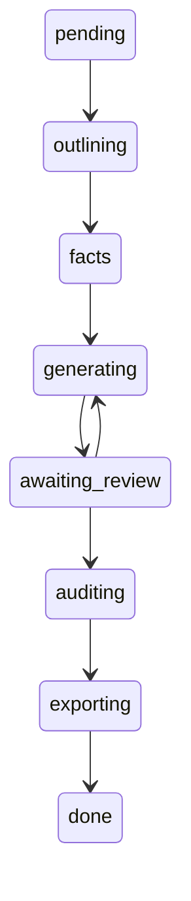

# 标书制作 4 步工作流

> 最后更新：2026-07-20

本文描述 BidWriter 标书制作的 4 步向导流程、对应的工作流状态机，以及前后端 API 契约。前端 `BidWorkspaceWrapper` 根据 `bid.status` 在"向导步骤 1/2"与"工作区步骤 3/4"间切换。

## 流程总览

| 步骤 | 前端组件 | 工作流状态 | 后端动作 |
|---|---|---|---|
| 1 解析材料 | `WizardSteps` 步骤1 | `pending` | `POST /bids/:id/parse` 调 router-svc 提取结构化字段 |
| 2 审核编辑 | `WizardSteps` 步骤2 | `pending` | `PUT /bids/:id/parse` 保存编辑；`POST /bids/:id/transition` 推进 `outlining` |
| 3 生成标书 | `BidWorkspace` 三栏 | `outlining`→`facts`→`generating` | planner 生成大纲；逐章生成内容 |
| 4 精修章节 | `BidWorkspace` 检查器 | `generating`/`awaiting_review` | `POST /bids/:id/chapters/:cid/generate`（可带 prompt）重生成 |

## 状态机

在 [state-machine.md](state-machine.md) 基础上新增 `awaiting_review` 暂停点（generating → awaiting_review → auditing），实现章节生成后的"人在回路"审核：

- `pending`：刚创建，用户在步骤 1/2 输入并解析材料。
- `outlining`：planner 读取 `bid_jobs.parse_result`（含用户编辑后的材料）生成大纲。
- `generating`：逐章生成内容，用户可在步骤 4 针对单章写提示词重生成。
- `awaiting_review`：章节生成完成的人工审核暂停点，用户 approve/reject 后再进入审计。

## 步骤 1/2：材料解析与审核

前端 `WizardSteps`（`web/src/pages/bids/WizardSteps.tsx`）仅在 `bid.status === 'pending'` 时由 `BidWorkspaceWrapper` 渲染。

**步骤 1 · 解析材料**：用户粘贴或上传招标材料，点击"解析材料"：
- `POST /api/v1/bids/:id/parse`（`parseApi.parseMaterial`）
- 后端 `chapter_handlers.parseMaterial` 调用 router-svc `/api/v1/router/chat`，用结构化 prompt 提取项目名称、招标编号、采购需求、技术参数、评分标准、资质要求等字段
- 结果写入 `bid_jobs.parse_result`（`material_text` + `parsed` + `parsed_at`），返回前端展示

**步骤 2 · 审核编辑**：用户审核、编辑、补充解析结果，点击"确认并生成大纲"：
- `PUT /api/v1/bids/:id/parse`（`parseApi.updateParse`）保存编辑
- `POST /api/v1/bids/:id/transition`（`bidsApi.transition`）推进到 `outlining`，触发 planner

## 步骤 3/4：生成与精修

`bid.status` 离开 `pending` 后，`BidWorkspaceWrapper` 渲染 `BidWorkspace`（三栏：章节树 / 编辑器 / 检查器），顶部 `BidStepper` 显示当前步骤。

**步骤 3 · 生成标书**：大纲生成（`outlining`→`facts`）+ 逐章生成（`generating`）。planner 优先读取 `bid_jobs.parse_result` 的材料与解析字段（`planner.go` step 1），保证步骤 2 的编辑流入生成。

**步骤 4 · 精修章节**：用户选中章节，在检查器"提示词"标签写自定义指令，点击"生成此章节"：
- `POST /api/v1/bids/:id/chapters/:cid/generate`（`bidsApi.generateChapter`），body 含 `prompt`
- 后端 `chapter_handlers.generateChapter` 入队 Asynq 任务，`prompt` 作为用户消息追加到 LLM

## 章节人工审核（HIL）

章节级 approve/reject 端点（修复了前端调用但后端缺失的缺口）：

| 端点 | 方法 | 作用 |
|---|---|---|
| `/api/v1/bids/:id/chapters/:cid/approve` | POST | status=`approved`，写 `approved_at/approved_by`，清 `rejection_reason` |
| `/api/v1/bids/:id/chapters/:cid/reject` | POST | status 回退 `planned`，写 `rejection_reason`，送回生成队列 |
| `/api/v1/bids/:id/outline/reorder` | POST | 拖拽重排，批量更新 `order_index` 与 `parent_id` |

`ChapterSpecOut` 新增 `approved_at`/`approved_by`/`rejection_reason` 字段，前端 `ChapterTree` 驳回原因 tooltip、`ChapterInspector` 审核时间线据此展示。

## 数据库迁移

`migrations/00014_chapter_review.up.sql`：
- `chapter_specs` 新增 `approved_at`/`approved_by`/`rejection_reason`，`status` 约束补 `approved`
- `workflows.status`/`bid_jobs.status` 约束补 `awaiting_review`（`bid_jobs` 同时补 `facts`）

## 相关文档

- [state-machine.md](state-machine.md) — 工作流状态机
- [overview.md](overview.md) — 系统架构总览
- [modules.md](modules.md) — 微服务划分
