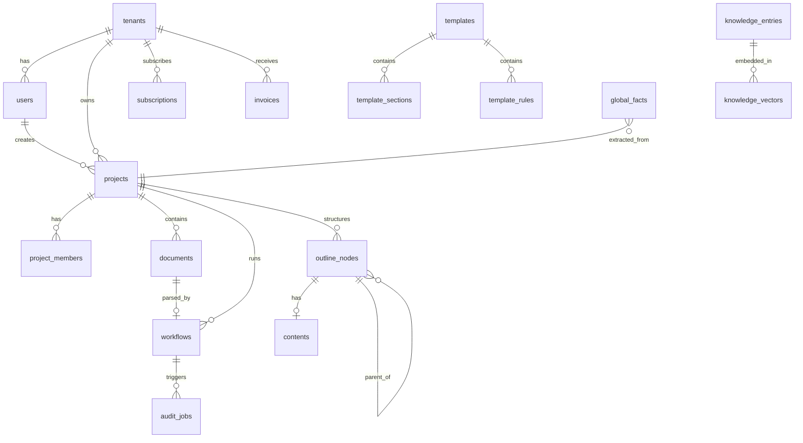

# 数据模型

> **PostgreSQL 16 + pgvector** —— 统一的事务型 + 向量数据库。

## 总览

```
┌────────────────────────────────────────────────────────┐
│  业务表（带 tenant_id）                                 │
│  - tenants / users / projects                          │
│  - documents / outline_nodes / contents                │
│  - workflows / workflow_steps / audit_jobs             │
│  - knowledge_entries / global_facts                    │
│  - templates / template_sections                       │
│  - subscriptions / usage_records / invoices            │
└────────────────────────────────────────────────────────┘
                          │
                          ▼
┌────────────────────────────────────────────────────────┐
│  审计表（不可变）                                       │
│  - audit_logs / sync_logs                              │
└────────────────────────────────────────────────────────┘
                          │
                          ▼
┌────────────────────────────────────────────────────────┐
│  路由 / AI 表                                          │
│  - router_call_logs / router_quality_scores           │
└────────────────────────────────────────────────────────┘
```

---

## 核心表

### tenants（租户 / 团队）

```sql
CREATE TABLE tenants (
    id UUID PRIMARY KEY DEFAULT gen_random_uuid(),
    name VARCHAR(128) NOT NULL,
    slug VARCHAR(64) UNIQUE NOT NULL,
    plan VARCHAR(32) NOT NULL DEFAULT 'free',  -- free | pro | team | enterprise
    settings JSONB NOT NULL DEFAULT '{}',
    created_at TIMESTAMPTZ NOT NULL DEFAULT NOW(),
    updated_at TIMESTAMPTZ NOT NULL DEFAULT NOW(),
    deleted_at TIMESTAMPTZ
);
```

### users（用户）

```sql
CREATE TABLE users (
    id UUID PRIMARY KEY DEFAULT gen_random_uuid(),
    tenant_id UUID NOT NULL REFERENCES tenants(id),
    email VARCHAR(256) UNIQUE NOT NULL,
    password_hash VARCHAR(256),  -- bcrypt
    name VARCHAR(128) NOT NULL,
    avatar_url TEXT,
    role VARCHAR(32) NOT NULL DEFAULT 'member',  -- owner | admin | member | viewer
    mfa_enabled BOOLEAN NOT NULL DEFAULT false,
    mfa_secret_encrypted BYTEA,
    last_login_at TIMESTAMPTZ,
    created_at TIMESTAMPTZ NOT NULL DEFAULT NOW(),
    updated_at TIMESTAMPTZ NOT NULL DEFAULT NOW(),
    deleted_at TIMESTAMPTZ
);

CREATE INDEX idx_users_tenant_id ON users(tenant_id);
CREATE INDEX idx_users_email ON users(email) WHERE deleted_at IS NULL;
```

### projects（项目）

```sql
CREATE TABLE projects (
    id UUID PRIMARY KEY DEFAULT gen_random_uuid(),
    tenant_id UUID NOT NULL REFERENCES tenants(id),
    name VARCHAR(256) NOT NULL,
    description TEXT,
    industry VARCHAR(64),
    template_id UUID,
    status VARCHAR(32) NOT NULL DEFAULT 'draft',
    estimated_value DECIMAL(18, 2),
    currency VARCHAR(8) DEFAULT 'CNY',
    deadline TIMESTAMPTZ,
    owner_id UUID NOT NULL REFERENCES users(id),
    version INT NOT NULL DEFAULT 1,
    created_at TIMESTAMPTZ NOT NULL DEFAULT NOW(),
    updated_at TIMESTAMPTZ NOT NULL DEFAULT NOW(),
    deleted_at TIMESTAMPTZ
);

CREATE INDEX idx_projects_tenant_id ON projects(tenant_id);
CREATE INDEX idx_projects_status ON projects(tenant_id, status);
CREATE INDEX idx_projects_owner ON projects(owner_id);
```

### project_members（项目成员）

```sql
CREATE TABLE project_members (
    project_id UUID NOT NULL REFERENCES projects(id),
    user_id UUID NOT NULL REFERENCES users(id),
    role VARCHAR(32) NOT NULL DEFAULT 'member',
    joined_at TIMESTAMPTZ NOT NULL DEFAULT NOW(),
    PRIMARY KEY (project_id, user_id)
);
```

### documents（文档）

```sql
CREATE TABLE documents (
    id UUID PRIMARY KEY DEFAULT gen_random_uuid(),
    tenant_id UUID NOT NULL REFERENCES tenants(id),
    project_id UUID NOT NULL REFERENCES projects(id),
    name VARCHAR(256) NOT NULL,
    type VARCHAR(32) NOT NULL,  -- rfp | case | qualification | output
    format VARCHAR(16) NOT NULL,  -- pdf | docx | xlsx | md
    size_bytes BIGINT NOT NULL,
    s3_key TEXT NOT NULL,
    s3_bucket VARCHAR(128) NOT NULL,
    content_md TEXT,  -- 解析后的 Markdown
    parse_status VARCHAR(32) DEFAULT 'pending',  -- pending | parsing | done | failed
    parse_error TEXT,
    metadata JSONB DEFAULT '{}',
    uploaded_by UUID NOT NULL REFERENCES users(id),
    created_at TIMESTAMPTZ NOT NULL DEFAULT NOW(),
    updated_at TIMESTAMPTZ NOT NULL DEFAULT NOW()
);

CREATE INDEX idx_documents_tenant_project ON documents(tenant_id, project_id);
```

### outline_nodes（大纲节点）

```sql
CREATE TABLE outline_nodes (
    id UUID PRIMARY KEY DEFAULT gen_random_uuid(),
    tenant_id UUID NOT NULL REFERENCES tenants(id),
    project_id UUID NOT NULL REFERENCES projects(id),
    parent_id UUID REFERENCES outline_nodes(id),
    title VARCHAR(256) NOT NULL,
    order_idx INT NOT NULL,
    level INT NOT NULL,  -- 1 | 2 | 3
    type VARCHAR(32) NOT NULL DEFAULT 'section',  -- section | chapter | subsection
    template_section_id UUID,  -- 来自模板的源 ID
    generated BOOLEAN NOT NULL DEFAULT false,  -- 是否 AI 生成
    content_id UUID,  -- 关联 contents 表
    metadata JSONB DEFAULT '{}',
    created_at TIMESTAMPTZ NOT NULL DEFAULT NOW(),
    updated_at TIMESTAMPTZ NOT NULL DEFAULT NOW()
);

CREATE INDEX idx_outline_nodes_project ON outline_nodes(tenant_id, project_id);
CREATE INDEX idx_outline_nodes_parent ON outline_nodes(parent_id);
```

### contents（章节内容）

```sql
CREATE TABLE contents (
    id UUID PRIMARY KEY DEFAULT gen_random_uuid(),
    tenant_id UUID NOT NULL REFERENCES tenants(id),
    project_id UUID NOT NULL REFERENCES projects(id),
    outline_node_id UUID NOT NULL REFERENCES outline_nodes(id),
    content_md TEXT NOT NULL,
    content_html TEXT,
    word_count INT NOT NULL DEFAULT 0,
    ai_generated BOOLEAN NOT NULL DEFAULT false,
    generation_meta JSONB DEFAULT '{}',  -- model, prompt, tokens, etc.
    version INT NOT NULL DEFAULT 1,
    created_at TIMESTAMPTZ NOT NULL DEFAULT NOW(),
    updated_at TIMESTAMPTZ NOT NULL DEFAULT NOW()
);

CREATE INDEX idx_contents_outline ON contents(outline_node_id);
CREATE INDEX idx_contents_project ON contents(tenant_id, project_id);
```

### workflows（工作流）

```sql
CREATE TABLE workflows (
    id UUID PRIMARY KEY DEFAULT gen_random_uuid(),
    tenant_id UUID NOT NULL REFERENCES tenants(id),
    project_id UUID NOT NULL REFERENCES projects(id),
    rfp_document_id UUID NOT NULL REFERENCES documents(id),
    current_step VARCHAR(32) NOT NULL DEFAULT 'parse',  -- parse | outline | facts | generate | audit | export | done | failed
    status VARCHAR(32) NOT NULL DEFAULT 'pending',  -- pending | running | paused | completed | failed | cancelled
    progress INT NOT NULL DEFAULT 0,  -- 0-100
    steps JSONB NOT NULL DEFAULT '{}',  -- 各步骤状态
    error TEXT,
    config JSONB DEFAULT '{}',  -- 用户配置（agent 模式等）
    started_at TIMESTAMPTZ,
    completed_at TIMESTAMPTZ,
    created_at TIMESTAMPTZ NOT NULL DEFAULT NOW(),
    updated_at TIMESTAMPTZ NOT NULL DEFAULT NOW()
);

CREATE INDEX idx_workflows_tenant_project ON workflows(tenant_id, project_id);
CREATE INDEX idx_workflows_status ON workflows(status);
```

### global_facts（全局事实）

```sql
CREATE TABLE global_facts (
    id UUID PRIMARY KEY DEFAULT gen_random_uuid(),
    tenant_id UUID NOT NULL REFERENCES tenants(id),
    project_id UUID NOT NULL REFERENCES projects(id),
    fact_type VARCHAR(64) NOT NULL,
    -- company_info | qualification | case | team_member | pricing
    fact_value JSONB NOT NULL,
    source VARCHAR(256),  -- 来源（哪个文档 / 哪段提取）
    confidence DECIMAL(3, 2) NOT NULL DEFAULT 1.00,
    verified BOOLEAN NOT NULL DEFAULT false,  -- 人工核验
    created_at TIMESTAMPTZ NOT NULL DEFAULT NOW(),
    updated_at TIMESTAMPTZ NOT NULL DEFAULT NOW()
);

CREATE INDEX idx_global_facts_project ON global_facts(tenant_id, project_id);
CREATE INDEX idx_global_facts_type ON global_facts(tenant_id, project_id, fact_type);
```

### knowledge_entries（知识库条目）

```sql
CREATE TABLE knowledge_entries (
    id UUID PRIMARY KEY DEFAULT gen_random_uuid(),
    tenant_id UUID NOT NULL REFERENCES tenants(id),
    title VARCHAR(256) NOT NULL,
    content TEXT NOT NULL,
    keywords TEXT[],
    category VARCHAR(64),
    source VARCHAR(256),  -- 来源说明
    created_by UUID NOT NULL REFERENCES users(id),
    created_at TIMESTAMPTZ NOT NULL DEFAULT NOW(),
    updated_at TIMESTAMPTZ NOT NULL DEFAULT NOW()
);

CREATE INDEX idx_knowledge_entries_tenant ON knowledge_entries(tenant_id);
CREATE INDEX idx_knowledge_entries_keywords ON knowledge_entries USING gin(keywords);
CREATE INDEX idx_knowledge_entries_content_trgm ON knowledge_entries USING gin(content gin_trgm_ops);
```

### knowledge_vectors（向量）

```sql
CREATE EXTENSION IF NOT EXISTS vector;

CREATE TABLE knowledge_vectors (
    id UUID PRIMARY KEY DEFAULT gen_random_uuid(),
    entry_id UUID NOT NULL REFERENCES knowledge_entries(id) ON DELETE CASCADE,
    tenant_id UUID NOT NULL REFERENCES tenants(id),
    chunk_text TEXT NOT NULL,
    embedding VECTOR(1536),  -- text-embedding-3-small
    chunk_idx INT NOT NULL,
    created_at TIMESTAMPTZ NOT NULL DEFAULT NOW()
);

CREATE INDEX idx_knowledge_vectors_embedding ON knowledge_vectors
    USING hnsw (embedding vector_cosine_ops)
    WHERE embedding IS NOT NULL;
```

### audit_jobs（审计任务）

```sql
CREATE TABLE audit_jobs (
    id UUID PRIMARY KEY DEFAULT gen_random_uuid(),
    tenant_id UUID NOT NULL REFERENCES tenants(id),
    project_id UUID NOT NULL REFERENCES projects(id),
    mode VARCHAR(16) NOT NULL DEFAULT 'normal',  -- normal | agent
    status VARCHAR(32) NOT NULL DEFAULT 'pending',
    progress INT NOT NULL DEFAULT 0,
    issues_count INT,
    issues JSONB DEFAULT '[]',  -- [{"layer":"mandatory","severity":"critical","message":"...","location":"..."}]
    summary JSONB DEFAULT '{}',
    cost_usd DECIMAL(10, 6),
    started_at TIMESTAMPTZ,
    completed_at TIMESTAMPTZ,
    created_at TIMESTAMPTZ NOT NULL DEFAULT NOW()
);

CREATE INDEX idx_audit_jobs_project ON audit_jobs(tenant_id, project_id);
```

### templates（模板）

```sql
CREATE TABLE templates (
    id UUID PRIMARY KEY DEFAULT gen_random_uuid(),
    name VARCHAR(128) NOT NULL,
    industry VARCHAR(64) NOT NULL,
    version VARCHAR(32) NOT NULL DEFAULT '1.0.0',
    author_id UUID REFERENCES users(id),  -- NULL = 官方
    visibility VARCHAR(16) NOT NULL DEFAULT 'private',  -- private | team | marketplace
    description TEXT,
    price_cents INT NOT NULL DEFAULT 0,
    downloads INT NOT NULL DEFAULT 0,
    rating_avg DECIMAL(3, 2),
    rating_count INT NOT NULL DEFAULT 0,
    created_at TIMESTAMPTZ NOT NULL DEFAULT NOW(),
    updated_at TIMESTAMPTZ NOT NULL DEFAULT NOW()
);

CREATE TABLE template_sections (
    id UUID PRIMARY KEY DEFAULT gen_random_uuid(),
    template_id UUID NOT NULL REFERENCES templates(id) ON DELETE CASCADE,
    parent_id UUID REFERENCES template_sections(id),
    title VARCHAR(256) NOT NULL,
    order_idx INT NOT NULL,
    level INT NOT NULL,
    type VARCHAR(32) NOT NULL,
    config JSONB DEFAULT '{}',
    prompt TEXT,
    created_at TIMESTAMPTZ NOT NULL DEFAULT NOW()
);

CREATE TABLE template_rules (
    id UUID PRIMARY KEY DEFAULT gen_random_uuid(),
    template_id UUID NOT NULL REFERENCES templates(id) ON DELETE CASCADE,
    rule_type VARCHAR(32) NOT NULL,  -- must_answer | blacklist | scoring
    content TEXT NOT NULL,
    severity VARCHAR(16) NOT NULL,  -- critical | warning | info
    description TEXT
);
```

---

## 计费表

### subscriptions（订阅）

```sql
CREATE TABLE subscriptions (
    id UUID PRIMARY KEY DEFAULT gen_random_uuid(),
    tenant_id UUID NOT NULL REFERENCES tenants(id),
    plan VARCHAR(32) NOT NULL,  -- free | pro | team | enterprise
    status VARCHAR(32) NOT NULL DEFAULT 'active',
    started_at TIMESTAMPTZ NOT NULL DEFAULT NOW(),
    current_period_start TIMESTAMPTZ NOT NULL,
    current_period_end TIMESTAMPTZ NOT NULL,
    cancel_at TIMESTAMPTZ,
    created_at TIMESTAMPTZ NOT NULL DEFAULT NOW(),
    updated_at TIMESTAMPTZ NOT NULL DEFAULT NOW()
);
```

### usage_records（用量记录）

```sql
CREATE TABLE usage_records (
    id UUID PRIMARY KEY DEFAULT gen_random_uuid(),
    tenant_id UUID NOT NULL REFERENCES tenants(id),
    user_id UUID REFERENCES users(id),
    resource VARCHAR(64) NOT NULL,  -- ai_tokens_input | ai_tokens_output | storage_gb | api_calls
    quantity DECIMAL(18, 4) NOT NULL,
    cost_usd DECIMAL(10, 6) DEFAULT 0,
    period VARCHAR(16) NOT NULL,  -- 2026-06
    metadata JSONB DEFAULT '{}',
    recorded_at TIMESTAMPTZ NOT NULL DEFAULT NOW()
);

CREATE INDEX idx_usage_records_tenant_period ON usage_records(tenant_id, period);
```

### invoices（发票）

```sql
CREATE TABLE invoices (
    id UUID PRIMARY KEY DEFAULT gen_random_uuid(),
    tenant_id UUID NOT NULL REFERENCES tenants(id),
    subscription_id UUID REFERENCES subscriptions(id),
    amount DECIMAL(18, 2) NOT NULL,
    currency VARCHAR(8) NOT NULL DEFAULT 'CNY',
    status VARCHAR(32) NOT NULL DEFAULT 'draft',
    items JSONB NOT NULL DEFAULT '[]',
    period_start TIMESTAMPTZ NOT NULL,
    period_end TIMESTAMPTZ NOT NULL,
    due_at TIMESTAMPTZ NOT NULL,
    paid_at TIMESTAMPTZ,
    created_at TIMESTAMPTZ NOT NULL DEFAULT NOW()
);
```

---

## 审计表

### audit_logs（操作审计）

```sql
CREATE TABLE audit_logs (
    id BIGSERIAL PRIMARY KEY,
    tenant_id UUID NOT NULL,
    user_id UUID,
    action VARCHAR(64) NOT NULL,
    resource_type VARCHAR(32),
    resource_id UUID,
    ip_address INET,
    user_agent TEXT,
    request_id UUID,
    metadata JSONB DEFAULT '{}',
    created_at TIMESTAMPTZ NOT NULL DEFAULT NOW()
);

CREATE INDEX idx_audit_logs_tenant ON audit_logs(tenant_id, created_at DESC);
CREATE INDEX idx_audit_logs_user ON audit_logs(user_id, created_at DESC);

-- 不可变
REVOKE UPDATE, DELETE ON audit_logs FROM PUBLIC;
CREATE RULE no_update_audit_logs AS ON UPDATE TO audit_logs DO INSTEAD NOTHING;
CREATE RULE no_delete_audit_logs AS ON DELETE TO audit_logs DO INSTEAD NOTHING;
```

### sync_logs（同步日志）

```sql
CREATE TABLE sync_logs (
    id UUID PRIMARY KEY DEFAULT gen_random_uuid(),
    tenant_id UUID NOT NULL,
    user_id UUID NOT NULL,
    entity_type VARCHAR(32) NOT NULL,
    entity_id UUID NOT NULL,
    version INT NOT NULL,
    source VARCHAR(16) NOT NULL,  -- web | desktop | server
    changes JSONB NOT NULL,
    created_at TIMESTAMPTZ NOT NULL DEFAULT NOW()
);
```

---

## 路由 / AI 表

### router_call_logs（AI 调用日志）

```sql
CREATE TABLE router_call_logs (
    id UUID PRIMARY KEY DEFAULT gen_random_uuid(),
    tenant_id UUID NOT NULL,
    workflow_id UUID,
    task VARCHAR(64) NOT NULL,
    provider VARCHAR(32) NOT NULL,
    model VARCHAR(64) NOT NULL,
    prompt_tokens INT NOT NULL DEFAULT 0,
    completion_tokens INT NOT NULL DEFAULT 0,
    latency_ms INT NOT NULL DEFAULT 0,
    cost_usd DECIMAL(10, 6) NOT NULL DEFAULT 0,
    cache_hit BOOLEAN NOT NULL DEFAULT false,
    fallback BOOLEAN NOT NULL DEFAULT false,
    error TEXT,
    metadata JSONB DEFAULT '{}',
    created_at TIMESTAMPTZ NOT NULL DEFAULT NOW()
);

CREATE INDEX idx_router_call_logs_tenant_time ON router_call_logs(tenant_id, created_at DESC);
CREATE INDEX idx_router_call_logs_task ON router_call_logs(tenant_id, task, created_at DESC);
```

### router_quality_scores（路由质量分）

```sql
CREATE TABLE router_quality_scores (
    id UUID PRIMARY KEY DEFAULT gen_random_uuid(),
    provider VARCHAR(32) NOT NULL,
    model VARCHAR(64) NOT NULL,
    task VARCHAR(64) NOT NULL,
    date DATE NOT NULL,
    sample_count INT NOT NULL,
    adopt_rate DECIMAL(5, 4),  -- 采纳率
    modify_rate DECIMAL(5, 4),  -- 修改率
    regenerate_rate DECIMAL(5, 4),  -- 重生成率
    error_rate DECIMAL(5, 4),
    quality_score DECIMAL(5, 4),  -- 综合得分
    created_at TIMESTAMPTZ NOT NULL DEFAULT NOW(),
    UNIQUE (provider, model, task, date)
);
```

---

## ER 图



---

## 设计要点

### 1. tenant_id 隔离

**所有业务表**强制带 `tenant_id`，NOT NULL + 外键。

应用层强制：

```go
// 在 Repository 层强制
func (r *Repo) Get(ctx context.Context, id uuid.UUID) (*Project, error) {
    tenantID := auth.GetTenantID(ctx)
    var p Project
    err := r.db.QueryRow(ctx, `
        SELECT * FROM projects WHERE id = $1 AND tenant_id = $2
    `, id, tenantID).Scan(...)
    return &p, err
}
```

### 2. 软删除

主要表用 `deleted_at`，物理删除由后台 Job 处理。

### 3. 审计不可变

`audit_logs` 表禁止 UPDATE/DELETE。

### 4. 版本号

`projects.workflows` 等表有 `version` 列，用于乐观锁 + 同步。

### 5. JSONB 灵活字段

`metadata`、`config`、`issues` 等用 JSONB。

### 6. 时间戳统一

全部 `TIMESTAMPTZ`，不用 `TIMESTAMP`。

### 7. 主键 UUID v7

可排序、去中心化、安全。

```sql
CREATE EXTENSION IF NOT EXISTS pgcrypto;

-- 用 gen_random_uuid() 默认 v4
-- 如需 v7，用 pgcrypto 或应用层生成
```

---

## 性能优化

### 索引策略

- tenant_id 列必建索引
- 复合索引按查询模式
- 部分索引（`WHERE deleted_at IS NULL`）

### 分区

大表考虑分区：

- `audit_logs` 按月分区
- `router_call_logs` 按月分区

```sql
CREATE TABLE audit_logs_2026_06 PARTITION OF audit_logs
    FOR VALUES FROM ('2026-06-01') TO ('2026-07-01');
```

### 物化视图

频繁聚合查询用物化视图：

```sql
CREATE MATERIALIZED VIEW mv_daily_usage AS
SELECT
    tenant_id,
    DATE(recorded_at) AS date,
    resource,
    SUM(quantity) AS total
FROM usage_records
GROUP BY tenant_id, DATE(recorded_at), resource;

CREATE UNIQUE INDEX ON mv_daily_usage (tenant_id, date, resource);

-- 定时刷新
REFRESH MATERIALIZED VIEW CONCURRENTLY mv_daily_usage;
```

---

## 相关文档

- [架构总览](overview.md)
- [模块设计](modules.md)
- [ADR-0001 多租户隔离](../decisions/0001-multi-tenant.md)