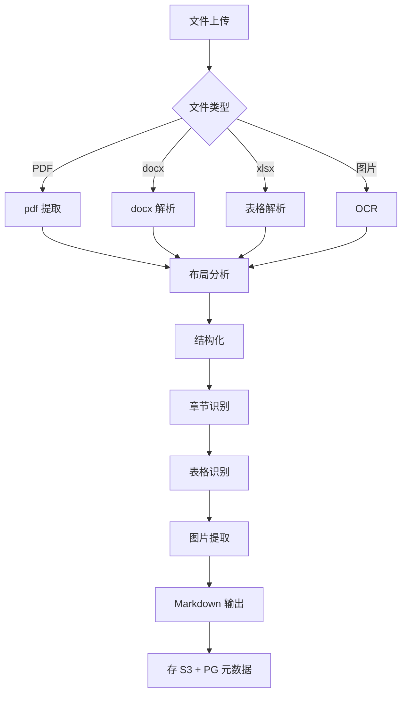

# 模块设计

> **10 个 Go 微服务** + 1 个 Next.js 前端 + 1 个 Tauri 桌面。

## 服务总览

| 服务 | 职责 | 端口 | 关键依赖 | 复杂度 |
|---|---|---|---|---|
| **api-gateway** | 认证、路由、限流、计量 | 8080 | 全部下游 | 高 |
| **project-svc** | 项目/标段 CRUD | 8081 | PG | 低 |
| **document-svc** | 文档上传/解析/Markdown | 8082 | PG, S3 | 中 |
| **workflow-svc** | Step01-05 编排 + 状态机 | 8083 | PG, Redis, Asynq | **高** |
| **knowledge-svc** | 知识库 / 向量检索 | 8084 | PG, pgvector | 中 |
| **router-svc** | AI 模型路由 | 8085 | Redis, 多 Provider | **高** |
| **template-svc** | 行业模板/市集 | 8086 | PG, S3 | 中 |
| **billing-svc** | 订阅/Token 计费 | 8087 | PG, Redis | 中 |
| **notify-svc** | 邮件/Webhook/IM | 8088 | Redis, S3 | 低 |
| **audit-svc** | 一致性审计/agent 修复 | 8089 | PG, S3, router-svc | **高** |

---

## api-gateway

### 职责

- 统一入口
- 认证（JWT 验证）
- 路由（按 path 分发）
- 限流（IP / user / API key）
- 计量（API 调用 + Token）
- 审计日志

### 技术栈

- Go + chi（HTTP router）
- Redis（限流计数器）
- JWT（github.com/golang-jwt/jwt）

### 关键流程

```
HTTP 请求
   ↓
中间件链：
   1. Recovery（panic 捕获）
   2. Logging（请求日志）
   3. Metrics（Prometheus）
   4. CORS
   5. Tracing（OpenTelemetry）
   6. RateLimit（IP / user）
   7. Auth（JWT 验证 + tenant 注入）
   8. Audit（写审计日志）
   ↓
路径路由：
   /api/v1/projects/*    → project-svc
   /api/v1/documents/*   → document-svc
   /api/v1/workflows/*   → workflow-svc
   /api/v1/knowledge/*   → knowledge-svc
   ...
   ↓
HTTP 反向代理（gRPC / HTTP）
   ↓
下游服务
```

### 配置

```yaml
# configs/api-gateway.yaml
server:
  port: 8080
  read_timeout: 30s
  write_timeout: 30s

auth:
  jwt_secret: ${JWT_SECRET}
  access_token_ttl: 1h

rate_limit:
  global_per_ip: 100/min
  global_per_user: 1000/min
  login_per_ip: 5/min
  api_key_per_key: 10000/min

routes:
  - prefix: /api/v1/projects
    service: project-svc
    auth_required: true
  - prefix: /api/v1/workflows
    service: workflow-svc
    auth_required: true
  - prefix: /api/v1/audits
    service: audit-svc
    auth_required: true
  - prefix: /api/v1/knowledge
    service: knowledge-svc
    auth_required: true
  - prefix: /healthz
    service: self
    auth_required: false
```

---

## project-svc

### 职责

- 项目 / 标段 CRUD
- 项目成员管理
- 项目状态

### 数据模型

```sql
CREATE TABLE projects (
    id UUID PRIMARY KEY,
    tenant_id UUID NOT NULL REFERENCES tenants(id),
    name VARCHAR(256) NOT NULL,
    description TEXT,
    industry VARCHAR(64),
    template_id UUID REFERENCES templates(id),
    status VARCHAR(32) NOT NULL DEFAULT 'draft',  -- draft | active | completed | archived
    estimated_value DECIMAL(18, 2),
    currency VARCHAR(8) DEFAULT 'CNY',
    deadline TIMESTAMPTZ,
    owner_id UUID NOT NULL REFERENCES users(id),
    created_at TIMESTAMPTZ NOT NULL DEFAULT NOW(),
    updated_at TIMESTAMPTZ NOT NULL DEFAULT NOW(),
    deleted_at TIMESTAMPTZ
);

CREATE INDEX idx_projects_tenant_id ON projects(tenant_id);
CREATE INDEX idx_projects_status ON projects(status);
CREATE INDEX idx_projects_owner ON projects(owner_id);
```

### API

| Method | Path | 说明 |
|---|---|---|
| POST | `/projects` | 创建项目 |
| GET | `/projects` | 列出项目 |
| GET | `/projects/{id}` | 详情 |
| PATCH | `/projects/{id}` | 更新 |
| DELETE | `/projects/{id}` | 软删除 |
| POST | `/projects/{id}/members` | 添加成员 |
| DELETE | `/projects/{id}/members/{user_id}` | 移除成员 |

详见：[api/overview.md](../api/overview.md)

---

## document-svc

### 职责

- 文件上传（PDF / docx / xlsx / 图片）
- 文档解析（→ Markdown）
- 版本管理

### 解析流程



### 关键库

```go
// PDF
import "github.com/ledongthuc/pdf"           // 轻量
import "github.com/unidoc/unipdf"             // 商业许可

// docx
import "github.com/nguyenthenguyen/docx"     // 读写

// xlsx
import "github.com/xuri/excelize/v2"         // 读写

// OCR
import "github.com/otiai10/gosseract/v2"     // Tesseract 包装
```

---

## workflow-svc

### 职责

- 工作流生命周期管理
- 状态机（Step01-05）
- 任务调度（Asynq）
- 实时进度推送（SSE）

### 状态机

```
Draft ──create──→ Parsing ──complete──→ Outlining
                                            │
                                            ▼
                              Done ←─ Auditing ←─ Generating
                                                │
                                                ▼
                                              Failed
```

详细：[state-machine.md](state-machine.md)

### 任务队列

```go
// Asynq 任务类型
const (
    TypeParseRFP        = "workflow:parse_rfp"
    TypeGenerateOutline = "workflow:generate_outline"
    TypeGlobalFacts     = "workflow:global_facts"
    TypeGenerateContent = "workflow:generate_content"
    TypeAuditDocument   = "workflow:audit_document"
    TypeExportWord      = "workflow:export_word"
)

// 入队
asynqClient.Enqueue(asynq.NewTask(TypeParseRFP, payload),
    asynq.Queue("critical"),
    asynq.MaxRetry(3),
    asynq.Timeout(10*time.Minute),
)
```

### 实时推送

```go
// SSE endpoint
func (s *Server) StreamWorkflow(w http.ResponseWriter, r *http.Request) {
    w.Header().Set("Content-Type", "text/event-stream")
    w.Header().Set("Cache-Control", "no-cache")
    w.Header().Set("Connection", "keep-alive")

    flusher, _ := w.(http.Flusher)

    ch := s.eventBus.Subscribe(workflowID)
    defer s.eventBus.Unsubscribe(workflowID, ch)

    for {
        select {
        case event := <-ch:
            data, _ := json.Marshal(event)
            fmt.Fprintf(w, "event: %s\ndata: %s\n\n", event.Type, data)
            flusher.Flush()
        case <-r.Context().Done():
            return
        }
    }
}
```

---

## knowledge-svc

### 职责

- 知识库管理（文档/条目）
- 向量化（pgvector）
- 三层检索（精确 + RAG + 全局事实）

### 数据模型

```sql
-- 精确匹配层
CREATE TABLE knowledge_entries (
    id UUID PRIMARY KEY,
    tenant_id UUID NOT NULL,
    title TEXT NOT NULL,
    content TEXT NOT NULL,
    keywords TEXT[],                    -- 关键词数组
    category VARCHAR(64),
    created_at TIMESTAMPTZ NOT NULL DEFAULT NOW()
);

-- 向量层
CREATE TABLE knowledge_vectors (
    id UUID PRIMARY KEY,
    entry_id UUID NOT NULL REFERENCES knowledge_entries(id),
    embedding VECTOR(1536),             -- OpenAI text-embedding-3
    chunk_text TEXT NOT NULL
);
CREATE INDEX idx_knowledge_vectors_embedding ON knowledge_vectors
    USING hnsw (embedding vector_cosine_ops);

-- 全局事实层
CREATE TABLE global_facts (
    id UUID PRIMARY KEY,
    tenant_id UUID NOT NULL,
    project_id UUID NOT NULL,
    fact_type VARCHAR(64) NOT NULL,      -- company_info | qualification | case
    fact_value JSONB NOT NULL,
    source VARCHAR(256),                -- 来源
    confidence DECIMAL(3, 2),
    created_at TIMESTAMPTZ NOT NULL DEFAULT NOW()
);
```

### 检索流程

```go
func (s *KnowledgeService) Search(ctx context.Context, q SearchQuery) (*SearchResult, error) {
    var result SearchResult

    // Layer 1: 精确匹配（关键词）
    result.ExactMatches = s.exactMatch(ctx, q)

    // Layer 2: 弱 RAG（向量）
    if q.UseRAG {
        result.RAGMatches = s.vectorSearch(ctx, q)
    }

    // Layer 3: 全局事实
    if q.UseGlobalFacts {
        result.GlobalFacts = s.getGlobalFacts(ctx, q.ProjectID, q.Category)
    }

    // 重排序
    result.Ranked = s.rerank(ctx, q, result)
    return &result, nil
}
```

---

## router-svc

### 职责

- AI Provider 适配（OpenAI / Anthropic / DeepSeek / Ollama）
- 路由决策（任务画像 → 模型）
- 降级链
- 用量计量
- Prompt 缓存
- JSON 修复

详细：[ai-router.md](ai-router.md)

### 路由表

```yaml
# configs/routes.yaml
routes:
  - task: rfp_parse
    primary: { provider: anthropic, model: claude-sonnet-4 }
    fallback:
      - { provider: openai, model: gpt-4o }
      - { provider: deepseek, model: deepseek-chat }

  - task: outline_generate
    primary: { provider: deepseek, model: deepseek-chat }
    fallback:
      - { provider: openai, model: gpt-4o-mini }
```

### Provider 接口

```go
type Provider interface {
    Name() string
    Chat(ctx context.Context, req *ChatRequest) (*ChatResponse, error)
    Embed(ctx context.Context, req *EmbedRequest) (*EmbedResponse, error)
    EstimateCost(req *ChatRequest) float64
}

type ChatRequest struct {
    Model       string
    Messages    []Message
    Temperature float64
    MaxTokens   int
    Tools       []Tool
    Metadata    map[string]string
}

type ChatResponse struct {
    Content          string
    PromptTokens     int
    CompletionTokens int
    Cost             float64
    Latency          time.Duration
    ProviderMetadata map[string]string
}
```

---

## template-svc

### 职责

- 模板管理（CRUD）
- 模板应用
- 模板市集（M3+）

### 数据模型

详见 [ADR-0006](../decisions/0006-template-marketplace.md)

### 模板应用

```go
func (s *TemplateService) Apply(ctx context.Context, templateID, projectID string) error {
    template := s.repo.GetTemplate(ctx, templateID)
    project := s.projectClient.Get(ctx, projectID)

    // 1. 复制 sections 到 project_outline_nodes
    sections := s.repo.GetSections(ctx, template.ID)
    for _, sec := range sections {
        s.projectClient.AddOutlineNode(ctx, project.ID, toOutlineNode(sec))
    }

    // 2. 复制 rules 到 project_audit_rules
    rules := s.repo.GetRules(ctx, template.ID)
    for _, rule := range rules {
        s.auditClient.AddRule(ctx, project.ID, rule)
    }

    return nil
}
```

---

## billing-svc

### 职责

- 订阅管理（Free / Pro / Team / Enterprise）
- Token 用量统计
- 配额管理（硬限 + 软限）
- 发票生成

### 数据模型

```sql
CREATE TABLE subscriptions (
    id UUID PRIMARY KEY,
    tenant_id UUID NOT NULL REFERENCES tenants(id),
    plan VARCHAR(32) NOT NULL,        -- free | pro | team | enterprise
    status VARCHAR(32) NOT NULL,      -- active | past_due | cancelled
    started_at TIMESTAMPTZ NOT NULL,
    current_period_start TIMESTAMPTZ NOT NULL,
    current_period_end TIMESTAMPTZ NOT NULL,
    cancel_at TIMESTAMPTZ
);

CREATE TABLE usage_records (
    id UUID PRIMARY KEY,
    tenant_id UUID NOT NULL,
    user_id UUID NOT NULL,
    resource VARCHAR(64) NOT NULL,     -- ai_tokens | storage_gb | projects
    quantity DECIMAL(18, 4) NOT NULL,
    period VARCHAR(16) NOT NULL,      -- 2026-06
    recorded_at TIMESTAMPTZ NOT NULL DEFAULT NOW()
);

CREATE TABLE invoices (
    id UUID PRIMARY KEY,
    tenant_id UUID NOT NULL,
    subscription_id UUID NOT NULL REFERENCES subscriptions(id),
    amount DECIMAL(18, 2) NOT NULL,
    currency VARCHAR(8) DEFAULT 'CNY',
    status VARCHAR(32) NOT NULL,      -- draft | open | paid | void
    period_start TIMESTAMPTZ NOT NULL,
    period_end TIMESTAMPTZ NOT NULL,
    due_at TIMESTAMPTZ NOT NULL,
    paid_at TIMESTAMPTZ
);
```

### 配额保护

```go
func (s *BillingService) CheckQuota(ctx context.Context, tenantID string, resource string) error {
    sub, _ := s.repo.GetSubscription(ctx, tenantID)
    usage, _ := s.repo.GetCurrentUsage(ctx, tenantID, resource)
    limit := s.getPlanLimit(sub.Plan, resource)

    if usage >= limit {
        return ErrQuotaExceeded
    }

    // 软限警告（80%）
    if usage >= limit * 0.8 {
        s.notify.WarnQuota(ctx, tenantID, resource, usage, limit)
    }

    return nil
}
```

---

## notify-svc

### 职责

- 邮件（订单、告警、通知）
- Webhook（事件推送）
- IM（飞书 / 钉钉 / Slack）

### 实现

```go
type Notifier interface {
    Send(ctx context.Context, msg Message) error
}

type EmailNotifier struct{ ... }
type WebhookNotifier struct{ ... }
type FeishuNotifier struct{ ... }

// 模板
const (
    TemplateWorkflowComplete = "workflow_complete"
    TemplateQuotaWarn        = "quota_warn"
    TemplateInviteMember     = "invite_member"
)
```

---

## audit-svc

### 职责

- 一致性审计（normal + agent）
- 问题分类与严重度
- 自动修复（agent 模式）

详细：[ADR-0005](../decisions/0005-audit-agent-mode.md)

### 审计层次

```go
type AuditLayer string

const (
    LayerMandatory    AuditLayer = "mandatory"     // 必答条款
    LayerConsistency  AuditLayer = "consistency"   // 一致性
    LayerTypo         AuditLayer = "typo"          // 错别字
    LayerDuplication  AuditLayer = "duplication"   // 查重
)

type Issue struct {
    ID         string     `json:"id"`
    Layer      AuditLayer `json:"layer"`
    Severity   string     `json:"severity"`  // critical | warning | info
    Location   string     `json:"location"`  // chapter.section.paragraph
    Type       string     `json:"type"`
    Message    string     `json:"message"`
    Suggestion string     `json:"suggestion"`
    Confidence float64    `json:"confidence"`
}
```

### agent 模式（OpenCode 子进程）

借鉴 yibiao：

```go
func (s *AuditService) RunAgent(ctx context.Context, req *AuditRequest) (*AuditResult, error) {
    // 启动 OpenCode 子进程
    cmd := exec.CommandContext(ctx, "opencode", "agent", "audit")
    cmd.Env = append(os.Environ(),
        fmt.Sprintf("AUDIT_INPUT=%s", req.InputFile),
        fmt.Sprintf("AUDIT_RULES=%s", req.RulesFile),
    )

    // 端口代理通信
    proxy := startPortProxy(8080, randomPort)
    cmd.Env = append(cmd.Env, fmt.Sprintf("AUDIT_PORT=%d", randomPort))

    // 启动
    if err := cmd.Start(); err != nil {
        return nil, err
    }

    // 等待 + 心跳
    return s.waitForAgent(ctx, cmd, proxy, 10*time.Minute)
}
```

---

## 相关文档

- [架构总览](overview.md)
- [数据模型](data-model.md)
- [AI 路由](ai-router.md)
- [状态机](state-machine.md)
- [ADR-0001 多租户](../decisions/0001-multi-tenant.md)
- [ADR-0002 AI 路由](../decisions/0002-ai-router-quality.md)
- [ADR-0005 审计模式](../decisions/0005-audit-agent-mode.md)