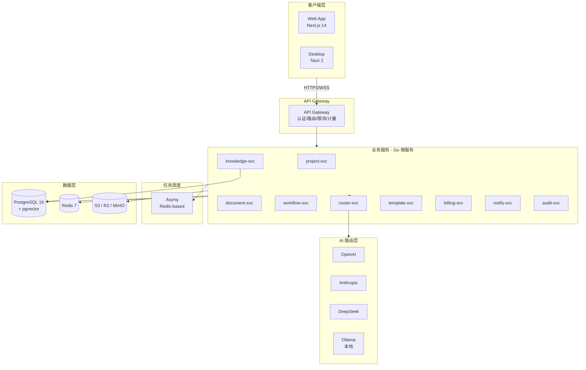
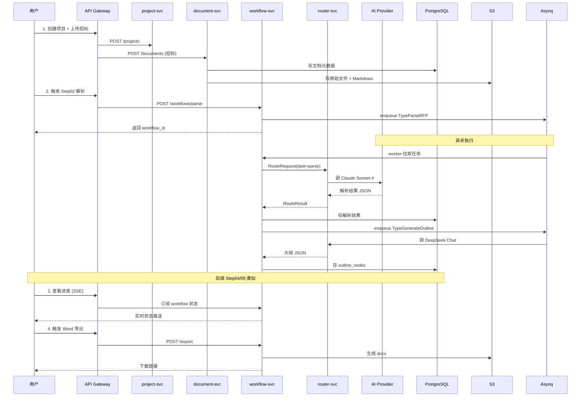
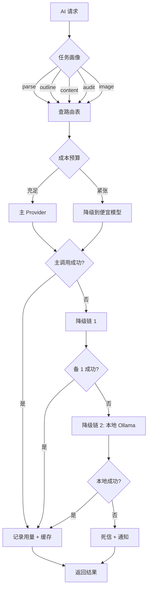

# 架构总览

> 本文档是 BidWriter 系统的架构总览。详细设计见各子章节。

## 1. 总体架构



## 2. 服务清单

| 服务 | 职责 | 端口 | 关键依赖 |
|---|---|---|---|
| api-gateway | 认证、路由、限流、计量 | 8080 | 全部下游 |
| project-svc | 项目/标段 CRUD | 8081 | PG |
| document-svc | 文档上传/解析/Markdown 化 | 8082 | PG, S3 |
| workflow-svc | Step01-05 编排 + 状态机 | 8083 | PG, Redis, Asynq |
| knowledge-svc | 知识库 / 向量检索 | 8084 | PG, pgvector |
| router-svc | AI 模型路由 | 8085 | Redis, 多 Provider |
| template-svc | 行业模板/市集 | 8086 | PG, S3 |
| billing-svc | 订阅/Token 计费 | 8087 | PG, Redis |
| notify-svc | 邮件/Webhook/IM | 8088 | Redis, S3 |
| audit-svc | 一致性审计/agent 修复 | 8089 | PG, S3, router-svc |

## 3. 数据流

### 3.1 创建标书的标准流程



### 3.2 AI 路由决策流



## 4. 关键设计决策

| 决策 | 选择 | 理由 | ADR |
|---|---|---|---|
| 后端语言 | Go | 高并发 + 任务调度友好 | — |
| 数据库 | PostgreSQL + pgvector | 一体化 + JSONB 灵活 | — |
| 队列 | Asynq | 纯 Go + Redis | — |
| 多租户 | 行级 tenant_id | M1-M3 够用 | [0001](../decisions/0001-multi-tenant.md) |
| AI 路由 | 多 Provider 自动选 | 成本/质量最优 | [0002](../decisions/0002-ai-router-quality.md) |
| 私有化模型 | 客户自备 + Ollama 脚本 | 灵活 + 合规 | [0003](../decisions/0003-self-hosted-model.md) |
| Word 格式 | 仅 .docx | 国内标准 | [0004](../decisions/0004-word-format.md) |
| 审计模式 | 默认 normal | 成本控制 | [0005](../decisions/0005-audit-agent-mode.md) |
| 模板 | v1 预置 6 个 | 冷启动 | [0006](../decisions/0006-template-marketplace.md) |
| 数据同步 | 云端权威 | 协作优先 | [0007](../decisions/0007-data-sync.md) |

## 5. 部署架构

### 5.1 云端 SaaS（默认）

```
Internet
  │
  ├─── CloudFront / CDN (静态资源)
  │
  ├─── ALB / Nginx Ingress
  │      │
  │      ├─── api-gateway (3 replicas, HPA)
  │      ├─── workflow-svc (5 replicas)
  │      └─── 其他 svc (2 replicas each)
  │
  ├─── Asynq Workers (5-10 replicas, 队列分组)
  │
  └─── Data Tier
         ├─── RDS PostgreSQL (16 vCPU 64GB)
         ├─── ElastiCache Redis (cluster)
         └─── S3 (文档/图片/导出)
```

### 5.2 私有化

```
客户机房
  │
  ├─── Ingress (Nginx)
  ├─── api-gateway (2 replicas)
  ├─── 各 svc (1-2 replicas)
  ├─── Asynq Workers
  ├─── PostgreSQL (StatefulSet)
  ├─── Redis (StatefulSet)
  ├─── MinIO (StatefulSet)
  └─── Ollama (StatefulSet, 可选)
```

详细：[运维 / 部署](../operations/deployment.md)

## 6. 非功能性需求

| 维度 | 指标 |
|---|---|
| 可用性 | 99.9%（SaaS） / 99.5%（私有化） |
| 并发 | 单租户 10 并发任务 |
| 响应延迟 | p95 < 1s（非 AI 调用）|
| AI 调用 | p95 < 30s（含降级链） |
| 数据持久性 | 99.999999% |
| 单标 Token | ≤ 500k（基于 DeepSeek 路由）|
| 文档大小 | 单文件 ≤ 100MB |
| 知识库容量 | 单租户 ≤ 10GB（M3 前）|

## 7. 安全模型

| 层 | 措施 |
|---|---|
| 传输 | TLS 1.3 全链路 |
| 认证 | OIDC + JWT（支持企业 SSO）|
| 授权 | RBAC（4 角色）|
| 数据 | tenant_id 行级隔离 + 加密字段 |
| 审计 | 不可变操作日志（audit_logs）|
| 隐私 | 用户数据不用于训练 |
| 合规 | 隐私政策 + 数据删除接口 |

详细：[运维 / 安全](../operations/security.md)

## 8. 子章节

- [设计框架](framework.md) — 5-Agent 抽象
- [模块设计](modules.md) — 各服务详细设计
- [数据模型](data-model.md) — PostgreSQL schema
- [AI 路由](ai-router.md) — 多模型路由核心
- [状态机](state-machine.md) — Step01-05 工作流

## 9. 相关文档

- [v1 设计](../plan/v1-design.md) — 1011 行完整设计
- [迭代路线](../plan/roadmap.md) — M1-M4 里程碑
- [开发流程](../development/workflow.md) — 文档先行的开发规范
