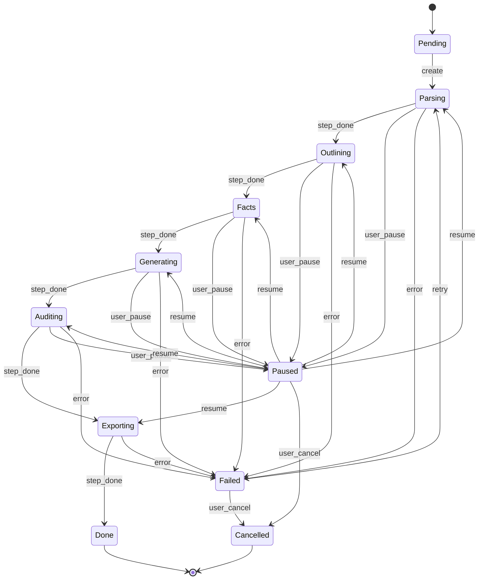

# 工作流状态机

> **Step01-05 状态机** —— 工作流的核心引擎。

## 总览

```
                 ┌────────────────────────────────────┐
                 │                                    │
                 ▼                                    │
  ┌─────────┐  创建   ┌─────────┐  完成    ┌─────────┐ │
  │  None   │ ───────→│Parsing  │ ────────→│Outlining│ │
  └─────────┘          └────┬────┘          └────┬────┘ │
                            │                    │      │
                            ▼                    ▼      │
                        ┌───────┐            ┌───────┐  │
                        │Failed │            │Failed │  │
                        └───────┘            └───────┘  │
                                                    ▼   │
                                            ┌─────────┐  │
                                            │Facts    │  │
                                            └────┬────┘  │
                                                 │       │
                                                 ▼       │
                                            ┌─────────┐  │
                                            │Failed   │  │
                                            └─────────┘  │
                                                 │       │
                                                 ▼       │
                                            ┌─────────┐  │
                                            │Generating    │
                                            └────┬────┘  │
                                                 │       │
                                                 ▼       │
                                            ┌─────────┐  │
                                            │Auditing │  │
                                            └────┬────┘  │
                                                 │       │
                              ┌──────────────────┘       │
                              ▼                          │
                        ┌─────────┐                      │
                        │Exporting│ ──── 完成 ──────────┘
                        └────┬────┘              ▼
                             │              ┌─────────┐
                             ▼              │ Done    │
                        ┌─────────┐         └─────────┘
                        │ Failed  │
                        └─────────┘
```

## 状态定义

| 状态 | 说明 |
|---|---|
| `pending` | 工作流已创建，未启动 |
| `parsing` | Step02 解析招标文档 |
| `outlining` | Step03 拆解大纲 |
| `facts` | Step04 提取全局事实 |
| `generating` | Step05 生成正文 |
| `auditing` | 一致性审计 |
| `exporting` | 导出 Word |
| `done` | 全部完成 |
| `failed` | 失败 |
| `cancelled` | 用户取消 |
| `paused` | 暂停（用户主动）|

## 转换规则

```go
var validTransitions = map[State][]State{
    StatePending:     {StateParsing, StateCancelled},
    StateParsing:     {StateOutlining, StateFailed, StatePaused, StateCancelled},
    StateOutlining:   {StateFacts, StateFailed, StatePaused, StateCancelled},
    StateFacts:       {StateGenerating, StateFailed, StatePaused, StateCancelled},
    StateGenerating:  {StateAuditing, StateFailed, StatePaused, StateCancelled},
    StateAuditing:    {StateExporting, StateFailed, StatePaused, StateCancelled},
    StateExporting:   {StateDone, StateFailed, StateCancelled},
    StatePaused:      {StateParsing, StateOutlining, StateFacts, StateGenerating, StateAuditing, StateExporting, StateCancelled},
    StateFailed:      {StateParsing, StateCancelled},  // 可从失败恢复
    StateDone:        {},  // 终态
    StateCancelled:   {},  // 终态
}

func CanTransition(from, to State) bool {
    for _, s := range validTransitions[from] {
        if s == to {
            return true
        }
    }
    return false
}
```

## 借鉴 yibiao 的设计

yibiao 的状态机（v2.15.1）：

```typescript
// yibiao 的 status
type WorkflowStatus = 'pending' | 'parsing' | 'paused' | 'restoring' | 'auditing' | 'generating' | 'completed' | 'failed'

// 关键设计：
// 1. paused / restoring 配对：用户暂停后可恢复
// 2. auditing 独立状态：与生成并行
// 3. 失败可重试
```

**我们的增强**：

| 特性 | yibiao | BidWriter |
|---|---|---|
| 步骤命名 | Step01-05 | Step02-06（+Export）|
| 暂停/恢复 | ✅ | ✅ |
| 失败重试 | ✅ | ✅ |
| 多步并发 | ❌ | ✅（未来）|
| 分布式 | ❌ | ✅（Asynq）|
| 实时推送 | ❌ | ✅（SSE）|

---

## 任务模型

每个工作流由多个 step 任务组成：

```go
type Workflow struct {
    ID         uuid.UUID
    TenantID   uuid.UUID
    ProjectID  uuid.UUID
    RFPDocID   uuid.UUID

    CurrentStep Step
    Status     Status
    Progress   int  // 0-100

    Steps      map[Step]*StepState
    Config     WorkflowConfig

    Error      string
    StartedAt  *time.Time
    CompletedAt *time.Time
}

type StepState struct {
    Step       Step
    Status     Status
    StartedAt  *time.Time
    CompletedAt *time.Time
    Error      string
    Output     json.RawMessage  // 各步骤的输出
    Attempts   int
    Cost       float64
}

type WorkflowConfig struct {
    AuditMode    string  // normal | agent
    AIConfig     map[string]string
    AutoApprove  bool    // 自动进入下一步
    SkipOptional []Step  // 跳过的可选步骤
}
```

---

## 任务定义

### TypeParseRFP

```go
const TypeParseRFP = "workflow:parse_rfp"

type ParseRFPPayload struct {
    WorkflowID  uuid.UUID `json:"workflow_id"`
    ProjectID   uuid.UUID `json:"project_id"`
    RFPDocID    uuid.UUID `json:"rfp_doc_id"`
    TenantID    uuid.UUID `json:"tenant_id"`
}

// worker 处理
func (w *Worker) HandleParseRFP(ctx context.Context, t *asynq.Task) error {
    var p ParseRFPPayload
    json.Unmarshal(t.Payload(), &p)

    // 1. 加载文档
    doc, _ := w.docSvc.Get(ctx, p.RFPDocID)

    // 2. 调 AI 解析
    result, err := w.router.Route(ctx, &RouteRequest{
        Task: "rfp_parse",
        Messages: []Message{
            {Role: "system", Content: parsePrompt},
            {Role: "user", Content: doc.ContentMD},
        },
    })
    if err != nil {
        return err
    }

    // 3. 解析 JSON
    parsed, err := parseParseResult(result.Content)
    if err != nil {
        return err
    }

    // 4. 存结果
    w.workflowSvc.UpdateStep(ctx, p.WorkflowID, StepParsing, &StepState{
        Status: StatusCompleted,
        Output: parsed,
        Cost:   result.Cost,
    })

    // 5. 自动触发下一步（或等用户审核）
    if w.config.AutoApprove {
        return w.enqueueNextStep(ctx, p.WorkflowID, StepOutlining)
    }

    return nil
}
```

### TypeGenerateOutline

```go
const TypeGenerateOutline = "workflow:generate_outline"

type GenerateOutlinePayload struct {
    WorkflowID uuid.UUID
    ProjectID  uuid.UUID
    TenantID   uuid.UUID
    ParseResult json.RawMessage
}

func (w *Worker) HandleGenerateOutline(ctx context.Context, t *asynq.Task) error {
    var p GenerateOutlinePayload
    json.Unmarshal(t.Payload(), &p)

    // 1. 加载模板（如有）
    template := w.templateSvc.GetByProject(ctx, p.ProjectID)

    // 2. 加载全局事实（从历史标书）
    facts := w.factsSvc.GetByProject(ctx, p.ProjectID)

    // 3. 调 AI 生成大纲
    outline, err := w.router.Route(ctx, &RouteRequest{
        Task: "outline_generate",
        Messages: buildOutlinePrompt(p.ParseResult, template, facts),
    })
    if err != nil {
        return err
    }

    // 4. 解析 + 写入数据库
    nodes := parseOutline(outline.Content)
    for _, node := range nodes {
        w.outlineRepo.Create(ctx, node)
    }

    // 5. 更新工作流
    w.workflowSvc.UpdateStep(ctx, p.WorkflowID, StepOutlining, &StepState{
        Status: StatusCompleted,
        Output: nodes,
    })

    return w.enqueueNextStep(ctx, p.WorkflowID, StepFacts)
}
```

### TypeGlobalFacts

```go
const TypeGlobalFacts = "workflow:global_facts"

func (w *Worker) HandleGlobalFacts(ctx context.Context, t *asynq.Task) error {
    var p GlobalFactsPayload
    json.Unmarshal(t.Payload(), &p)

    // 1. 加载项目所有相关文档
    docs := w.docSvc.GetByProject(ctx, p.ProjectID)

    // 2. 提取事实（公司信息 / 资质 / 案例 / 团队 / 价格）
    facts := w.extractFacts(ctx, docs)

    // 3. 写入数据库
    for _, fact := range facts {
        w.factsRepo.Create(ctx, fact)
    }

    // 4. 触发下一步
    return w.enqueueNextStep(ctx, p.WorkflowID, StepGenerating)
}
```

### TypeGenerateContent

```go
const TypeGenerateContent = "workflow:generate_content"

func (w *Worker) HandleGenerateContent(ctx context.Context, t *asynq.Task) error {
    var p GenerateContentPayload
    json.Unmarshal(t.Payload(), &p)

    // 1. 加载大纲
    nodes := w.outlineRepo.GetByProject(ctx, p.ProjectID)

    // 2. 加载全局事实
    facts := w.factsRepo.GetByProject(ctx, p.ProjectID)

    // 3. 加载知识库
    knowledge := w.knowledgeSvc.Search(ctx, ...)

    // 4. 并发生成每个章节
    g, ctx := errgroup.WithContext(ctx)
    sem := make(chan struct{}, 5)  // 并发限制
    for _, node := range nodes {
        node := node
        g.Go(func() error {
            sem <- struct{}{}
            defer func() { <-sem }()

            content, err := w.generateSection(ctx, node, facts, knowledge)
            if err != nil {
                return err
            }
            w.contentRepo.Create(ctx, content)
            return nil
        })
    }
    if err := g.Wait(); err != nil {
        return err
    }

    return w.enqueueNextStep(ctx, p.WorkflowID, StepAuditing)
}
```

### TypeAuditDocument

```go
const TypeAuditDocument = "workflow:audit_document"

func (w *Worker) HandleAuditDocument(ctx context.Context, t *asynq.Task) error {
    var p AuditDocumentPayload
    json.Unmarshal(t.Payload(), &p)

    // 1. 加载所有内容
    contents := w.contentRepo.GetByProject(ctx, p.ProjectID)

    // 2. 选择模式（normal / agent）
    if p.Mode == "agent" {
        return w.auditSvc.RunAgent(ctx, p)
    }
    return w.auditSvc.RunNormal(ctx, p)
}
```

### TypeExportWord

```go
const TypeExportWord = "workflow:export_word"

func (w *Worker) HandleExportWord(ctx context.Context, t *asynq.Task) error {
    var p ExportWordPayload
    json.Unmarshal(t.Payload(), &p)

    // 1. 加载完整文档
    doc := w.buildMarkdown(ctx, p.ProjectID)

    // 2. Markdown → docx
    docxBytes, err := w.exporter.MarkdownToDocx(doc)
    if err != nil {
        return err
    }

    // 3. 上传到 S3
    s3Key, err := w.s3.Upload(ctx, docxBytes, "exports")
    if err != nil {
        return err
    }

    // 4. 完成
    w.workflowSvc.UpdateStep(ctx, p.WorkflowID, StepExporting, &StepState{
        Status: StatusCompleted,
        Output: json.RawMessage(fmt.Sprintf(`{"s3_key":"%s"}`, s3Key)),
    })

    w.workflowSvc.Complete(ctx, p.WorkflowID)
    return nil
}
```

---

## 暂停 / 恢复

### 暂停

```go
func (s *WorkflowService) Pause(ctx context.Context, id uuid.UUID) error {
    return s.repo.UpdateStatus(ctx, id, StatusPaused)
}

// Asynq worker 看到 paused 状态时停止入队
func (w *Worker) shouldStop(ctx context.Context, workflowID uuid.UUID) bool {
    wf, _ := w.workflowSvc.Get(ctx, workflowID)
    return wf.Status == StatusPaused || wf.Status == StatusCancelled
}
```

### 恢复

```go
func (s *WorkflowService) Resume(ctx context.Context, id uuid.UUID) error {
    wf, err := s.repo.Get(ctx, id)
    if err != nil {
        return err
    }
    if wf.Status != StatusPaused {
        return ErrNotPaused
    }

    // 恢复到暂停时的步骤
    return s.enqueueNextStep(ctx, id, wf.CurrentStep)
}
```

借鉴 yibiao 的 `restoring` 状态：

```go
// 恢复时短暂进入 restoring 状态
StatusPaused → StatusRestoring → (CurrentStep)
```

---

## 失败处理

### 重试

```go
const (
    MaxRetries = 3
    RetryDelay = 30 * time.Second
)

asynqClient.Enqueue(task,
    asynq.MaxRetry(MaxRetries),
    asynq.RetryDelayFunc(func(attempt int, err error, t *asynq.Task) time.Duration {
        return time.Duration(attempt) * RetryDelay
    }),
)
```

### 用户重试

```go
func (s *WorkflowService) RetryStep(ctx context.Context, workflowID uuid.UUID, step Step) error {
    wf, _ := s.repo.Get(ctx, workflowID)

    if wf.Status != StatusFailed {
        return ErrNotFailed
    }

    // 重置步骤状态
    wf.Steps[step] = &StepState{Status: StatusPending}
    wf.Status = StatusPending
    wf.CurrentStep = step

    s.repo.Update(ctx, wf)
    return s.enqueue(ctx, workflowID, step)
}
```

---

## 实时进度（SSE）

```go
// workflow-svc
func (s *Server) StreamWorkflow(w http.ResponseWriter, r *http.Request) {
    workflowID := chi.URLParam(r, "id")

    w.Header().Set("Content-Type", "text/event-stream")
    w.Header().Set("Cache-Control", "no-cache")
    w.Header().Set("Connection", "keep-alive")

    flusher, _ := w.(http.Flusher)

    ch := s.eventBus.Subscribe(workflowID)
    defer s.eventBus.Unsubscribe(workflowID, ch)

    ctx := r.Context()
    for {
        select {
        case event := <-ch:
            data, _ := json.Marshal(event)
            fmt.Fprintf(w, "event: %s\ndata: %s\n\n", event.Type, data)
            flusher.Flush()
        case <-ctx.Done():
            return
        }
    }
}

// eventBus 用 Redis Pub/Sub 或本地 channel
```

事件类型：

```go
const (
    EventStepStarted    = "step_started"
    EventStepProgress   = "progress"
    EventStepCompleted  = "step_completed"
    EventStepFailed     = "step_failed"
    EventWorkflowPaused = "workflow_paused"
    EventWorkflowDone   = "workflow_completed"
)
```

---

## 监控指标

```go
var (
    workflowsRunning = promauto.NewGauge(prometheus.GaugeOpts{
        Name: "bidwriter_workflows_running",
    })

    workflowStepDuration = promauto.NewHistogramVec(
        prometheus.HistogramOpts{
            Name:    "bidwriter_workflow_step_duration_seconds",
            Buckets: []float64{10, 30, 60, 180, 600},
        },
        []string{"step"},
    )

    workflowFailures = promauto.NewCounterVec(
        prometheus.CounterOpts{Name: "bidwriter_workflow_failures_total"},
        []string{"step", "error_type"},
    )
)
```

---

## 并发控制

```go
// 同租户并发限制
const MaxConcurrentWorkflowsPerTenant = 10

func (s *WorkflowService) CanStart(ctx context.Context, tenantID uuid.UUID) error {
    count, _ := s.repo.CountByTenantAndStatus(ctx, tenantID, StatusRunning)
    if count >= MaxConcurrentWorkflowsPerTenant {
        return ErrTenantConcurrencyLimit
    }
    return nil
}
```

---

## 状态机可视化



---

## 相关文档

- [架构总览](overview.md)
- [模块设计 - workflow-svc](modules.md#workflow-svc)
- [AI 路由](ai-router.md)
- [ADR-0002 模型路由](../decisions/0002-ai-router-quality.md)