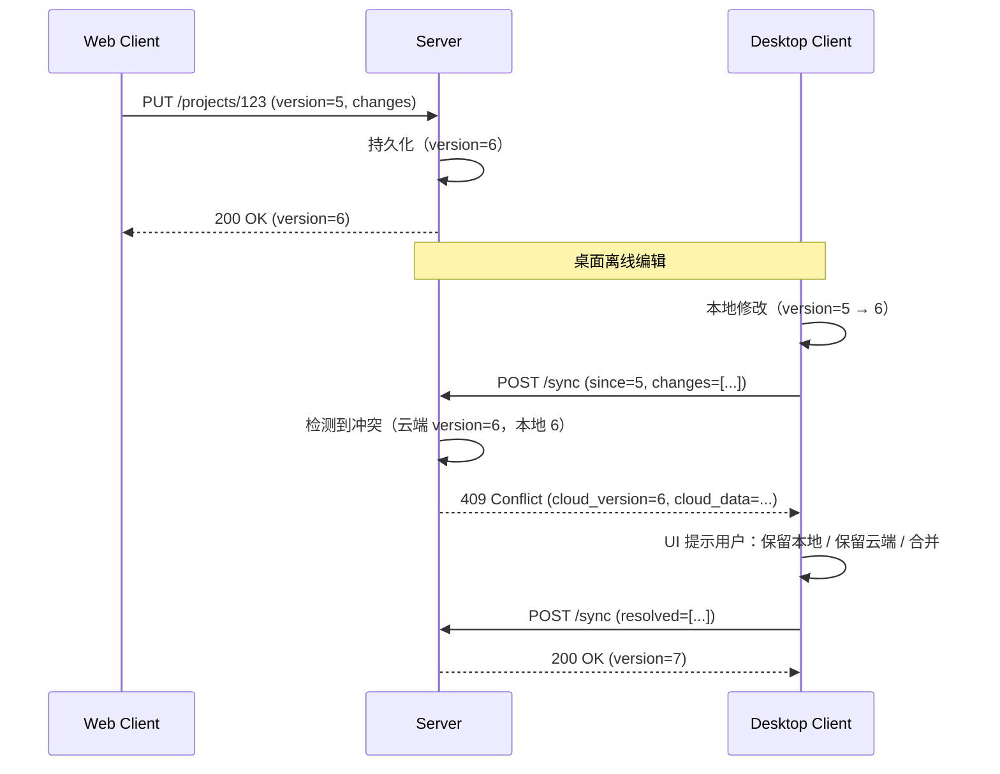

# 0007. Web 与桌面数据同步冲突

## 状态

Accepted

## 日期

2026-06-27

## 参与者

- 架构组
- 桌面组
- 产品组

## 背景

BidWriter 计划支持 Web（主）和 Desktop（备，M4 起）。两个客户端会产生数据冲突。

**约束条件**：
- 桌面端是 Web 端的"离线备选"
- 用户可能在桌面端离线编辑，然后联网同步
- 团队协作（多人同时编辑）的实时性
- 不能让数据丢失

**需要决策**：数据同步冲突解决策略。

## 决策

**云端权威 + 桌面端定期同步 + 冲突时手动解决。**

```
┌────────────────────────────────────────────────┐
│  Web（在线，云端权威）                          │
│   - 实时协作（多人同时编辑同一项目）            │
│   - 服务端合并（CRDT 或 last-write-wins）       │
│   - 状态：source of truth                       │
└────────────────────────────────────────────────┘
                    ↕ 同步（双向）
┌────────────────────────────────────────────────┐
│  Desktop（离线缓存，定时同步）                   │
│   - 本地 SQLite 缓存最近 30 天数据              │
│   - 离线编辑 → 联网后冲突检测                   │
│   - 冲突时：手动选择（保留本地 / 保留云端 / 合并）│
└────────────────────────────────────────────────┘
```

## 理由

- ✅ 云端权威，协作优先
- ✅ 桌面端离线可用（M4+ 才开始）
- ✅ 冲突不丢数据
- ✅ 用户主动决策避免误合并

## 考虑的替代方案

### 方案 A：完全离线优先（CRDT）

- ❌ 实现复杂（CRDT 库需要成熟）
- ❌ 协作性能差
- ❌ 大文档同步成本高

### 方案 B：桌面只读（无离线编辑）

- ❌ 桌面端价值低
- ❌ 网络不稳定场景无法用

### 方案 C：云端权威 + 桌面缓存 + 手动冲突解决（**选择**）

- ✅ 实现简单
- ✅ 用户可控
- ✅ 不丢数据

## 后果

### 正面

- 协作实时性优先（云端权威）
- 桌面端有离线能力（M4+）
- 冲突不丢数据
- 用户可控

### 负面

- 用户需要做冲突决策（体验负担）
- 桌面端定期同步延迟（数据不是秒级）
- M4 前桌面端受限（M3 才开始桌面开发）

### 中性（需要承担的工作）

- 云端：版本号 + 向量时钟
- 桌面端：本地 SQLite + 同步队列
- 冲突检测 + 手动解决 UI
- 协作合并算法（CRDT 或 LWW）

## 实施细节

### 同步数据流



### 数据模型（带版本号）

```sql
-- 所有业务表加 version 列
CREATE TABLE projects (
    id UUID PRIMARY KEY,
    tenant_id UUID NOT NULL,
    version INT NOT NULL DEFAULT 1,    -- 每次更新 +1
    name TEXT NOT NULL,
    content JSONB NOT NULL DEFAULT '{}',
    updated_at TIMESTAMPTZ NOT NULL DEFAULT NOW()
);

-- 不可变审计日志
CREATE TABLE sync_logs (
    id UUID PRIMARY KEY,
    entity_type VARCHAR(32) NOT NULL,   -- project | outline_node | document
    entity_id UUID NOT NULL,
    version INT NOT NULL,
    source VARCHAR(16) NOT NULL,        -- web | desktop | server
    changes JSONB NOT NULL,
    created_at TIMESTAMPTZ NOT NULL DEFAULT NOW()
);
```

### 冲突检测

```go
type SyncRequest struct {
    EntityType string
    EntityID   string
    BaseVersion int       // 客户端基于哪个版本
    Changes     json.RawMessage
}

func (s *SyncService) Sync(ctx context.Context, req SyncRequest) (*SyncResult, error) {
    // 1. 获取云端当前版本
    cloud, err := s.repo.GetByVersion(ctx, req.EntityType, req.EntityID, req.BaseVersion)
    if err != nil {
        return nil, err
    }

    if cloud.Version == req.BaseVersion {
        // 无冲突，直接应用
        return s.apply(ctx, req)
    }

    // 2. 检测冲突
    if hasConflict(cloud.Content, req.Changes) {
        return &SyncResult{
            Status: ConflictStatus,
            CloudVersion: cloud.Version,
            CloudContent: cloud.Content,
            LocalContent: req.Changes,
        }, nil
    }

    // 3. 无冲突（不同字段），自动合并
    merged := autoMerge(cloud.Content, req.Changes)
    return s.apply(ctx, SyncRequest{
        BaseVersion: cloud.Version,
        Changes:     merged,
    })
}
```

### 协作合并（Web 端）

Web 端用 **last-write-wins + 字段级合并**：

```typescript
// 简化 LWW
function merge(local: Doc, remote: Doc, remoteTimestamp: number): Doc {
    const result = { ...local };
    for (const [field, value] of Object.entries(remote)) {
        if (!local[field] || local[field].timestamp < remoteTimestamp) {
            result[field] = value;
        }
    }
    return result;
}
```

后续可升级到 CRDT（如 Yjs）。

### 桌面端缓存

- 本地 SQLite（schema 与云端 PG 镜像）
- 最近 30 天数据
- 启动时拉取增量
- 定期心跳同步（每 5 分钟）

### 冲突解决 UI

```
┌─────────────────────────────────────────────────┐
│  检测到冲突                                       │
├─────────────────────────────────────────────────┤
│  项目："数据中心建设标书"                         │
│  冲突字段：项目描述                                │
│                                                  │
│  ┌─ 本地版本（2026-06-27 10:00）─────────────┐  │
│  │ 本项目将建设一个 10000 m² 的数据中心，... │  │
│  └──────────────────────────────────────────┘  │
│                                                  │
│  ┌─ 云端版本（2026-06-27 14:30）─────────────┐  │
│  │ 本项目采用模块化设计，建设一个 8000 m²    │  │
│  │ 的数据中心，符合 TIA-942 T3+ 标准。       │  │
│  └──────────────────────────────────────────┘  │
│                                                  │
│  选择：                                           │
│   ○ 保留本地版本                                 │
│   ○ 保留云端版本（推荐）                         │
│   ○ 手动合并                                     │
│                                                  │
│              [取消]    [应用]                     │
└─────────────────────────────────────────────────┘
```

## 退出条件

需要重新评估的触发条件：

- 🔴 桌面端用户大量增加，CRDT 价值体现
- 🔴 冲突频繁发生影响体验
- 🔴 出现更简单的同步方案
- 🔴 客户要求实时协作（多人同时编辑同一章节）

## 后续动作

- M3 桌面端原型（同步策略 P2）
- M4 桌面端 GA（同步策略 P0）
- M4+ 评估是否升级到 CRDT

## 参考

- [架构 / 模块设计 - desktop](../architecture/modules.md)
- [Plan / v1 设计 第 10 节](../plan/v1-design.md)
- [运维 / 部署](../operations/deployment.md)