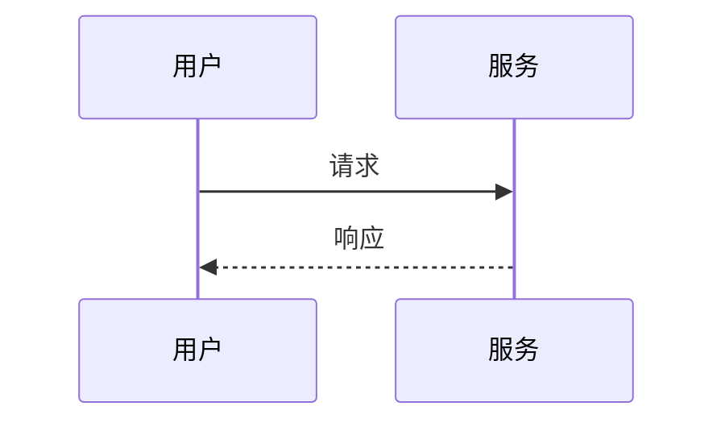
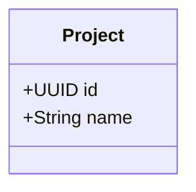
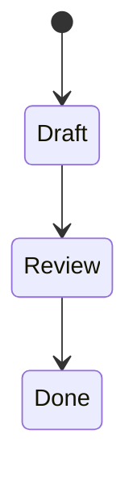

# 文档规范

> **统一的文档风格让所有人都能高效读写。**

## 基本规则

### 1. 中文为主

- 默认中文，必要时英文补充
- 术语第一次出现给英文（例：`路由（router）`）
- 国际化文件用英文（`AGENTS.md`、`CONTRIBUTING.md`）

### 2. 简洁明确

- 一句话说清楚的别用三句
- 删掉废话（"显然"、"毫无疑问"等）
- 用主动语态（"我们决定" 而不是 "被决定"）

### 3. 必有例子

每个抽象概念配一个具体例子。例子来自真实场景。

### 4. 可链接

- 章节之间互相引用
- 链接到代码：`[router-svc](../architecture/modules.md#router-svc)`
- 链接到 ADR：`[ADR-0001](../decisions/0001-multi-tenant.md)`

### 5. 注明更新

- 文件末尾注明"最后更新"
- 重大改动写"更新原因"

---

## 文件结构

```markdown
# 标题

> 一句话简介（可选）

## 章节 1

内容。

## 章节 2

### 子章节 2.1

内容。

## 章节 3

内容。

---

## 相关文档

- [链接 1](path)
- [链接 2](path)
```

---

## 格式约定

### 标题

- 用 ATX 风格（`#`，`##`）
- 标题前后空一行
- 不跳级（`#` → `###`）
- 标题用名词短语，避免动词

### 段落

- 中文段落不加粗整段
- 关键术语用 `code` 样式（例：`tenant_id`）
- 强调用 `**` （少用）

### 列表

- 无序用 `-` （不用 `*`）
- 有序列表用 `1.`（自动编号）
- 列表项简短，复杂内容用子段落

### 表格

- 用 GFM 表格（`| col | col |`）
- 第一列对齐：左对齐
- 列数 ≤ 6（多就用列表）

### 代码

````markdown
```go
// 注释用中文
func Example() {
    fmt.Println("示例代码")
}
```
````

- 总是标注语言
- 完整可运行（不是片段）
- 加注释说明关键逻辑

### 链接

- 内部链接用相对路径：`[docs/foo.md](foo.md)`
- 外部链接带描述：`[mkdocs](https://www.mkdocs.org/)`
- 不要用裸 URL

### 图片

- ❌ 不用图片（除非截图）
- ✅ 用 Mermaid 画图（架构图、流程图、时序图）
- 图片放 `docs/assets/images/`，命名 `kebab-case.png`

---

## Mermaid 画图

### 流程图


### 时序图



### 类图



### 状态图



详细语法：[Mermaid 官方文档](https://mermaid.js.org/)

---

## ADR 规范

详见 [decisions/README.md](../decisions/README.md)。

模板：

```markdown
# NNNN. 决策标题

## 状态
Proposed / Accepted / Deprecated

## 日期
YYYY-MM-DD

## 背景
...

## 决策
...

## 理由
...

## 考虑的替代方案
- 方案 A：...

## 后果
### 正面
### 负面
### 中性

## 参考
```

---

## 设计文档规范

新功能的设计文档模板：

```markdown
# <功能名>

## 目标
解决什么问题

## 背景
为什么需要

## 设计
### 整体方案
### 数据模型
### API 设计
### 关键流程
### 风险与边界

## 验收标准
- [ ] 可测试的条件 1

## 替代方案

## 相关文档
```

---

## API 文档规范

每个 API 端点：

```markdown
## POST /api/v1/projects

创建项目。

### 请求

| 字段 | 类型 | 必填 | 说明 |
|---|---|---|---|
| name | string | 是 | 项目名 |
| template_id | uuid | 否 | 模板 ID |

### 请求示例

\`\`\`json
{
  "name": "数据中心建设标",
  "template_id": "..."
}
\`\`\`

### 响应 200

\`\`\`json
{
  "id": "...",
  "name": "..."
}
\`\`\`

### 错误码

| 状态码 | 错误码 | 说明 |
|---|---|---|
| 400 | INVALID_INPUT | 输入校验失败 |
| 401 | UNAUTHORIZED | 未登录 |
| 403 | FORBIDDEN | 无权限 |
```

---

## 检查清单

提交前确认：

- [ ] 标题清晰
- [ ] 中文表达通顺
- [ ] 必有具体例子
- [ ] 章节互相链接
- [ ] 代码标注语言
- [ ] Mermaid 图清晰
- [ ] 注明最后更新
- [ ] `mkdocs build --strict` 通过

---

## 常见错误

### ❌ 反模式

```markdown
# ❌ 标题模糊
# 项目设计文档

# ❌ 没例子
系统会路由请求到合适的模型。
# ❌ 没用 Mermaid

```

### ✅ 正例

```markdown
# ✅ 标题明确
# 工作流状态机设计

# ✅ 有例子
系统会根据任务画像路由，例如 `rfp_parse` 路由到 Claude Sonnet 4，失败时降级到 GPT-4o。

# ✅ Mermaid 图
\`\`\`mermaid
flowchart LR
    A --> B
\`\`\`
```

---

## 相关文档

- [开发流程](workflow.md) — 何时写文档
- [ADR 模板](../decisions/README.md) — 决策记录
- [Mermaid 教程](https://mermaid.js.org/syntax/flowchart.html)