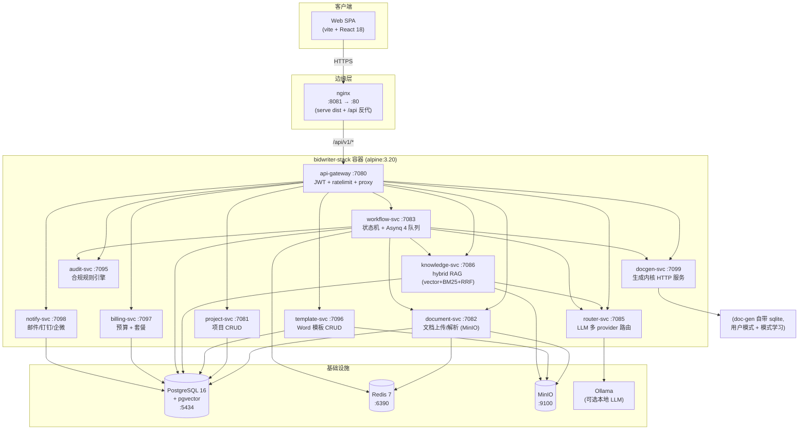
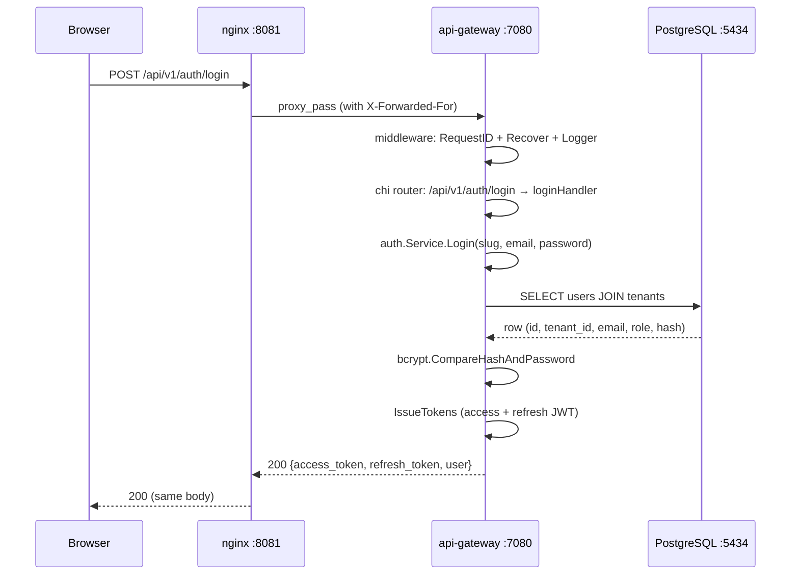
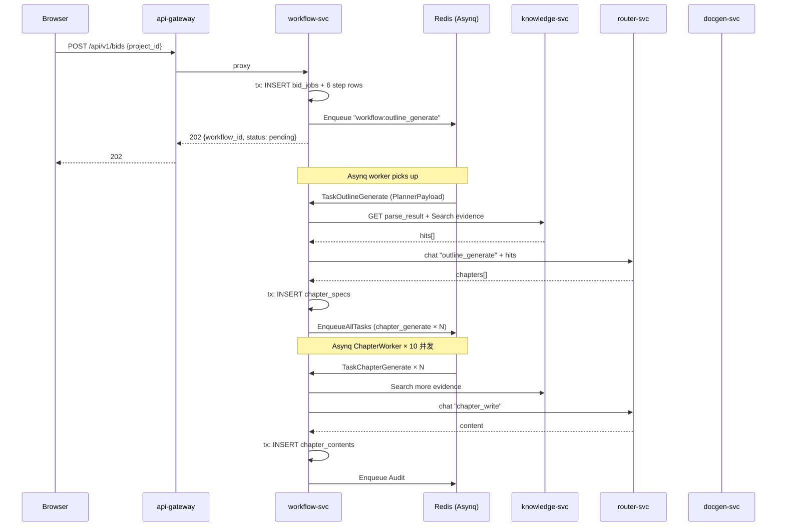

# 架构详细文档

> 与 `high-level-design.md`（产品视角的概要设计）互补，本文从 **代码工程视角** 描述当前 `main` 分支（commit `e73c712`，2026-07-13）的实际架构：11 个 Go 微服务的职责、边界、调用关系、数据流。
>
> 阅读对象：后端工程师、SRE、新加入项目的开发。

---

## 0. 设计原则（Why）

| 原则 | 体现 |
|---|---|
| **服务即产品** | 每个服务有独立 `cmd/` 入口、独立 `go.mod`、独立 Dockerfile（隐式） |
| **共享但不耦合** | `shared/` 提供 `db / httperr / logger / tenant / validator` 5 个包，**禁止反向依赖业务服务** |
| **接口隔离** | HTTP 层的依赖（store / service / parser）都用 interface 声明，便于单测注入 fake |
| **失败可恢复** | 所有跨服务调用走 HTTP + retry；长任务走 Asynq 队列，断电可续 |
| **租户硬隔离** | 每个请求必须从 context 拿 tenant_id（`tenant.FromContext`），DB 查询全部带 `WHERE tenant_id = $1` |
| **可观测性先行** | 每个请求一个 request_id（`middleware.RequestID`），贯穿日志 / 错误响应 |

---

## 1. 服务全景

### 1.1 一图概览



### 1.2 服务职责矩阵

| 服务 | 端口 | 主要职责 | 主要依赖 | 关键中间件 |
|---|---|---|---|---|
| **api-gateway** | 7080 | JWT 校验 / 限流 / 路由代理 | 所有业务服务 | chi + 自研 ratelimit |
| **project-svc** | 7081 | 项目（tenant 内子单位）CRUD | PG | chi + pgx |
| **document-svc** | 7082 | 文档上传、下载、**异步解析** | PG / MinIO / Redis | chi + pgx + asynq + minio-go |
| **workflow-svc** | 7083 | 标书状态机 + 异步编排 | PG / Redis / router / knowledge / document / audit / docgen | chi + pgx + asynq |
| **router-svc** | 7085 | LLM provider 抽象 / 路由 / 限流 | Ollama（可选）/ Anthropic / OpenAI / DeepSeek | chi + LRU |
| **knowledge-svc** | 7086 | 素材 CRUD / 混合检索 | PG (pgvector+tsvector) / MinIO / router | chi + pgx + minio-go |
| **audit-svc** | 7095 | 合规规则引擎 | 无外部依赖 | chi + pgx |
| **template-svc** | 7096 | Word 模板 CRUD | PG / MinIO | chi + pgx + minio-go |
| **billing-svc** | 7097 | 预算 / 交易 / 套餐 | PG | chi + pgx |
| **notify-svc** | 7098 | 多渠道通知 | PG / SMTP / 钉钉 webhook / 企微 webhook | chi + pgx + smtp |
| **docgen-svc** | 7099 | 生成内核 HTTP 入口（CLI 模式 bidgen 共享 Pipeline） | sqlite (内置) / LibreOffice (PDF) | net/http |

### 1.3 单容器部署模式

`bidwriter-stack` 用 **alpine:3.20 supervisor** 把 11 个 Go 二进制跑在一个容器里，由 `backend/scripts/stack-entrypoint.sh` 管理：

```
PID 1: sh /ep/stack-entrypoint.sh
  ├── supervisor (loop, 每 5s 检查子进程)
  ├── project-svc  :7081
  ├── document-svc :7082
  ├── workflow-svc :7083
  ├── router-svc   :7085
  ├── knowledge-svc:7086
  ├── audit-svc    :7095
  ├── template-svc :7096
  ├── billing-svc  :7097
  ├── notify-svc   :7098
  └── docgen-svc   :7099
api-gateway:7080  ← 唯一对外暴露端口
```

**为什么单容器**（参见 `start-stack.sh` 顶部注释）：
1. 11 个服务共享 `localhost`，无需 docker DNS / network alias
2. 一个 SIGTERM 全部优雅退出，无孤儿进程
3. 共享 PG / MinIO / Redis 连接的环境变量统一注入

---

## 2. 请求生命周期

### 2.1 一次「登录」请求的完整路径



**关键路径上的中间件（api-gateway）**：

```go
r := chi.NewRouter()
r.Use(middleware.RequestID)   // 注入 X-Request-Id
r.Use(middleware.Recover(log)) // panic → 500 + 日志
r.Use(middleware.Logger(log))  // 结构化访问日志
```

### 2.2 一次「生成章节」请求（异步路径）

标书创建 → workflow 触发 planner → enqueue outline → 4 步 enqueue chapter → 完成。



---

## 3. 状态机详解（workflow-svc 核心）

### 3.1 状态邻接表

```go
// backend/services/workflow-svc/internal/state/machine.go
var validTransitions = map[State][]State{
    StatePending:    {Parsing, Failed, Cancelled},
    StateParsing:    {Outlining, Failed, Paused, Cancelled},
    StateOutlining:  {Facts, Failed, Paused, Cancelled},
    StateFacts:      {Generating, Failed, Paused, Cancelled},
    StateGenerating: {Auditing, Failed, Paused, Cancelled},
    StateAuditing:   {Exporting, Failed, Paused, Cancelled},
    StateExporting:  {Done, Failed, Cancelled},
    StatePaused:     {/* any non-terminal */},
    StateFailed:     {Parsing, Cancelled},  // 可重试
    StateDone:       {},                     // 终态
    StateCancelled:  {},                     // 终态
}
```

### 3.2 HIL（人在回路）暂停点

系统在以下 3 处自动暂停，等待用户操作：

1. **Outlining 完成**：用户审阅章节大纲，可调整层级 / 合并 / 重命名
2. **Facts 完成**：用户审阅从 RFP + KB 抽取的事实
3. **Generating 中**（任意章节拒稿后）：用户审阅拒稿原因，可修改事实后恢复

恢复方式：`POST /api/v1/workflows/:id/transition { to: "generating", metadata: {...} }`，`metadata.target_chapter` 字段告诉 worker 从哪一章继续。

### 3.3 Asynq 任务类型与队列

| 任务类型 | 队列 | 并发 | 超时 | 重试 |
|---|---|---|---|---|
| `workflow:outline_generate` | planner (权重 1) | 共享 10 | 60min | 3 |
| `workflow:chapter_generate` | chapter (权重 10) | 共享 10 | 60min | 3 |
| `workflow:audit` | auditor (权重 2) | 共享 10 | 60min | 3 |
| `workflow:export` | exporter (权重 2) | 共享 10 | 60min | 3 |
| `document:parse` | parser (权重 1) | 共享 4 | 15min | 3 |

队列权重决定 Asynq 在 worker 池空闲时的派单优先级：chapter 是 10（高），其他是 1-2。

### 3.4 事件溯源（Event Log）

每次状态变更写一条 `workflow_events`：

```sql
INSERT INTO workflow_events (workflow_id, event_type, from_state, to_state, actor, metadata, created_at)
VALUES ($1, 'state_transition', 'pending', 'parsing', $actor, $metadata, NOW());
```

通过 `GET /api/v1/workflows/:id/events` 暴露给前端时间线（BidWorkspace 的右侧检查器）。

---

## 4. 数据流与持久化

### 4.1 PostgreSQL Schema 分组（17 个 migration）

| 编号 | 内容 | 服务 |
|---|---|---|
| `00001_init` | tenants, users, projects, audit_events + pgvector | 共享 |
| `00003_documents` | documents 表 | document-svc |
| `00004_workflows` | workflows, steps, events | workflow-svc |
| `00005_router` | provider_routing, model_costs | router-svc |
| `00006_init_bid_jobs` | bid_jobs, chapter_specs, chapter_contents, illustrations, evidence | workflow-svc |
| `00007_init_kb` | kb_materials, kb_chunks (vector), kb_evidence_links | knowledge-svc |
| `00008_init_audit` | audit_reports, audit_issues | audit-svc |
| `00009_init_templates` | word_templates | template-svc |
| `00010_init_billing` | billing_budgets, billing_transactions | billing-svc |
| `00011_init_notifications` | notification_preferences, notification_logs | notify-svc |
| `00012_chapter_content_text` | chapter_contents.content_text 全文检索列 | workflow-svc |
| `00013_kb_chunk_id_and_tsv` | kb_chunks.id → UUID + tsvector 触发器 | knowledge-svc |

详细 schema 见 `docs/database.md`。

### 4.2 MinIO Bucket 分组

| Bucket | 用途 | 写入方 | 读取方 |
|---|---|---|---|
| `bidwriter` | 导出文档 (.docx / .pdf)、上传 RFP | workflow-svc / document-svc | api-gateway (proxy 下载) |
| `kb-materials` | 知识库素材原文件 | knowledge-svc | knowledge-svc |
| `templates` | Word 模板原文件 | template-svc | template-svc / workflow-svc |

### 4.3 Redis 用法

| 数据 | 用途 | TTL |
|---|---|---|
| Asynq 队列 (`asynq:{queue}:*`) | 任务队列 | 任务 TTL |
| `asynq:dead` | 死信队列 | 永久（待人工处理）|
| `bidwriter:jwt:revoked:*` | (未来) JWT 黑名单 | token TTL |

---

## 5. 共享包（`backend/shared/`）

```
backend/shared/
├── go.mod
└── pkg/
    ├── db/          # pgxpool.Pool 工厂 + 健康检查
    ├── httperr/     # 统一错误响应格式 + 5xx/4xx helper
    ├── logger/      # slog 结构化日志 + RequestID 注入
    ├── tenant/      # 从 context 拿 tenant_id 的 helper
    └── validator/   # struct tag 校验 + 规则（hex64, mime 等）
```

**重要约束**：`shared/` **不** import 任何业务服务，反之亦然。共享包改动需要全服务回归（目前 5 个包都已有 100% 测试覆盖）。

---

## 6. 错误处理约定

### 6.1 HTTP 错误响应形状

```json
{
  "error": {
    "code": "INVALID_INPUT",
    "message": "邮箱或密码错误",
    "request_id": "61138cbd-352c-4266-93ed-9079f7a3dc9d",
    "details": {"field": "email"}
  }
}
```

| code | HTTP | 含义 |
|---|---|---|
| `INVALID_INPUT` | 400 | 参数校验失败 |
| `UNAUTHORIZED` | 401 | 凭据错误 |
| `FORBIDDEN` | 403 | 权限不足（owner-only 操作） |
| `NOT_FOUND` | 404 | 资源不存在 |
| `CONFLICT` | 409 | 乐观锁冲突（version 不匹配） |
| `INTERNAL_ERROR` | 500 | 兜底 |
| `NOT_IMPLEMENTED` | 501 | 不支持的格式 |
| `SERVICE_UNAVAILABLE` | 503 | 上游不可用（如 LibreOffice 未装） |

### 6.2 Panic 处理

- HTTP 层：`middleware.Recover(log)` 兜底 panic，写 ERROR 日志，返回 500
- 业务逻辑层：**禁止 panic**（除启动期配置校验），所有错误走 `error` 返回
- 启动期：`config.Load()` 用 `fmt.Errorf` 失败返回 `os.Exit(1)`，**不 panic**

---

## 7. 鉴权与租户隔离

### 7.1 JWT 结构

```json
{
  "tenant_id": "11111111-1111-1111-1111-111111111111",
  "sub": "aaaaaaaa-aaaa-aaaa-aaaa-aaaaaaaaaaaa",
  "role": "owner",
  "type": "access",
  "iss": "bidwriter",
  "exp": 1784000000,
  "iat": 1783913600
}
```

- `HS256` 签名
- `JWT_SECRET` 从 `JWT_SECRET` env 注入（`bidwriter-stack` 默认 `dev-only-jwt-secret-bidwriter-stack-please-rotate-in-prod`）
- 访问令牌 TTL 24h，刷新令牌 TTL 30d

### 7.2 租户注入流程

1. `api-gateway/auth` 校验 JWT，写入 `context.Context`：
   ```go
   ctx = tenant.WithTenant(ctx, claims.TenantID)
   ctx = context.WithValue(ctx, "user_id", claims.UserID)
   ctx = context.WithValue(ctx, "role", claims.Role)
   ```
2. 网关在 proxy 时把 tenant header 透传：`X-Tenant-ID`, `X-User-ID`
3. 下游服务（如 knowledge-svc）从 header 重新注入 context（`tenant.FromContext`）
4. 所有 SQL 必须带 `WHERE tenant_id = $1`，**任何遗漏都会被 code review 拦截**

### 7.3 角色矩阵

| 操作 | owner | member |
|---|---|---|
| 创建 / 删除标书 | ✓ | ✗ |
| 编辑章节内容 | ✓ | ✓（限分配的章节） |
| 提交审稿意见 | ✓ | ✓ |
| 上传知识库 | ✓ | ✓ |
| 修改套餐 | ✓ | ✗ |
| 邀请新成员 | ✓ | ✗ |

---

## 8. LLM Provider 路由（router-svc）

### 8.1 Provider 接口

```go
type Provider interface {
    Name() string                                          // "anthropic" | "openai" | "deepseek" | "ollama"
    Chat(ctx, ChatInput) (*ChatOutput, error)
    Embed(ctx, EmbeddingInput) (*EmbeddingOutput, error)
    EstimateCost(ChatInput) float64                         // USD 估算
    HealthCheck(ctx) error
}
```

4 个实现：`anthropic.go` / `openai.go`（DeepSeek 也走 OpenAI 兼容协议）/ `mock.go`（开发模式）。

### 8.2 路由策略

router-svc 当前实现 **简单 registry**（`MapRegistry`），不内置 fallback chain。生产部署建议用环境变量 `PROVIDER_FALLBACK=anthropic,deepseek` 启用 fallback（1.x 路线图）。

### 8.3 计费集成

每次 Chat 调用返回 `prompt_tokens` / `completion_tokens`，router-svc 用 `model_costs` 表查单价，**主动写一条 billing_transactions**：

```sql
INSERT INTO billing_transactions (tenant_id, provider, model, task_type, input_tokens, output_tokens, cost_cents, call_id)
VALUES (...)
```

billing-svc 在每个月初重置 budget（基于 `tenants.plan` + 上月 usage）。

---

## 9. 安全与性能

### 9.1 已实现

| 措施 | 位置 |
|---|---|
| JWT HS256 + tenant 硬隔离 | api-gateway/auth |
| bcrypt 密码哈希（cost=10） | api-gateway/auth.Login |
| 限流（per-IP token bucket） | api-gateway/ratelimit |
| SQL 注入防护 | 全部用 pgx prepared statement |
| 大小写敏感 | 全小写 schema 名 |
| 路径遍历防护 | document-svc 用 UUID 不接受 path |
| 异步解析避免 LLM 阻塞 HTTP | document-svc/parser.go + workers |
| 乐观锁 | documents.version / chapter_contents.version |
| Request ID 全链路 | middleware + logger |

### 9.2 待加固（1.x 路线图）

- [ ] JWT 黑名单（登出立即失效）
- [ ] Refresh token rotation（每次 refresh 旧 token 失效）
- [ ] RBAC 中间件（当前 owner/member 二元判断写在 handler）
- [ ] CSP / HSTS 头部
- [ ] Prometheus 指标暴露（容器在跑但没 scrape）
- [ ] Grafana dashboard 模板
- [ ] LLM 输出内容审核（暗标规则扫描）
- [ ] 文件上传 MIME 嗅探（防恶意伪装）

---

## 10. 部署拓扑

### 10.1 当前 demo 部署（你正在跑的）

```
Host (Ubuntu)
├── docker compose (backend/docker-compose.yml)
│   ├── bidwriter-postgres  (5432, unused — see bidwriter-pg-test)
│   ├── bidwriter-redis     (6379, unused — see bidwriter-redis)
│   ├── bidwriter-minio     (9000, unused — see bidwriter-minio-test)
│   ├── bidwriter-ollama    (11434)
│   ├── bidwriter-prometheus(9090)
│   └── bidwriter-grafana   (3000)
│
├── bidwriter-pg-test       :5434  ← PG (data in /home/ubuntu/bidwriter-pg-data)
├── bidwriter-redis         :6390  ← Redis
├── bidwriter-minio-test    :9100  ← MinIO
├── bidwriter-web           :8081  ← nginx serving dist (bind mount)
└── bidwriter-stack         :7080  ← 11 Go services supervisor
```

### 10.2 端口分配（必须保留）

| 端口 | 服务 | 备注 |
|---|---|---|
| 5432 | PG (compose) | **未用**，避开 ai-teacher 等冲突 |
| 5434 | PG (test) | **生产路径** |
| 6379 | Redis (compose) | 未用 |
| 6390 | Redis (test) | 生产路径 |
| 9100-9101 | MinIO (test) | 生产路径 |
| 7080 | api-gateway | 唯一对外 |
| 7081-7099 | 内部服务 | stack 内部，host 不暴露 |
| 8080 | (others) | 避开 ai-teacher-backend |
| 8081 | web (nginx) | 前端对外 |

---

## 11. 故障排查快查

| 现象 | 看哪里 | 命令 |
|---|---|---|
| 登录 500 | api-gateway.log | `docker exec bidwriter-stack tail -30 /logs/api-gateway.log` |
| 章节卡住 | workflow-svc.log | `grep "chapter:" /logs/workflow-svc.log` |
| 导出失败 | docgen-svc.log | `grep "pdf\|assemble" /logs/docgen-svc.log` |
| PG 鉴权失败 | bidwriter-pg-test 日志 | `docker logs bidwriter-pg-test --tail 20` |
| MinIO 上传失败 | minio-test 日志 | `docker logs bidwriter-minio-test --tail 20` |
| 全栈无响应 | stack 进程 | `docker exec bidwriter-stack ps aux` |
| Redis 满 | redis 日志 | `docker logs bidwriter-redis --tail 10` |

详细排查手册见 `docs/operations/troubleshooting.md`（后端 mkdocs 站点）。

---

## 12. 演进路线（1.x）

| 优先级 | 事项 | 影响范围 |
|---|---|---|
| P0 | JWT 黑名单 + Refresh rotation | api-gateway |
| P0 | document-svc 异步解析切到全部用户（目前仅 async=true） | document-svc |
| P1 | LLM Provider fallback chain | router-svc |
| P1 | Prometheus 指标 scrape | 全部服务 |
| P1 | CI markdown/mermaid lint 绿灯 | .github |
| P2 | RBAC 中间件 | 所有 handler |
| P2 | 章节实时协作（多人光标） | web |
| P2 | 离线导出 / 桌面客户端 | 新项目 |
| P3 | 模板市场（跨租户共享） | template-svc + 新服务 |

---

**文档版本**：基于 commit `e73c712`（2026-07-13）

**相关文档**：
- 概要设计：[high-level-design.md](high-level-design.md)
- 技术选型：[tech-selection.md](tech-selection.md)
- 设计纲要：[framework.md](framework.md)
- 数据库：[database.md](database.md)
- API：[api-spec.md](api-spec.md)
- 用户手册：[user-guide.md](user-guide.md)
