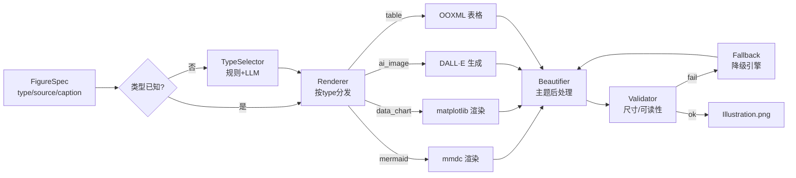
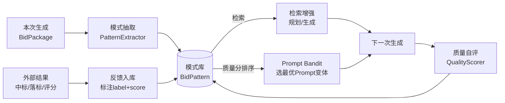

# 文档生成模块算法设计（doc-gen）

> 本文是 [架构设计](architecture.md) 的算法落地说明，覆盖材料索引、招标分析、大纲规划、章节生成、**图表生成与美化**、**自动学习迭代**、文档组装七大算法。
> 重点章节为 **第五章（图表美化）** 与 **第六章（学习迭代）**，用伪代码描述可实现的算法。

---

## 一、材料索引算法（Ingest）

### 1.1 目标
递归遍历材料目录，解析异构文件，分块向量化，建立可检索的本地索引。增量更新时只处理变化文件。

### 1.2 目录约定与识别

```
材料目录/
├── 招标文件.pdf            → category=rfp      (主输入)
├── 资质证书/               → category=qualification
├── 技术方案/               → category=technical
├── 业绩案例/               → category=performance
└── 历史标书/               → category=reference (学习源)
```

分类规则：路径关键字优先，否则按文件名/内容启发式归类（LLM 兜底）。

### 1.3 解析与分块

```
function ParseAndChunk(path) -> []Chunk:
    mime = DetectMime(path)
    text = switch mime:
        pdf      -> PopplerText(path) ∪ RegexPDFFallback(path)
        docx     -> ExtractDOCXParagraphs(path)   # 保留段落结构
        xlsx     -> SheetToText(path)             # 表格→Markdown表
        text/*   -> ReadUTF8(path)
    chunks = SemanticChunk(text, targetTokens=512, overlap=64)
    for c in chunks: c.category, c.file_path, c.offset = ...
    return chunks
```

**分块策略（语义分块）**：优先按标题/空行切段；超长段落按字符滑窗（512 token、64 重叠）；短段落向后合并至 ~256 token。中文按 1 token≈1.6 字估算。

### 1.4 向量化与索引

```
function BuildIndex(chunks) -> Index:
    batches = Batch(chunks, size=32)
    for b in batches:
        vecs = LLMEmbed(b.texts, model="text-embedding-3-small")  # 走 router-svc
        UpsertChunks(b, vecs)        # SQLite: chunks 表 + sqlite-vec 虚表
    BuildBM25Index(chunks)           # content_tsv 触发器 / 或内存倒排
```

### 1.5 增量索引

按 `(file_path, mtime, size)` 哈希判断变更；仅对变更文件重解析重嵌入，旧 chunk 按 file_path 删除后重建。保证 CLI 多次运行不重复付费嵌入。

---

## 二、招标文件分析算法（Analyzer）

### 2.1 目标
从 RFP 抽取**结构化画像** `RFPProfile`：评分项树（含权重）、资质门槛、★号废标条款、暗标规则，供 Planner 与 Auditor 复用。

### 2.2 两阶段抽取

```
function Analyze(rfp) -> RFPProfile:
    text = ParseAndChunk(rfp)[0..N]            # 取全文
    # 阶段1：LLM 结构化抽取（大上下文模型）
    profile = LLM(rfp_parse, prompt=结构化抽取模板, text=Truncate(text, 100k tok))
    # 阶段2：规则校验与补全
    profile.star_clauses  ∪= RegexStarClauses(text)   # 正则扫"★/星号/否则废标"
    profile.dark_rules    ∪= DetectDarkBid(text)       # 复用 document-svc 模式匹配
    profile.scoring_tree  = NormalizeWeights(profile.scoring_tree)  # 权重归一化到100
    return profile
```

### 2.3 评分项权重归一化

LLM 抽取的评分项权重常不闭合（子项和≠父项）。归一化算法：

```
function NormalizeWeights(node):
    if node.children:
        for c in node.children: NormalizeWeights(c)
        rawSum = sum(c.weight for c in node.children)
        if rawSum > 0:
            for c in node.children: c.weight = c.weight / rawSum * node.weight
    return node
```

### 2.4 评分项→章节映射

每个叶子评分项标注 `chapter_mapping`（建议落入的章节）。Planner 据此保证"分值高的评分项有专属章节响应"，Auditor 据此核对覆盖率。

---

## 三、大纲规划算法（Planner，学习增强）

### 3.1 目标
基于评分权重 + 历史中标模式，生成章节大纲，并按权重分配目标字数与图表清单。

### 3.2 权重→字数分配算法

核心思想：**评分权重越高，分配字数与图表越多**，同时受总字数预算约束。

```
function AllocateWords(scoring_items, totalBudget=60000) -> map[chapter]words:
    # 1. 按评分项权重映射到章节
    chapters = MapScoringItemsToChapters(scoring_items)
    # 2. 章节权重 = 其响应评分项权重之和
    for ch in chapters:
        ch.weight = sum(si.weight for si in scoring_items if si in ch.scoring_items)
    # 3. 基础字数 = 总预算 × (章节权重 / Σ权重)
    W = sum(ch.weight for ch in chapters)
    for ch in chapters:
        ch.target_words = round(totalBudget * ch.weight / W)
    # 4. 上下限裁剪：每章 [min=800, max=总预算×40%]
    Clamp(ch.target_words, 800, totalBudget*0.4)
    # 5. 重分配溢出/欠额
    RebalanceToTotal(chapters, totalBudget)
    return chapters
```

### 3.3 学习增强规划

```
function Plan(profile) -> Outline:
    # 检索同行业/同类型的高分历史大纲
    patterns = RetrievePatterns(profile.industry, profile.rfp_type, topK=3)
    # 融合：LLM 以"评分项 + 历史模式"为上下文生成大纲
    outline = LLM(outline_generate,
                  context = profile.scoring_tree + patterns.outline_templates,
                  prompt  = BanditSelectPrompt("outline"))   # 见 §6.3
    outline.chapters = AllocateWords(profile.scoring_items)
    # 标注每章图表需求（哪些评分项需图表佐证）
    for ch in outline.chapters:
        ch.figure_requirements = InferFigureNeed(ch, profile)
    return outline
```

`InferFigureNeed` 规则：评分项含"方案图/流程/组织/进度/对比"等关键字 → 标注需 mermaid/data_chart/table。

---

## 四、章节生成算法（Generator，RAG 接地）

### 4.1 流程

```
function Generate(outline) -> []Chapter:
    chapters = ParallelMap(outline.chapters, worker=GenerateOne, concurrency=10)
    return chapters

function GenerateOne(spec) -> Chapter:
    evidence = HybridSearch(spec.title + spec.scoring_items, topK=5)  # §复用 RRF
    prompt   = BanditSelectPrompt("content", spec)
    md       = LLM(content_generate, evidence, spec, prompt)
    # 自审：字数/评分项覆盖/禁造数据
    issues   = SelfAudit(md, spec)
    if issues.has_critical: md = LLM(revise, md, issues)   # 至多2次
    return Chapter{spec, md, evidence_refs}
```

### 4.2 防幻觉接地约束

- System Prompt 强制："所有数据必须来自 evidence，无证据则标注`[需补充]`"。
- 生成后正则扫描数值，与 evidence 比对，不符则标记待校验。
- 图表占位符格式 `[!figure:<type> caption=...]` 由 Generator 产出，Illustrator 解析。

---

## 五、图表生成与美化算法（Illustrator）★重点

### 5.1 总览流水线

```
FigureSpec → 类型选择 → 渲染(原始图) → 美化(主题后处理) → 校验 → Illustration(PNG)
                ↑ fallback 链：主引擎失败 → 降级引擎 → 占位图
```



### 5.2 图表类型选择算法（TypeSelector）

当 Generator 未指定 type 时，根据章节语义自动选择：

```
function SelectType(context) -> ChartType:
    # 规则优先（确定性、零成本）
    rules = [
        (含"流程|架构|时序|状态|甘特",  mermaid),
        (含"对比|趋势|占比|分布|雷达",  data_chart),
        (含"响应矩阵|参数表|清单",       table),
        (含"场景|示意|封面",             ai_image),
    ]
    for (keywords, type) in rules:
        if Match(context, keywords): return type
    # 规则未命中 → LLM 判定（带成本，可缓存）
    return LLM(image_type_select, context)  # 返回 type + source 草案
```

### 5.3 Mermaid 渲染与美化

```
function RenderMermaid(spec, theme) -> PNG:
    # 1. LLM 生成/修正 mermaid 源码（确保语法合法）
    src = spec.source or LLM(mermaid_generate, spec.caption, theme.mermaid_vars)
    src = ApplyMermaidTheme(src, theme)        # 注入 themeVariables
    # 2. 写临时 .mmd，shell-out mmdc
    png = Exec("mmdc", "-i", tmpMmd, "-o", tmpPng,
               "-t", theme.mermaid.theme,
               "-b", "transparent",
               "-w", theme.chart.width_px)
    # 3. 美化后处理（见 §5.7）
    return Beautify(png, theme)
```

**美化要点**：通过 `themeVariables` 注入企业主色（`primaryColor`/`lineColor`/`fontSize`），保证全篇图表配色一致；DPI 提升到 300；统一白底去透明（Word 兼容）。

### 5.4 数据图表渲染与美化（matplotlib）

```
function RenderDataChart(spec, theme) -> PNG:
    data = ParseData(spec.source)              # JSON: {type, series, labels}
    script = RenderTemplate("render/datachart.py.tmpl", {
        data, theme.palette, theme.font, theme.chart
    })
    png = Exec("python", script)               # 输出 PNG 到 stdout
    return png
```

**`datachart.py` 美化策略**（主题驱动）：

```python
# 1. 全局样式：企业字体 + 调色板循环
plt.rcParams.update({"font.family": theme.font, "font.size": theme.font.size})
colors = cycle(theme.palette)
# 2. 数据系列按调色板上色，避免默认杂色
for series, color in zip(data.series, colors):
    plot(series, color=color)
# 3. 去顶/右边框、虚线网格、轴标签加粗
sns.despine(); plt.grid(linestyle=theme.chart.grid_style, alpha=0.3)
# 4. 16:9 画布 + 300 DPI，预留 caption 空间
plt.figure(figsize=theme.chart.figure_size, dpi=theme.chart.dpi)
# 5. 数据标签：柱状图标数值、饼图标占比
```

### 5.5 AI 配图（ai_image）

```
function RenderAIImage(spec, theme) -> PNG:
    prompt = spec.source or LLM(image_prompt_generate, spec.caption, theme.style_hint)
    # 走 router-svc image_generate（DALL·E 3），已含缓存
    png = Router.ImageGenerate(prompt, size="1792x1024", quality="hd")
    return Beautify(png, theme)    # 统一加边框/水印/裁剪到16:9
```

### 5.6 表格渲染与美化

表格不走位图，直接生成 OOXML 原生表格（矢量、可编辑）：

```
function RenderTable(spec, theme) -> OOXML:
    rows = ParseTable(spec.source)              # Markdown 表 或 JSON
    xml = BuildOOXMLTable(rows, theme.table)    # 复用 document-svc renderTableXML
    # 美化：表头填充主题色+白字、斑马纹、等宽列、首列加粗
    ApplyTableTheme(xml, theme.table)
    return xml
```

### 5.7 统一美化层（Beautifier）

美化是**引擎无关的后处理**，保证四类图表视觉一致：

```
function Beautify(png, theme) -> PNG:
    img = Decode(png)
    # 1. 尺寸归一：统一最大宽 1600px，保持比例
    img = Resize(img, maxWidth=1600)
    # 2. 白底合成（消除透明导致的 Word 黑底）
    img = CompositeOnWhite(img)
    # 3. 一致边距与细边框（主题色 1px）
    img = AddBorder(img, theme.palette[0], width=1, padding=8)
    # 4. 高频锐化（提升 300DPI 下文字清晰度）
    img = UnsharpMask(img, amount=0.6)
    return Encode(img, format="png", dpi=300)
```

### 5.8 校验与 Fallback 链

```
function Validate(illust) -> bool:
    return illust.width >= 800 && NotBlank(illust) && AspectRatioInRange(illust)

# fallback 链记录在 Illustration.fallback_chain，供学习分析
fallbackChain = {
    mermaid:    [mmdc → mermaid.ink API → 占位图],
    data_chart: [matplotlib → go-echarts PNG → 简化表格 → 占位图],
    ai_image:   [DALL·E → SDXL → 占位图],
}
```

### 5.9 全篇一致性保证

`Illustrator` 在渲染前加载单一 `Theme`，所有 `FigureSpec.theme_override` 默认空。保证一份标书内：调色板一致、字体一致、DPI 一致、边框一致。`bidgen theme apply` 可对成稿整体换主题重渲染。

---

## 六、自动学习迭代算法（Learner）★重点

### 6.1 学习闭环总览



学习分四机制：**模式库**（存什么）、**检索增强**（怎么用）、**Prompt 进化**（怎么变好）、**反馈闭环**（怎么校准）。

### 6.2 标书模式库（PatternExtractor）

每次生成完，抽取可复用的**结构性模式**入库：

```
function ExtractPattern(bid) -> BidPattern:
    return BidPattern{
        industry     = bid.profile.industry,
        rfp_type     = ClassifyRFPType(bid.profile),
        outline_template = NormalizeOutline(bid.outline),   # 标题序列+层级+字数占比
        chart_distribution = ChartStats(bid.figures),       # 各类图数量/分布
        section_word_ratio = bid.chapters.words / total,    # 字数分配比例
        scoring_coverage   = CoveredScoringItems(bid),      # 评分项覆盖率
        quality_score      = QualityScore(bid),             # §6.5
        label              = bid.label or "draft",          # won/lost/draft
    }
```

模式按 `(industry, rfp_type)` 聚类；高 `quality_score` 且 `label=won` 的模式权重更高。

### 6.3 检索增强（Retrieval）

规划与生成时，从模式库检索相似样本注入上下文：

```
function RetrievePatterns(industry, rfp_type, topK=3) -> []BidPattern:
    # 向量检索：用 (industry, rfp_type, 评分项摘要) 的嵌入查模式库
    vec = Embed(f"{industry}|{rfp_type}|{scoring_summary}")
    cands = VectorSearch(patterns, vec, topK*3)
    # 按 quality_score × label_weight 排序
    ranked = Sort(cands, key = quality_score * LabelWeight(label))
    return ranked[:topK]

LabelWeight: won=1.5, draft=1.0, lost=0.5   # 落标样本降权但不丢弃（反面教材）
```

注入方式：把 top-3 模式的 `outline_template` 作为 few-shot 示例放进 Planner 的 prompt。

### 6.4 Prompt 进化（多臂老虎机）

每个生成任务（outline/content/mermaid）维护多个 **Prompt 变体**（臂），用 Thompson 采样平衡探索与利用：

```
# 每个变体 v 维护 Beta(α, β) 后验：α=成功次数, β=失败次数
function BanditSelectPrompt(task) -> PromptVariant:
    arms = PromptVariants[task]
    for v in arms:
        v.sample = BetaSample(v.α, v.β)      # Thompson 采样
    return argmax(v.sample)

# 生成后用 QualityScore 作为奖励更新后验
function UpdatePrompt(task, variant, reward):
    if reward >= threshold:  variant.α += 1
    else:                    variant.β += 1
    # 衰减旧数据（窗口），适应需求漂移
    Decay(arms, factor=0.95)
```

`reward` = 该次生成章节的质量分（§6.5）。这样**表现好的 Prompt 自然被更多选中**，差的被淘汰，无需人工调参。变体初始由人工设计 3-5 个（如不同结构、不同接地强度）。

### 6.5 质量评分模型（QualityScorer）

多维加权打分，既是学习奖励信号，也写进生成报告供人参考：

```
function QualityScore(bid) -> float:   # 0~100
    s = 0
    s += 30 * ScoringItemCoverage(bid)        # 评分项被响应比例（最重要）
    s += 15 * WordCountCompliance(bid)        # 字数达标率
    s += 15 * FigureRichness(bid)             # 关键章有图、图表类型合理
    s += 10 * EvidenceGrounding(bid)          # 数据可追溯到 evidence 比例
    s += 10 * ConsistencyScore(bid)           # 跨章数据/人员一致
    s += 10 * AuditPassRate(bid)              # 内审通过率
    s += 10 * DarkBidCompliance(bid)          # 暗标规则无违反
    return s
```

各子项均可程序化计算（评分项覆盖率=已响应/总数；字数达标=达标章/总章；图表丰富度=关键章有图比例 …）。

### 6.6 反馈闭环

外部结果回流：

```
function ApplyFeedback(bid_id, label, human_score):
    bid = Load(bid_id)
    bid.label = label                         # won / lost
    bid.human_score = human_score
    # 1. 更新模式库中对应 pattern 的 label/质量分
    UpdatePattern(bid.pattern_id, label, human_score)
    # 2. 更新本次所用 Prompt 变体的老虎机后验
    UpdatePrompt(bid.task, bid.prompt_variant, reward=human_score)
    # 3. 触发反向学习：落标样本抽取"可能失分点"供 Auditor 加强
    if label == "lost": EnrichAuditRules(bid)
```

`iterate` 子命令据此重生成：加载旧标书 + 反馈，Planner 优先参考 `won` 模式、规避 `lost` 模式的失分点。

### 6.7 学习的收敛与安全

- **冷启动**：模式库为空时退化为纯 LLM 规划（不阻断）。
- **防过拟合**：单模式被引用超过阈值后降权，鼓励多样性；保留探索（Thompson 采样本身保证）。
- **可解释**：每次规划记录"参考了哪些模式、选了哪个 Prompt 变体"写入 report.json，可追溯。
- **可回滚**：模式库与 Prompt 变体均为版本化数据，`bidgen learn --undo` 可撤销错误样本。

---

## 七、文档组装算法（Assembler）

### 7.1 流程

```
function Assemble(bid, theme) -> .docx:
    doc = NewOOXML(theme.styles)
    doc += TitlePage(bid.profile)
    doc += TOC(bid.outline)
    for ch in bid.chapters sorted by order:
        doc += Heading(ch)
        doc += MarkdownToOOXML(ch.md, theme)   # 含图表占位符替换
    doc += ResponseMatrix(bid.profile, bid.chapters)   # 响应矩阵附录
    doc += EvidenceIndex(bid.evidence_refs)            # 证据索引附录
    return ZipDOCX(doc)
```

### 7.2 图表嵌入（关键：占位符→图片）

```
function MarkdownToOOXML(md, theme):
    for each line:
        if line matches "[!figure:<type> caption=<c>]":
            fig = MatchFigure(bid.figures, c)
            if fig.type == "table":
                emit OOXMLTable(fig.ooxml)           # 矢量表格
            else:
                emit ImageParagraph(fig.png, theme)  # 嵌入PNG + 居中 + 图注
        else:
            emit 标题/列表/段落/表格(常规Markdown)
```

`ImageParagraph` 生成 `<w:drawing>` 内嵌图片，宽度按主题（页宽 90%），下方居中图注（小字号 + 主题色）。

### 7.3 主题应用到文档级

除了图表（§5），文档级样式（标题字号、正文字体、页边距、页眉页脚）也由 `theme.styles` 驱动，实现"一份标书一套视觉"。

---

## 八、算法复杂度与成本控制

| 算法 | 复杂度 | LLM 调用 | 成本控制手段 |
|---|---|---|---|
| Ingest | O(N_chunks) | embed 批量 | 增量索引 + embed 缓存 |
| Analyze | O(1) | 1 次 rfp_parse | 截断 + 大上下文模型 |
| Plan | O(C) | 1 次 outline_generate | 模式 few-shot + 缓存 |
| Generate | O(C) 并发 | C 次 content_generate | 并发 + 自审限2轮 |
| Illustrate | O(F) | F 次（mermaid/图类型选择）| 类型选择规则优先免 LLM；image 缓存 |
| Learn | O(C+F) | 0（纯统计）| 离线、不阻塞主流程 |
| Assemble | O(C+F) | 0 | 纯本地 OOXML |

（C=章节数, F=图表数）

---

> 架构与组件关系见 [架构设计文档](architecture.md)。
