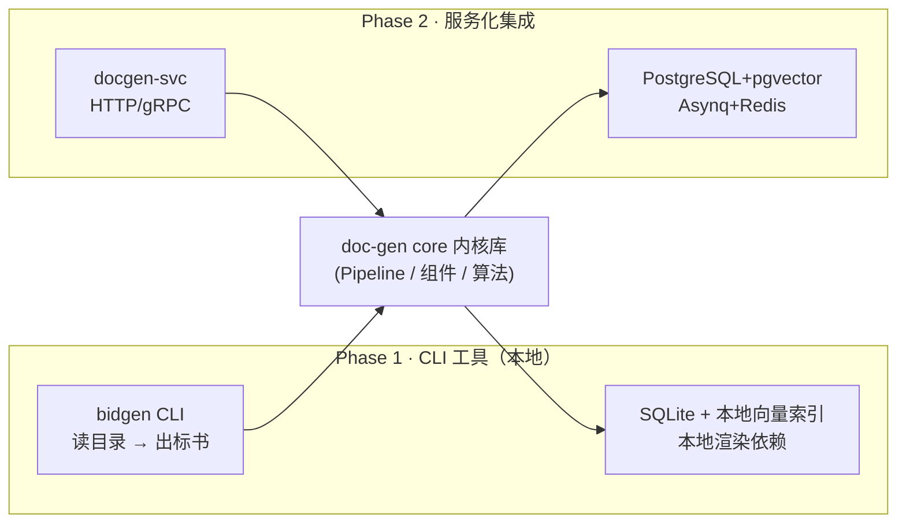
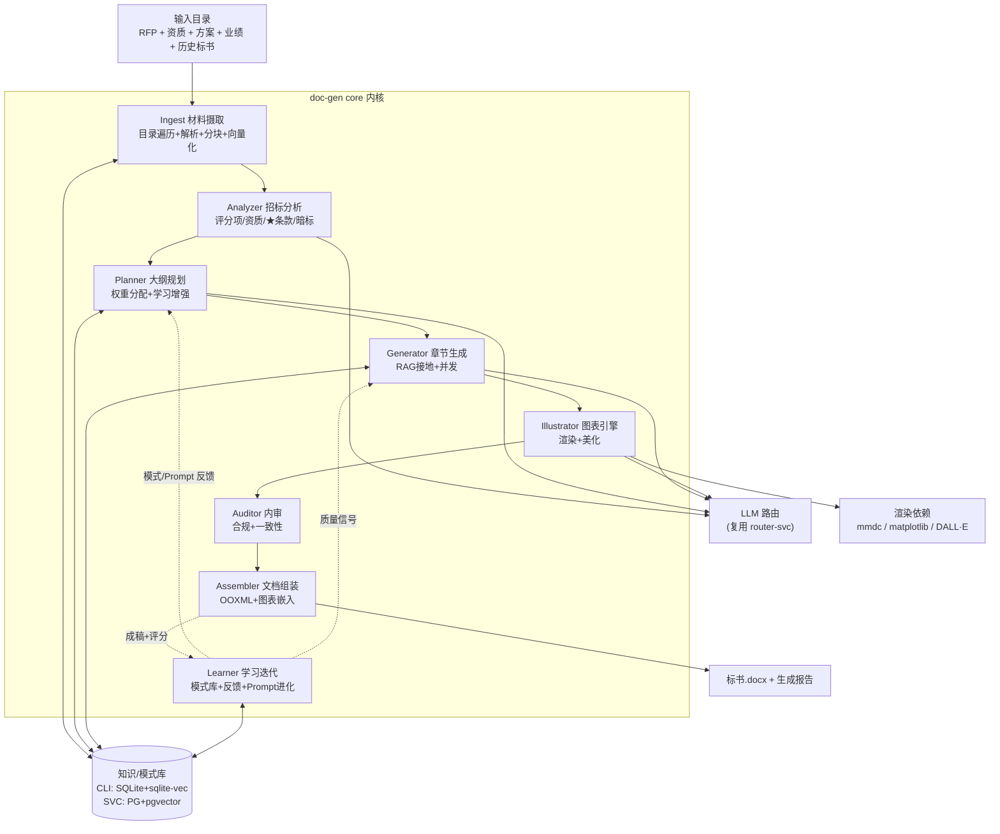
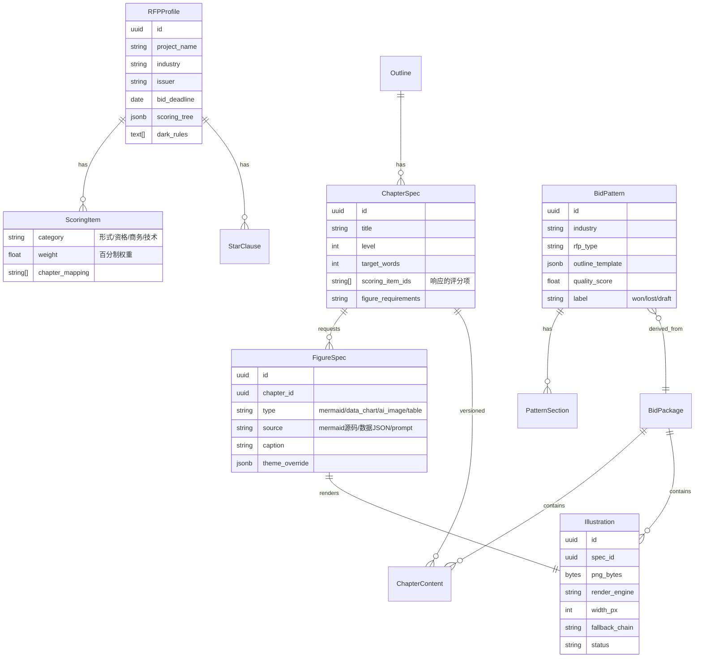
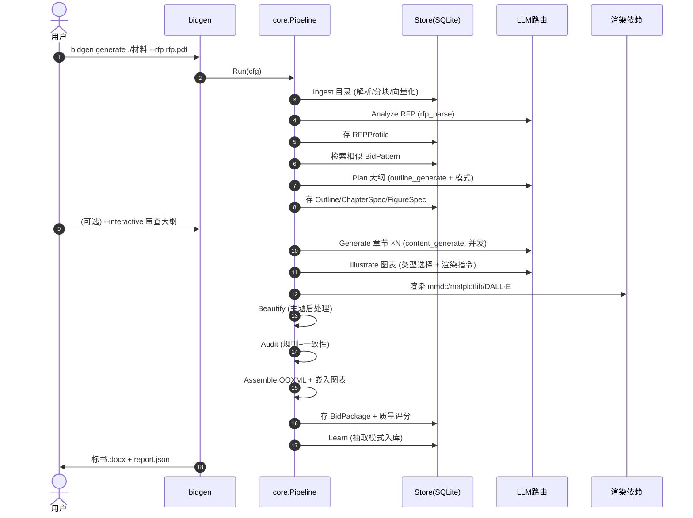
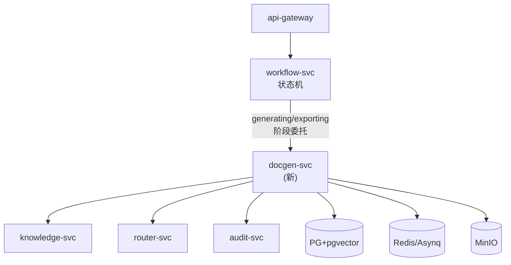

# 文档生成模块架构设计（doc-gen）

> 本模块是 AI 标书系统的**文档生产内核**：输入招标文件 + 企业材料目录，输出可直接交付的 Word/PDF 标书。
> 设计遵循"**CLI 优先、内核复用、服务化演进**"三原则——同一套核心逻辑既能作为命令行工具本地运行，也能无缝嵌入现有微服务体系。

---

## 〇、设计哲学

| 抽象 | 本质 |
|---|---|
| 标书 | 章节正文 + 图表库 + 响应矩阵 + 证据链 的结构化集合（非单一文档）|
| 图表 | 一等公民，与正文同生命周期：一起规划、一起生成、一起美化、一起审计 |
| 学习 | 每一次生成都是一次"训练样本"：模式入库 → 检索复用 → 反馈迭代 |
| 内核 | 与入口解耦的纯逻辑库，CLI / 服务 / 测试共享同一 Pipeline |

与现有 `document-svc`（仅做 RFP 解析 + 占位符导出）的区别：`doc-gen` 是**完整的生成内核**，补齐了图表渲染、美化、学习迭代三大短板，并向下兼容复用现有 router/knowledge 能力。

---

## 一、设计目标与原则

### 1.1 功能目标

1. **标书自动生成**：读取目录材料 → 自动规划章节 → RAG 接地生成正文 → 组装成稿
2. **图表美化**：流程图/数据图/配图/表格统一渲染，应用企业主题，保证全篇视觉一致
3. **自动学习迭代**：积累中标/落标样本，检索增强规划，Prompt 自进化，反馈闭环提质

### 1.2 非功能目标

| 维度 | 目标 |
|---|---|
| 可移植 | CLI 单二进制 + 可选渲染依赖，离线可用 |
| 可演进 | Phase1 CLI → Phase2 服务，零核心代码改动 |
| 可扩展 | 图表渲染器、学习策略、LLM Provider 均为插件接口 |
| 幂等 | 同输入同种子可复现（缓存 + 确定性调度）|

### 1.3 核心原则

- **内核与入口分离**：`core` 包是纯逻辑，不含 IO 绑定；`cmd/bidgen`（CLI）与 `cmd/docgen-svc`（服务）只是两个入口壳。
- **图表一等公民**：图表不是正文的附属占位符，而是独立 `FigureSpec → Illustration` 流水线，渲染后嵌入文档。
- **学习是离线累积**：v1 不做在线模型训练，靠"模式库 + 检索 + Prompt Bandit + 反馈评分"实现经验复用与渐进提质。
- **本地优先**：CLI 模式所有状态落 SQLite，不依赖 PG/Redis；服务模式切换到 PG/Redis 仅改 store 实现。

---

## 二、模块定位与演进路径



### Phase 1 — CLI 工具（本期重点）

```bash
# 读取目录，一键生成标书
bidgen generate ./投标材料 --rfp 招标文件.pdf --out 标书.docx

# 学习模式：把一份历史标书录入模式库
bidgen learn ./历史标书 --label won --industry IT

# 迭代模式：基于上次输出 + 反馈重新生成
bidgen generate ./投标材料 --ref 标书_v1.docx --feedback review.md
```

- 输入：一个材料目录（RFP + 资质 + 方案 + 业绩 + 可选历史标书）
- 输出：成稿 `.docx`（含嵌入图表）+ 生成报告 JSON
- 状态：本地 SQLite（`bidgen.db`）+ 本地向量索引（`sqlite-vec` / 嵌入式）
- 渲染：shell-out 到 `mmdc`(mermaid-cli) / `python`(matplotlib) / router-svc(DALL·E)

### Phase 2 — 服务化集成

- `docgen-svc` 暴露 `POST /api/v1/docgen/generate`（异步任务）+ `GET .../status`
- 内核不变，store 从 SQLite 换 PostgreSQL，队列从本地 channel 换 Asynq
- 接入现有 `workflow-svc` 状态机：`docgen-svc` 承担 `generating + exporting` 两阶段的全部逻辑
- 图表渲染从 shell-out 升级为常驻 Python 渲染 Worker（gRPC sidecar）

---

## 三、整体架构



数据流主线：`Ingest → Analyze → Plan → Generate → Illustrate → Audit → Assemble`，学习回路在 Assemble 之后回流到 Planner/Generator。

---

## 四、组件分解与职责

| 组件 | 职责 | 关键接口 | 复用现有 |
|---|---|---|---|
| **Ingest** | 递归遍历目录，按 MIME 解析（PDF/Word/Excel/文本），分块向量化入索引 | `Ingest(dir) → Index` | knowledge-svc 分块/embed 逻辑 |
| **Analyzer** | RFP 结构化抽取：评分项树(含权重)、资质门槛、★号废标条款、暗标规则 | `Analyze(rfp) → RFPProfile` | document-svc parser |
| **Planner** | 基于评分权重 + 历史中标模式规划章节大纲，分配目标字数与图表清单 | `Plan(profile, patterns) → Outline` | workflow-svc planner |
| **Generator** | 逐章 RAG 接地生成 Markdown 正文，并发执行，内置自审 | `Generate(outline) → []Chapter` | workflow-svc chapter worker |
| **Illustrator** | 图表流水线：类型选择 → 渲染 → 美化 → 校验，产出嵌入用 PNG | `Illustrate(specs) → []Figure` | **新建**（补齐短板）|
| **Auditor** | 内审：合规规则 + 跨章一致性 + 图表引用核对 | `Audit(bid) → Issues` | audit-svc rules |
| **Assembler** | Markdown→OOXML + 图表嵌入 + 主题样式 → .docx；可选 PDF | `Assemble(bid) → File` | document-svc exporter |
| **Learner** | 模式抽取入库、检索增强、Prompt Bandit、反馈评分 | `Learn(bid, outcome) → ()` | **新建** |

### 组件间契约

所有组件通过**纯数据结构**交互（`FigureSpec`、`Chapter`、`Outline` 等），不直接持有 IO 句柄。IO（DB/LLM/文件）通过注入的接口访问，保证内核可单测、可复用。

---

## 五、核心数据模型



### 关键设计点

- **`ChapterSpec.scoring_item_ids`**：把章节与评分项显式绑定，审计时核对"每个评分项是否被响应"，是质量评分的核心信号。
- **`FigureSpec → Illustration` 分离**：规格（要什么图）与产物（渲染结果）解耦，支持重渲染、换主题、fallback 链。
- **`BidPattern`**：学习产物的载体，按行业/RFP类型聚类，存大纲模板 + 质量分 + 标签。

---

## 六、目录结构

```
backend/services/doc-gen/
├── cmd/
│   ├── bidgen/              # Phase1 CLI 入口
│   │   └── main.go
│   └── docgen-svc/          # Phase2 服务入口（预留）
│       └── main.go
├── internal/
│   ├── core/                # 纯逻辑内核（CLI/服务共享）
│   │   ├── pipeline.go      # 编排全流程
│   │   ├── types.go         # FigureSpec/Chapter/Outline 等数据模型
│   │   └── config.go        # 主题/Provider/路径配置
│   ├── ingest/              # 目录摄取 + 本地索引
│   ├── analyzer/            # RFP 分析
│   ├── planner/             # 大纲规划（学习增强）
│   ├── generator/           # 章节生成
│   ├── illustrator/         # 图表引擎（渲染+美化）
│   │   ├── renderer.go      # Renderer 接口
│   │   ├── selector.go      # 类型选择
│   │   ├── mermaid.go       # mmdc shell-out
│   │   ├── datachart.go     # matplotlib shell-out
│   │   ├── aiimage.go       # router-svc DALL·E
│   │   ├── table.go         # 原生 OOXML 表格
│   │   ├── beautifier.go    # 主题后处理
│   │   └── theme.go         # 调色板/字体/尺寸
│   ├── auditor/             # 内审
│   ├── assembler/           # 文档组装（OOXML）
│   │   ├── ooxml.go
│   │   ├── markdown.go      # Markdown→OOXML（含图表嵌入）
│   │   └── pdf.go           # LibreOffice 转换
│   ├── learner/             # 学习迭代
│   │   ├── pattern.go       # 模式抽取
│   │   ├── retrieval.go     # 检索增强
│   │   ├── bandit.go        # Prompt 多臂老虎机
│   │   ├── feedback.go      # 反馈闭环
│   │   └── scorer.go        # 质量评分
│   └── store/               # 存储抽象
│       ├── store.go         # Store 接口
│       ├── sqlite.go        # Phase1: SQLite + sqlite-vec
│       └── postgres.go      # Phase2: PG + pgvector
├── themes/                  # 主题资产（YAML）
│   ├── default.yaml
│   └── corporate.yaml
├── render/                  # Python 渲染脚本（被 shell-out）
│   ├── datachart.py         # matplotlib 数据图
│   └── requirements.txt
├── configs/
│   └── bidgen.yaml          # CLI 默认配置
└── go.mod
```

---

## 七、CLI 工作流



### CLI 子命令

| 命令 | 作用 |
|---|---|
| `bidgen generate <dir>` | 主流程：生成标书 |
| `bidgen learn <dir> --label won` | 把历史标书录入模式库（离线学习）|
| `bidgen iterate <pkg> --feedback <f>` | 基于反馈迭代改进已有标书 |
| `bidgen theme apply <pkg> <theme>` | 对成稿重应用主题（换肤美化）|
| `bidgen index <dir>` | 仅摄取建索引（增量）|
| `bidgen report <pkg>` | 查看生成报告与质量评分 |

---

## 八、服务化集成方案（Phase 2）

### 与现有微服务的衔接



- `workflow-svc` 的 `generating` 阶段不再自己调 chapter worker，而是**整体委托**给 `docgen-svc`：`POST /api/v1/docgen/generate {bid_job_id}`。
- `docgen-svc` 内部跑完整 `Generate→Illustrate→Audit` 子流程，完成后回调 workflow 推进到 `exporting`。
- `exporting` 阶段调用 `docgen-svc` 的 `Assemble` 端点产出文件存 MinIO。
- **复用而非重建**：`docgen-svc` 的 LLM 调用走 `router-svc`，知识检索走 `knowledge-svc`，审计可走 `audit-svc`；`doc-gen core` 仅替换 store 实现。

### 接口契约（Phase 2 预留）

```
POST /api/v1/docgen/generate      { bid_job_id, options } → { task_id }
GET  /api/v1/docgen/tasks/:id     → { status, progress, report }
POST /api/v1/docgen/illustrate    { figure_specs } → { illustrations }
POST /api/v1/docgen/assemble      { bid_job_id, format } → { download_url }
POST /api/v1/docgen/learn         { bid_package_id, label } → {}
```

---

## 九、技术选型

| 层 | 选型 | 理由 |
|---|---|---|
| 内核语言 | Go 1.22 | 与现有后端一致，复用 shared/pkg；CLI 单二进制易分发 |
| 本地存储 | SQLite + sqlite-vec | CLI 零依赖嵌入式；向量检索够用 |
| 服务存储 | PostgreSQL + pgvector | 复用现有 knowledge-svc 栈 |
| LLM | 复用 router-svc | 多 Provider + 缓存 + 预算，已就绪 |
| Mermaid 渲染 | `mmdc`(mermaid-cli) shell-out | 官方引擎，主题可控 |
| 数据图渲染 | Python matplotlib（shell-out） | 图表美化生态最强 |
| AI 配图 | router-svc `image_generate`(DALL·E) | 已有路由 |
| 表格 | 原生 OOXML | 已实现，向量级清晰 |
| PDF | LibreOffice headless | 已验证 |
| 图表美化 | 主题 YAML + 渲染参数注入 | 引擎无关的一致性层 |
| 配置 | YAML + 环境变量 | 主题/Provider/路径可覆盖 |

### 渲染依赖的可插拔性

```go
// Renderer 是所有图表渲染器的统一接口
type Renderer interface {
    Type() string                                  // "mermaid" | "data_chart" | ...
    Render(ctx context.Context, spec FigureSpec, theme Theme) (*Illustration, error)
}
```

- CLI 模式：`MermaidRenderer` shell-out `mmdc`；`DataChartRenderer` shell-out `python render/datachart.py`。
- 服务模式：替换为常驻 gRPC Python Worker，消除进程启动开销。
- 无 `mmdc`/`python` 时：`ai_image`/`table` 仍可用，`mermaid`/`data_chart` 降级为占位符并告警。

---

## 十、配置与扩展点

### 主题示例（`themes/default.yaml`）

```yaml
palette: ["#1F4E79", "#2E75B6", "#9DC3E6", "#A9D18E", "#FFC000"]
font: { family: "微软雅黑", size_pt: 10 }
chart:
  dpi: 300
  grid_style: "dashed"
  figure_size: [10, 5.6]      # 16:9
mermaid:
  theme: "base"
  theme_variables: { fontSize: "14px", primaryColor: "#1F4E79" }
table:
  header_fill: "1F4E79"
  header_font_color: "FFFFFF"
  zebra: true
```

### 扩展点

| 扩展点 | 接口 | 用途 |
|---|---|---|
| `Renderer` | 图表渲染器 | 新增图表类型（如公式/甘特图）|
| `Store` | 存储后端 | SQLite ↔ PostgreSQL 切换 |
| `LLMClient` | LLM 访问 | 直连 / 走 router-svc |
| `LearningStrategy` | 学习策略 | Bandit / 检索 / 规则，可组合 |
| `Theme` | 视觉主题 | 企业换肤、行业模板 |

---

> 算法细节见同目录 [算法设计文档](algorithms.md)。
