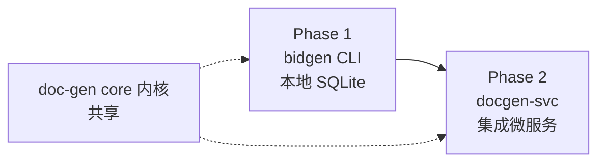

# 文档生成模块（doc-gen）

> AI 标书系统的文档生产内核：输入招标文件 + 企业材料目录，输出可交付的 Word/PDF 标书。
> 支持标书自动生成、图表美化、自动学习迭代；前期 CLI 工具，后期集成到前端服务。

## 文档索引

| 文档 | 内容 |
|---|---|
| [架构设计](architecture.md) | 模块定位、整体架构、组件分解、数据模型、CLI/服务演进、技术选型 |
| [算法设计](algorithms.md) | 材料索引、招标分析、大纲规划、章节生成、**图表美化**、**学习迭代**、文档组装 |

## 核心能力

- **标书自动生成**：读目录材料 → 评分项分析 → 大纲规划 → RAG 接地生成 → 组装成稿
- **图表美化**：流程图/数据图/配图/表格统一渲染，企业主题保证全篇视觉一致
- **自动学习迭代**：模式库 + 检索增强 + Prompt 老虎机 + 反馈闭环，渐进提质

## 演进路径

