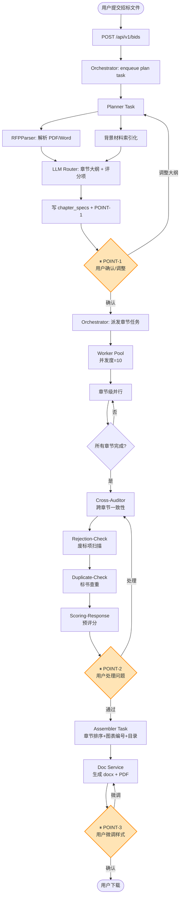
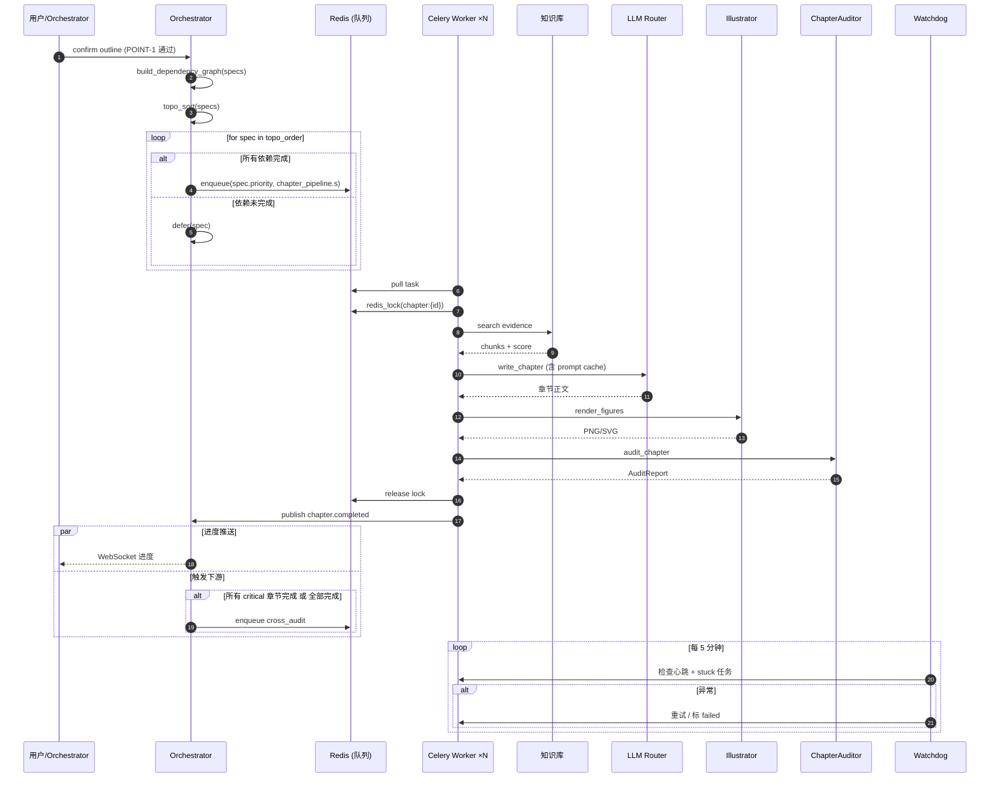
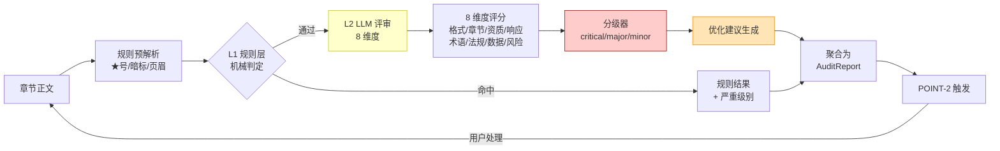
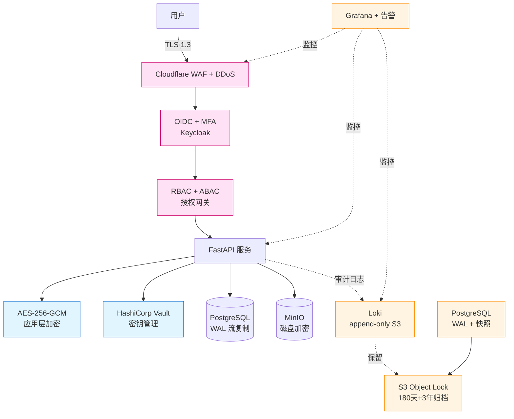
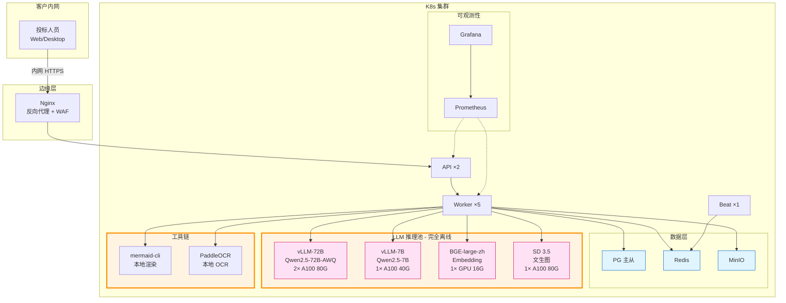

# 概要设计文档（HLD）

> 本文档基于 `docs/framework.md` 的设计纲要和 `docs/tech-selection.md` 的技术选型，给出系统的具体架构设计。
> 目标读者：开发工程师、架构师、测试工程师。

---

# 〇、文档约定

- **接口**：用 TypeScript-style 伪代码表示
- **数据流**：用文字 + ASCII 流程图描述
- **状态机**：用 ASCII 图表示
- **错误码**：统一前缀 `BID_` 开头

---

# 一、系统目标与边界

## 1.1 系统目标

实现"输入 RFP + 背景材料 → 自动生成完整标书"的端到端系统，支撑：

| 目标 | 量化指标 |
|---|---|
| 端到端延迟 | 50 章节 / 10 并发，≤ 10 分钟（不含人在回路） |
| 章节质量 | 最小字数 800/小节，合规条款响应率 100% |
| 图表质量 | 渲染成功率 ≥ 95%（含 fallback） |
| 跨章节一致性 | 术语统一率 ≥ 98%，数据矛盾 ≤ 0 |
| 失败恢复 | 单章节失败不阻塞其他，可重试可恢复 |
| 主输出格式 | **Word（.docx）**，PDF 为衍生品 |

## 1.2 系统边界

**在范围内**：
- RFP 解析（PDF/Word/Markdown）
- 章节规划、撰写、配图、审计、汇总
- 人在回路点（章节大纲确认、审计问题处理、最终样式微调）
- 知识库管理（公司资质、历史标书、技术文档）
- Word（主）/ PDF（衍生）输出

**不在范围内（MVP）**：
- 实时多人协作
- 移动端
- 跨语言（先支持中文）
- 自动投标（只生成标书，不参与投标流程）

## 1.3 非功能性需求

| 维度 | 指标 |
|---|---|
| 可用性 | ≥ 99.5%（单实例） |
| 并发 | 至少 10 章节并行 + 5 人在回路点 |
| 数据持久性 | 零丢失（异常关闭后可恢复） |
| 可观测 | 端到端追踪、日志结构化、指标全覆盖 |
| 安全 | 敏感数据加密、API Key 不落地前端 |
| 输出格式 | Word 一等公民，PDF 衍生 |

---

# 二、组件架构

## 2.1 顶层架构图

```
┌────────────────────────────────────────────────────────────────────┐
│                        客户端（Web / Desktop）                       │
│                                                                    │
│  ┌────────────┐  ┌────────────┐  ┌────────────┐  ┌────────────┐    │
│  │ RFP 上传    │  │ 进度可视化  │  │ 人在回路交互 │  │ 文档下载    │    │
│  └────────────┘  └────────────┘  └────────────┘  └────────────┘    │
└────────────────────────────────────────────────────────────────────┘
                          │ HTTPS / IPC（OpenAPI 3.1）
                          ↓
┌────────────────────────────────────────────────────────────────────┐
│                        API 网关（FastAPI）                          │
│   ┌──────┐ ┌──────┐ ┌──────┐ ┌──────┐ ┌──────┐ ┌──────┐         │
│   │ 鉴权  │ │ 限流  │ │ 路由  │ │ 缓存  │ │ 监控  │ │ OpenAPI│        │
│   └──────┘ └──────┘ └──────┘ └──────┘ └──────┘ └──────┘         │
└────────────────────────────────────────────────────────────────────┘
        │                  │                  │
        ↓                  ↓                  ↓
┌─────────────────┐ ┌─────────────────┐ ┌─────────────────┐
│   编排服务       │ │   知识库服务     │ │   文档服务       │
│ Orchestrator    │ │  KB Service     │ │  Doc Service    │
│                 │ │                 │ │                 │
│ · 状态机         │ │ · 文档索引化     │ │ · 文件存储       │
│ · 章节任务派发   │ │ · 全文检索       │ │ · Word 模板     │
│ · 人在回路点     │ │ · 证据链         │ │ · Markdown→docx │
│ · 暂停/恢复      │ │ · 素材推荐       │ │ · docx→pdf      │
└─────────────────┘ └─────────────────┘ └─────────────────┘
        │                  │                  │
        ↓                  ↓                  ↓
┌────────────────────────────────────────────────────────────────────┐
│                   任务队列（Celery + Redis）                         │
│                                                                    │
│   ┌──────────┐ ┌──────────┐ ┌──────────┐ ┌──────────┐ ┌──────────┐│
│   │ planner  │ │ writer-q │ │ illust-q │ │ auditor-q│ │export-q  ││
│   └──────────┘ └──────────┘ └──────────┘ └──────────┘ └──────────┘│
│       ↑             ↑              ↑           ↑           ↑       │
│       └────────── 优先级分片 + 并发控制 + 重试 + 心跳 ─────────┘    │
└────────────────────────────────────────────────────────────────────┘
        │              │              │              │
        ↓              ↓              ↓              ↓
┌────────────────────────────────────────────────────────────────────┐
│                     AI 路由层（LLM Router）                         │
│                                                                    │
│   ┌────────────┐ ┌────────────┐ ┌────────────┐ ┌────────────┐    │
│   │ 任务路由    │ │ Prompt 缓存 │ │ 重试+熔断   │ │ 成本核算    │    │
│   └────────────┘ └────────────┘ └────────────┘ └────────────┘    │
└────────────────────────────────────────────────────────────────────┘
        │              │              │              │
        ↓              ↓              ↓              ↓
   ┌────────┐    ┌────────┐    ┌────────┐    ┌────────┐
   │Claude  │    │DeepSeek│    │ GPT-4o │    │ 本地模型│
   │ Sonnet │    │  V3    │    │  mini  │    │(可选)  │
   └────────┘    └────────┘    └────────┘    └────────┘
        │              │              │              │
        ↓              ↓              ↓              ↓
┌────────────────────────────────────────────────────────────────────┐
│                图表渲染层（Illustration Renderer）                  │
│                                                                    │
│   ┌──────────┐ ┌──────────┐ ┌──────────┐ ┌──────────┐ ┌────────┐│
│   │ Mermaid  │ │ DALL-E 3 │ │matplotlib│ │ 自实现表格 │ │智能截图││
│   └──────────┘ └──────────┘ └──────────┘ └──────────┘ └────────┘│
│       ↑             ↑              ↑            ↑            ↑    │
│       └────── mermaid.ink / Replicate / 本地 / pandoc / 多源 ──┘    │
└────────────────────────────────────────────────────────────────────┘
                            │
                            ↓
┌────────────────────────────────────────────────────────────────────┐
│                       存储层                                       │
│                                                                    │
│   ┌────────────────┐ ┌────────────────┐ ┌────────────────┐        │
│   │  PostgreSQL    │ │   Redis         │ │   S3 (MinIO)   │        │
│   │ · 元数据        │ │ · 任务队列      │ │ · 章节正文     │        │
│   │ · 章节规格      │ │ · 任务锁        │ │ · 图表源码     │        │
│   │ · 响应矩阵      │ │ · Prompt 缓存   │ │ · 渲染产物     │        │
│   │ · 证据链        │ │ · 检索缓存      │ │ · Word/PDF    │        │
│   │ · 全文索引      │ │ · 会话          │ │ · 用户上传     │        │
│   └────────────────┘ └────────────────┘ └────────────────┘        │
└────────────────────────────────────────────────────────────────────┘
```

## 2.2 关键数据流

### 2.2.1 用户提交 → 标书生成

```
[客户端]  RFP + 材料
   │ (HTTPS upload)
   ↓
[API] POST /api/v1/bids → 创建 BidJob (status=pending)
   │
   ↓
[Orchestrator] enqueue(PlannerTask)
   │
   ↓
[Planner Worker]
   ├──→ [KB] 索引化 RFP + 材料
   ├──→ [LLM Router] 生成章节大纲
   └──→ 写库 + 触发人在回路点 1
   │
   ↓
[用户在回路点 1] 确认/调整大纲
   │
   ↓ (按章节 spec 并发 enqueue)
[Writer Queue × N]
   │
   ↓
[Writer Worker × N] 并发
   ├──→ [KB] 检索章节素材
   ├──→ [LLM Router] chat (Prompt 缓存命中)
   ├──→ [Illustrator] 渲染章节内图表
   ├──→ [Auditor] 章节内一致性审计
   └──→ 写库 + 触发人在回路点 2 (如有 issue)
   │
   ↓
[Cross Auditor]
   ├──→ 响应矩阵交叉
   ├──→ 术语/数据一致性
   └──→ 触发人在回路点 2
   │
   ↓
[用户在回路点 2] 处理审计问题
   │
   ↓
[Assembler]
   ├──→ 章节排序/编号
   ├──→ 图表编号统一
   ├──→ 交叉引用解析
   ├──→ Markdown → docx 渲染
   └──→ 触发人在回路点 3
   │
   ↓
[用户在回路点 3] 样式微调
   │
   ↓
[Doc Service]
   ├──→ 主输出：Word（python-docx）
   └──→ 衍生：PDF（LibreOffice headless）
   │
   ↓
[客户端] 下载 docx / pdf
```

### 2.2.2 单章节内部数据流（重点）

```
[Writer Worker]
   │ 拿锁 (redis_lock chapter:{id})
   ↓
[1] 检索素材 → KB Service → search(spec)
   ↓
[2] 构造 Prompt → 加入 cache_control 标记
   ↓
[3] LLM Router.chat (chapter_write) → Markdown 内容
   ↓
[4] 占位符扫描 → [FigureSpec × N]
   ↓
[5] 串行图表渲染 (illustrator_service.generate × N)
   │    ├──→ 查 illustrations 表（命中即跳过）
   │    ├──→ 数据准备 → 渲染 → 校验
   │    └──→ 失败 → fallback 链
   ↓
[6] 章节内审计 (chapter_auditor)
   ↓
[7] 字数校验（不达标 → 扩写循环）
   ↓
[8] 写库 + 释放锁
   │
   ↓
发 chapter.completed 事件 → Orchestrator
```

## 2.3 核心服务职责

### 2.3.1 编排服务（Orchestrator）

```typescript
interface Orchestrator {
    // 启动端到端流程
    async startBidGeneration(input: BidGenerationInput): Promise<BidJob>
    async pauseBidJob(jobId: string): Promise<void>
    async resumeBidJob(jobId: string): Promise<void>
    async redoChapter(jobId: string, chapterId: string): Promise<void>
    async getBidJobStatus(jobId: string): Promise<BidJobStatus>
    
    // 人在回路点
    async awaitHumanReviewPoint(jobId: string, point: HumanReviewPoint): Promise<ReviewRequest>
    async submitHumanDecision(jobId: string, point: HumanReviewPoint, decision: ReviewDecision): Promise<void>
}
```

### 2.3.2 知识库服务（KB Service）

```typescript
interface KBService {
    async ingestDocument(file: UploadedFile): Promise<Document>
    async search(query: string, filters: SearchFilters): Promise<SearchHit[]>
    async getEvidence(evidenceId: string): Promise<Evidence>
    async linkEvidenceToChapter(evidenceId: string, chapterId: string): Promise<void>
}
```

### 2.3.3 文档服务（Doc Service）

```typescript
interface DocService {
    async storeChapterContent(chapterId: string, content: string, version: number): Promise<Path>
    async loadChapterContent(chapterId: string, version: number): Promise<string>
    async renderWordTemplate(templateId: string, data: TemplateData): Promise<Buffer>
    
    // 主输出
    async exportToWord(bidJobId: string, options: WordExportOptions): Promise<Buffer>
    
    // 衍生
    async exportToPDF(bidJobId: string): Promise<Buffer>
}
```

### 2.3.4 AI 路由层（LLM Router）

```typescript
interface LLMRouter {
    async chat(taskName: string, request: ChatRequest): Promise<ChatResponse>
    async chatJson<T>(taskName: string, request: ChatRequest, schema: Type<T>): Promise<T>
    async embed(text: string): Promise<number[]>
}
```

### 2.3.5 图表渲染服务（Illustrator Service）

```typescript
interface IllustratorService {
    // 主入口：从 FigureSpec 渲染
    async render(spec: FigureSpec, evidence: Evidence[]): Promise<Illustration>

    // 各类型单独入口（便于测试和复用）
    async renderMermaid(source: string, options?: MermaidOptions): Promise<Buffer>
    async renderAIDiagram(prompt: string, style?: string): Promise<Buffer>
    async renderDataChart(data: DataSeries, chartType: ChartType): Promise<Buffer>
    async renderTable(headers: string[], rows: string[][]): Promise<Buffer>
}
```

### 2.3.6 解析服务（RFP Parser Service）

对应需求 §3.1（招标文件智能解析），将异构源（PDF/Word/扫描件）解析为统一结构化目录，输出评分项、资质门槛、★号条款、暗标规则，供下游 Planner、Auditor、Scoring 复用。

```typescript
interface RFPParserService {
    // 入口：从异构源解析
    async parse(file: UploadedFile): Promise<ParsedRFP>
    // 章节结构 + 评分项 + 资质门槛 + 隐性要求（合并为一次大调用）
    async extractStructure(parsed: ParsedRFP): Promise<RFPStructure>
    // 单独用于"试解析"或"增量重解析"
    async extractScoringItems(parsed: ParsedRFP): Promise<ScoringItem[]>
}

interface ParsedRFP {
    file_id: string
    file_type: 'pdf_text' | 'pdf_scanned' | 'docx'
    raw_text: string                       // 全文（含分页边界）
    pages: ParsedPage[]
    metadata: {
        project_name: string
        project_id: string
        issuer: string
        bid_deadline: Date
        budget: number | null
        industry: IndustryTag                // 行业标签（影响 §5.12 行业适配）
    }
    parse_duration_ms: number
}

interface RFPStructure {
    sections: RFPSection[]                  // 树形目录
    scoring_items: ScoringItem[]            // 评分项（含权重）
    qualifications: QualificationRequirement[]
    hidden_requirements: HiddenRequirement[] // 脚注/附件/备注
    star_clauses: StarClause[]              // ★号条款（废标红线）
    dark_label_rules: DarkLabelRule[]       // 暗标规则
}

interface ScoringItem {
    id: string
    category: 'preliminary_form'           // 形式评审
          | 'preliminary_qual'             // 资格评审
          | 'preliminary_response'         // 响应性审查
          | 'detailed_business'            // 商务评分
          | 'detailed_technical'           // 技术评分
    weight: number                          // 分值（百分制子项权重）
    sub_items: ScoringSubItem[]            // 子项
    description: string
    chapter_mapping: string[]               // 建议落到的章节 id
}

interface StarClause {
    id: string
    text: string
    location: { page: number, section: string }
    severity: 'rejection' | 'mandatory'    // 废标红线 / 必含条款
    rationale: string                       // LLM 解释"为什么判定为 ★"
}
```

**解析流水线**：

```
[客户端] POST /api/v1/parse (multipart)
   ↓
[RFPParserService]
   │
   ├─ [1] 文件类型识别
   │     PDF 文本型：PyMuPDF（fitz）直接抽文本
   │     PDF 扫描型：Tesseract / PaddleOCR（异步队列，不阻塞主流程）
   │     Word：python-docx → Markdown 中间态
   │
   ├─ [2] 结构化分块（按章节标题 / 页码 / 段落）
   │
   ├─ [3] LLM 并行抽取（4 个并发 prompt）
   │     ├─ 章节大纲 → JSON 树
   │     ├─ 评分项 → JSON 列表（含权重、category）
   │     ├─ 资质门槛 → JSON 列表
   │     └─ ★号条款 → JSON 列表（高优先级 prompt + 二次复核）
   │
   ├─ [4] 暗标规则检测
   │     关键词匹配（"不得出现公司名称" 等）+ LLM 二次确认
   │
   └─ [5] 写到 bid_jobs.parse_result (JSONB) + 入 evidence
   ↓
[API] 返回 ParsedRFP（含 structure.scoring_items / star_clauses）
   ↓
[Planner] 根据 scoring_items 生成 chapter_specs 并校准优先级与篇幅
```

**性能保证**（百万字 ≤ 60 秒）：

| 阶段 | 时间预算 | 说明 |
|---|---|---|
| 文本提取 | ≤ 5s | PyMuPDF C++ 内核 |
| LLM 抽取（4 并发） | ≤ 30s | Claude Sonnet 4.6 + cache_control |
| 暗标 + 资质检测 | ≤ 5s | 关键词预筛 + LLM 兜底 |
| 写库 + 索引 | ≤ 5s | 异步写 |
| 余量 | 15s | 长尾 IO |

**关键技术决策**：
- **PDF 文本型用 PyMuPDF**：比 pdfplumber 快 3-5 倍（C++ 内核）
- **扫描件走异步队列**：不让用户等 OCR，先返回"解析中"状态
- **LLM 抽取用 cache_control**：章节标题、评分项模板可缓存复用
- **★号条款二次复核**：第一遍抽取 → 第二遍独立 prompt 校验召回率，漏召回即阻断

### 2.3.7 评分响应服务（Scoring Response Service）

对应需求 §3.5（评分响应与优化模块），与解析服务、章节规划、审计模块联动，是 POINT-2 人在回路的核心数据源。

```typescript
interface ScoringResponseService {
    // 响应清单生成（前置：章节规划后立即触发）
    async generateResponseMatrix(
        bid_job_id: string,
        scoring_items: ScoringItem[]
    ): Promise<ResponseMatrix>

    // 篇幅智能分配（根据评分权重）
    async allocateWordBudget(
        scoring_items: ScoringItem[]
    ): Promise<WordBudgetAllocation[]>

    // 预评分（后置：跨章节审计完成后触发）
    async preScore(
        bid_job_id: string,
        bid_content: BidContent
    ): Promise<PreScoreReport>

    // 机器可读性评估
    async evaluateMachineReadability(
        content: string
    ): Promise<MachineReadabilityReport>

    // 技术方案优化建议
    async suggestOptimizations(
        chapter_id: string
    ): Promise<OptimizationSuggestion[]>
}

interface ResponseMatrix {
    items: ResponseItem[]
    coverage_rate: number                   // 覆盖率（已响应 / 总项）
    unaddressed: ScoringItem[]              // 未覆盖的项（关键风险）
}

interface ResponseItem {
    scoring_item_id: string
    requirement_text: string
    response_chapter_id: string
    response_summary: string
    evidence_refs: string[]
    compliance_status: 'fully' | 'partial' | 'unaddressed'
    score_estimate: number                  // 0-该项满分，预估得分
    confidence: number                      // 0-1
}

interface PreScoreReport {
    total_score: number                     // 总分（百分制）
    max_score: number
    score_breakdown: ScoreBreakdownItem[]   // 按章节/评分项拆解
    weak_points: WeakPoint[]                // 薄弱点
    optimization_suggestions: OptimizationSuggestion[]
}

interface WeakPoint {
    location: { chapter_id: string, paragraph: string }
    scoring_item_id: string
    issue: string
    expected_score: number
    current_score: number
    severity: 'critical' | 'major' | 'minor'
}

interface OptimizationSuggestion {
    location: { chapter_id: string, paragraph: string }
    dimension: 'specificity'                // 表述具体性
              | 'data_support'              // 数据支撑
              | 'term_accuracy'             // 术语准确性
              | 'depth'                     // 方案深度
    current_snippet: string
    suggested_action: string
    expected_score_gain: number
}
```

**与现有服务的联动**：

```
[Parser] ──→ scoring_items ──→ [Scoring Response]
                                  │
                                  ├─→ [Planner] 校准 chapter_specs（priority、target_word_count）
                                  │
                                  ├─→ [Auditor] 提供"评分项→章节"对照（FR-3.4-B-3 实质性响应）
                                  │
                                  └─→ [POINT-2] 人在回路：弱点评分 + 优化建议
```

---

# 三、核心流程设计

## 3.1 端到端流程

```
用户提交                                  用户确认/调整          用户处理问题          用户微调样式
   ↓                                         ↓                    ↓                    ↓
[API] POST /api/v1/bids                  ⏸ POINT-1           ⏸ POINT-2           ⏸ POINT-3
   ↓                                         ↓                    ↓                    ↓
[Orchestrator] pending                            ↓                    ↓                    ↓
   ↓                                         ↓                    ↓                    ↓
[Planner Task]                                          ↓                    ↓                    ↓
   ├─ 解析 RFP                                                     ↓                    ↓
   ├─ 索引化背景材料                                                   ↓                    ↓
   ├─ LLM 生成章节大纲 + 规格清单                                       ↓                    ↓
   └─ 写库 → POINT-1                                                   ↓                    ↓
                                                                       ↓                    ↓
[Orchestrator] 派发章节任务（celery_group, 并发度=10）                       ↓                    ↓
                                                                       ↓                    ↓
   ┌────────────────────────────────────────────────────┐               ↓                    ↓
   │ 章节级并行（每章节独立）                              │               ↓                    ↓
   │  ┌────┐ ┌────┐ ┌────┐ ... ┌────┐                   │               ↓                    ↓
   │  │Ch 1│ │Ch 2│ │Ch 3│     │Ch N│  并发度 = 10     │               ↓                    ↓
   │  └────┘ └────┘ └────┘     └────┘                   │               ↓                    ↓
   │    ↓      ↓      ↓          ↓                      │               ↓                    ↓
   │    撰写+图表+内审 串行执行                              │               ↓                    ↓
   │    (Prompt 缓存复用：章节规格 / 章节正文)              │               ↓                    ↓
   └────────────────────────────────────────────────────┘               ↓                    ↓
                                                                       ↓                    ↓
[Orchestrator] 收集所有章节完成信号                                       ↓                    ↓
                                                                       ↓                    ↓
[Cross-Auditor Task] 跨章节一致性审计                                       ↓                    ↓
                                                                       ↓                    ↓
[Rejection-Check Task] 废标项扫描                                             ↓                    ↓
                                                                       ↓                    ↓
[Duplicate-Check Task] 标书查重                                                 ↓                    ↓
                                                                       ↓                    ↓
[Orchestrator] 触发 POINT-2 → 用户处理 → POINT-2 通过                              ↓                    ↓
                                                                                 ↓                    ↓
[Assembler Task] 标书汇总                                                         ↓                    ↓
   ├─ 章节排序、编号                                                                  ↓                    ↓
   ├─ 图表编号统一                                                                       ↓                    ↓
   ├─ 交叉引用解析                                                                         ↓                    ↓
   ├─ 目录自动生成                                                                          ↓                    ↓
   └─ 输出 docx（主）                                                                       ↓                    ↓
                                                                                            ↓                    ↓
[Orchestrator] 触发 POINT-3                                                                 ↓                    ↓
                                                                                            ↓                    ↓
[Doc Service]                                                                               ↓                    ↓
   ├─ 主输出 docx（python-docx + 模板）                                                          ↓                    ↓
   └─ 衍生 PDF（LibreOffice headless，异步）                                                      ↓                    ↓
                                                                                                       ↓                    ↓
[客户端] 下载 docx + pdf                                                                                  ↓
                                                                                                            ↓
                                                                                                       用户下载
```

### 3.1.1 端到端流程（mermaid 版）

> 上面的 ASCII 流程图保留作为"无渲染可读"版本；下面 mermaid 版用于清晰的视觉化。



## 3.2 端到端时序图

```
 用户           API           Orchestrator   Planner        KB             LLM Router       Worker Pool       Doc Service
  │              │                  │          │            │                  │                 │                 │
  │  POST /bids │                  │          │            │                  │                 │                 │
  ├─────────────→│  enqueue plan    │          │            │                  │                 │                 │
  │              ├─────────────────→│          │            │                  │                 │                 │
  │              │                  │  pull    │            │                  │                 │                 │
  │              │                  ├─────────→│            │                  │                 │                 │
  │  202 + id    │                  │          │  ingest    │                  │                 │                 │
  │←─────────────┤                  │          ├───────────→│                  │                 │                 │
  │              │                  │          │            │  plan_chapters   │                 │                 │
  │              │                  │          ├──────────────────────────────→│                 │                 │
  │              │                  │          │  outline   │                  │                 │                 │
  │              │                  │          │←──────────────────────────────┤                 │                 │
  │              │                  │          │  write specs                  │                 │                 │
  │              │                  │          │  → POINT-1                    │                 │                 │
  │              │                  │←─────────┤            │                  │                 │                 │
  │              │                  │ POINT-1  │            │                  │                 │                 │
  │  GET /outline│                  │          │            │                  │                 │                 │
  ├─────────────→│                  │          │            │                  │                 │                 │
  │  outline     │                  │          │            │                  │                 │                 │
  │←─────────────┤                  │          │            │                  │                 │                 │
  │  PUT /outline (调整后)           │          │            │                  │                 │                 │
  ├─────────────→│  resume         │          │            │                  │                 │                 │
  │              ├─────────────────→│          │            │                  │                 │                 │
  │              │                  │  enqueue N chapters (group)            │                 │                 │
  │              │                  ├────────────────────────────────────────────────────────→│                 │
  │              │                  │                                          pull ──→ chapter worker          │
  │              │                  │                                          search  → KB                    │
  │              │                  │                                          write   → LLM                   │
  │              │                  │                                          illustrate (内串行)              │
  │              │                  │                                          audit                            │
  │              │                  │                                          write db                         │
  │              │                  │  chapter.completed × N                                              │
  │              │                  │←────────────────────────────────────────────────────────┤                 │
  │              │                  │  cross_audit                                                      │
  │              │                  │  → POINT-2                                                        │
  │              │                  │                                                                  │
  │              │                  │  GET audit-issues / PUT resolve                                                │
  │              │                  │                                                                  │
  │              │                  │  assemble                                                          │
  │              │                  │  → POINT-3                                                         │
  │              │                  │  export docx (主)                                                   │
  │              │                  ├───────────────────────────────────────────────────────────────────→│
  │              │                  │                                                                  render Word
  │              │                  │                                                                  → pdf (async)
  │  GET /export/word              │                                                                  │
  ├─────────────→│                                                                  │
  │  docx        │←───────────────────────────────────────────────────────────────────┤
  │←─────────────┤                                                                  │
```

## 3.3 状态机

### 3.3.1 BidJob 状态机

```
pending
  ↓
planning                  ← 章节规划中（Planner Task）
  ↓
awaiting_review_1         ← 人在回路点 1（章节大纲确认）
  ↓
writing                   ← 章节撰写中（10 并发，含图表、内审）
  ↓
auditing                  ← 跨章节审计中（Cross-Auditor + Rejection + Duplicate）
  ↓
awaiting_review_2         ← 人在回路点 2（审计问题处理）
  ↓
assembling                ← 汇总中（Assembler Task）
  ↓
awaiting_review_3         ← 人在回路点 3（样式微调）
  ↓
exporting                 ← Word/PDF 输出中
  ↓
completed
  ↓
  └──→ failed             ← 任意阶段失败（重试后仍失败）

辅助状态（不参与主流程）：paused（暂停，保留状态）
```

### 3.3.2 Chapter 状态机

```
planned
  ↓
writing                   ← 撰写
  ↓
illustrating              ← 图表生成（串行内嵌）
  ↓
chapter_auditing          ← 章节内审计
  ↓
expanding                 ← 扩写（如字数不足，可选循环）
  ↓
done

辅助状态：
  paused        ← 暂停
  restoring     ← 恢复中
  failed        ← 失败（可重做）
```

## 3.4 章节任务内部流程

```python
@celery_app.task(base=ChapterTask, bind=True, max_retries=3)
def chapter_pipeline(self, chapter_spec: ChapterSpec, materials: List[Evidence]) -> ChapterResult:
    # 1. 任务组锁（防止并发）
    with redis_lock(f"chapter:{chapter_spec.id}", ttl=600):
        
        # 2. 检索章节素材（如未提供）
        if not materials:
            materials = kb_service.search_by_spec(chapter_spec)
        
        # 3. 生成章节正文（Prompt 缓存复用）
        content = llm_router.chat(
            task_name="chapter_write",
            system=[
                {"type": "text", "text": GLOBAL_FACTS_AND_GLOSSARY},
                {"type": "text", "text": chapter_spec.to_prompt(),
                 "cache_control": {"type": "ephemeral"}}
            ],
            messages=[{"role": "user", "content": build_user_prompt(materials)}],
            max_tokens=4000,
            temperature=0.3
        )
        
        # 4. 解析章节正文（Markdown）
        chapter_content = parse_markdown(content.text)
        
        # 5. 提取图表占位符（[!figure:id type=... attrs]）
        illustration_specs = extract_figure_placeholders(chapter_content)
        
        # 6. 串行生成图表
        illustrations = []
        for illust_spec in illustration_specs:
            illust = illustrator_service.render(illust_spec, materials)
            if illust.status == "failed":
                # fallback：占位图，不阻塞
                illust = create_placeholder_illustration(illust_spec, illust.error)
            illustrations.append(illust)
        
        # 7. 章节内一致性审计
        audit_report = chapter_auditor.audit(chapter_content, illustrations, chapter_spec)
        
        # 8. 字数校验（不达标 → 扩写循环）
        if not audit_report.min_word_met:
            chapter_content = chapter_expander.expand(spec, chapter_content, audit_report.short_sections)
            audit_report = chapter_auditor.audit(chapter_content, illustrations, spec)
        
        # 9. 写入存储
        doc_service.store_chapter_content(chapter_spec.id, chapter_content, version=1)
        
        # 10. 更新状态
        update_chapter_status(chapter_spec.id, "done", audit_report)
        
        return ChapterResult(
            chapter_id=chapter_spec.id,
            content_path=...,
            illustrations=illustrations,
            audit=audit_report
        )
```

---

# 四、章节划分与调度（重点）

> 章节是本系统的核心调度单元。本章回答：怎么划分章节、怎么调度章节任务、怎么保证质量与效率。

## 4.1 章节粒度自适应

章节数不是固定的，需要根据 RFP 自动调节：

```
目标章节数 = clamp(
    estimated_rfp_words / 2000,
    MIN_CHAPTERS = 20,
    MAX_CHAPTERS = 80
)
```

参考因子：

| 因子 | 影响 |
|---|---|
| RFP 估算字数 | 主导因子（每 2000 字一章节） |
| 章节类型分布 | 技术/商务/管理/服务/资质 等配比 |
| RFP 章节划分提示 | RFP 自带目录时优先按 RFP 章节 |
| 必含合规条款数 | 多 → 加章节细化响应 |
| 用户配置 | 可手动指定粒度 |

## 4.2 章节规格模型（Spec Schema）

每章节用一份 **ChapterSpec** 描述，是调度与撰写的契约：

```typescript
interface ChapterSpec {
    // 基础
    id: string                          // UUID
    bid_job_id: string
    parent_id?: string                  // 父章节（用于嵌套）
    title: string                       // 章节标题
    level: 1 | 2 | 3                    // 层级
    order_index: number                 // 排序
    
    // 分类
    chapter_type: ChapterType           // technical | business | management | qualification | ...
    
    // 篇幅
    target_word_count: number           // 目标字数（默认 1500）
    min_word_count: number              // 最小字数（默认 800）
    
    // 写作风格
    writing_style: WritingStyle         // formal | concise | technical | narrative
    
    // 内容约束
    required_elements: RequiredElement[]    // 必含要素清单
    illustration_requirements: IllustrationRequirement[] // 必含图表清单
    evidence_requirements: EvidenceRequirement[]   // 必引用证据
    
    // 调度
    priority: Priority                  // critical | high | normal | low
    dependencies: string[]              // 依赖的章节 id（用于 DAG）
    estimated_llm_tokens: number        // 预估 token（用于成本与限流）
    
    // 状态
    status: ChapterStatus
    created_at: Date
    updated_at: Date
}

type ChapterType =
    | 'cover_summary'    // 投标函、封面、目录
    | 'project_understanding' // 项目理解
    | 'technical'        // 技术方案
    | 'business'         // 商务方案
    | 'implementation'   // 实施方案
    | 'team'             // 团队介绍
    | 'qualification'    // 资质证明
    | 'service'          // 服务承诺
    | 'risk'             // 风险控制
    | 'appendix'         // 附录

type Priority = 'critical' | 'high' | 'normal' | 'low'

type WritingStyle = 'formal' | 'concise' | 'technical' | 'narrative'

interface RequiredElement {
    type: 'compliance_clause' | 'data_point' | 'methodology' | 'case' | 'commitment'
    description: string
    is_strict: boolean                  // 严格 = 必须出现，软 = 建议
}

interface IllustrationRequirement {
    type: 'mermaid' | 'ai_image' | 'data_chart' | 'table' | 'smart_crop'
    intent: string                      // 用途描述（"展示系统分层架构"）
    must_have_data_refs?: string[]      // 必须引用的证据 id
}
```

## 4.3 优先级模型

每章节有 priority，决定调度顺序：

| 优先级 | 含义 | 触发条件 | 队列 |
|---|---|---|---|
| **critical** | 合规硬要求、废标项、必含条款 | RFP 标注"必须"、"不得缺少"；响应矩阵关键项 | high-q |
| **high** | 评分高权重章节 | 技术方案、商务方案核心章节 | high-q |
| **normal** | 一般章节 | 实施计划、服务承诺等 | default-q |
| **low** | 附录、可选章节 | 资质列表、附件说明 | low-q |

调度策略：
- critical / high 章节**优先抢占** worker
- normal 按 FIFO
- low 仅在 worker 空闲时执行

## 4.4 依赖分析（DAG）

章节之间可能有依赖（必须在其他章节完成后才能写）：

```
依赖类型：
  1. data_dep    数据依赖：A 写完后，B 才能引用 A 中的数据
  2. style_dep    风格依赖：A 是技术章节定调，B 才能延续术语
  3. ref_dep      引用依赖：B 引用了 A 的图表/段落
  4. order_dep    顺序依赖：封面 → 目录 → 章节 → 附录
```

依赖图算法：

```python
def build_dependency_graph(specs: List[ChapterSpec]) -> Dict[str, List[str]]:
    graph = defaultdict(list)
    
    # 1. 顺序依赖（父子章节、章节顺序）
    for spec in sorted(specs, key=lambda s: s.order_index):
        if spec.parent_id:
            graph[spec.parent_id].append(spec.id)
        elif spec.level == 1:
            prev = find_previous_chapter(specs, spec)
            if prev:
                graph[prev.id].append(spec.id)
    
    # 2. 引用依赖（扫描 required_elements 中的 cross_ref）
    for spec in specs:
        for elem in spec.required_elements:
            for ref in elem.cross_refs or []:
                graph[ref].append(spec.id)
    
    # 3. 数据依赖（evidence_requirements 共享）
    # 同一证据被多个章节需求时，先写先引用的章节
    shared_evidence = find_shared_evidence(specs)
    for evidence_id, spec_ids in shared_evidence.items():
        ordered = order_by_first_reference(specs, evidence_id)
        for i in range(1, len(ordered)):
            graph[ordered[i-1]].append(ordered[i])
    
    # 4. 检测环
    if has_cycle(graph):
        raise BidPlannerError("章节依赖图存在环")
    
    return graph
```

调度器按 DAG 拓扑序出队——只有依赖章节全部 done 时，当前章节才能 enqueue。

## 4.5 调度策略

### 4.5.1 队列分片

```
Celery queues:
  - critical-q  (worker concurrency=4)  ← critical 章节
  - high-q      (worker concurrency=6)  ← high 章节
  - default-q   (worker concurrency=10) ← normal 章节
  - low-q       (worker concurrency=2)  ← low 章节
  
  - planner-q   (concurrency=2)         ← Planner Task
  - auditor-q   (concurrency=4)         ← Cross-Auditor
  - export-q    (concurrency=2)         ← Assembler + Doc Export
```

### 4.5.2 并发控制

```
全局并发上限 = min(
    LLM_PROVIDER_RATE_LIMIT,         // 如 Claude Tier 2: 100 RPM
    WORKER_REPLICAS * WORKER_CONCURRENCY,
    USER_CONFIG.max_concurrency      // 用户配置
)

每用户并发上限 = 10 (default)
每 BidJob 并发上限 = 10 (default)
每章节并发上限 = 1 (章节内串行)
```

### 4.5.3 防饿死

- **动态优先级提升**：等待超过 60s 的 normal 章节 → 升为 high
- **快车道**：critical 章节直接绕过 FIFO，插队到队首
- **断路降级**：LLM provider 5xx 率 > 50% 时，critical 切到备选 provider，normal 延后

### 4.5.4 心跳与超时

```python
# Worker 心跳（每 30s 写一次）
heartbeat_key = f"worker:heartbeat:{worker_id}"
redis.setex(heartbeat_key, 60, json.dumps({
    "current_chapter": chapter_id,
    "started_at": started_at.isoformat(),
    "phase": "writing"  # writing | illustrating | auditing
}))

# 任务超时
chapter_timeout = 900  # 15 min
@celery_app.task(time_limit=chapter_timeout, soft_time_limit=chapter_timeout-60)

# Watchdog（Beat 任务，每 5min）
def watchdog():
    # 1. 检查 worker 心跳，超时的 worker 任务标为失败
    # 2. 检查 stuck 章节（writing > 15min）
    # 3. 触发重试或人工介入
```

## 4.6 调度时序图

```
用户/Orchestrator
   │
   ↓ confirm outline
[Orchestrator]
   │
   │ build_dependency_graph(specs)
   │ topo_sort(specs)
   │
   ↓
for spec in topo_order:
   ↓
   if all_dependencies_done(spec):
       enqueue(spec.priority_queue, chapter_pipeline.s(spec))
   else:
       defer(spec, wait_for_dependencies)
   ↓
[Celery Worker × N]
   │ pull task
   ↓
   redis_lock(chapter:{id})
   ↓
   chapter_pipeline(spec)        # 详见 §3.4
   │ - KB.search
   │ - LLM.write
   │ - Illustrator.render
   │ - ChapterAuditor.audit
   │ - write db
   ↓
   release lock
   ↓
   publish chapter.completed { chapter_id, status, audit }
   ↓
[Orchestrator 事件订阅]
   │ 收到 chapter.completed
   │
   ├─ 若所有 critical 章节完成 → 触发 cross_audit
   ├─ 若所有章节完成 → 触发 cross_audit
   └─ 推送进度给客户端（WebSocket）
   ↓
[Watchdog]
   │ 每 5min 检查心跳与 stuck 任务
   │
   └─ 异常 → 触发重试或标 failed
```

### 4.6.1 调度时序图（mermaid 版）



## 4.7 调度监控指标

```
# 调度指标（Prometheus）
chapter_queue_length{priority="critical|high|normal|low"}
chapter_in_flight{priority=...}
chapter_duration_seconds{type, priority, status}  # histogram
chapter_dependency_wait_seconds{chapter_id}
chapter_retry_total{chapter_id, reason}

# 调度决策
scheduler_decision_total{action="enqueue|defer|skip", priority}
scheduler_priority_change_total{from, to, reason}

# 防饿死
chapter_starvation_total{priority, wait_seconds_bucket}
```

## 4.8 评分响应与预评分调度

评分响应服务（§2.3.7）有两个调度入口，都使用独立的 `scoring-q` 队列（concurrency=4）：

### 4.8.1 响应清单生成（前置调度）

```python
# 触发点：Planner Task 完成、POINT-1 之前
@on_event("planning.completed")
def on_planning_completed(bid_job_id: str):
    scoring_items = load_bid_job(bid_job_id).parse_result['scoring_items']
    enqueue(
        queue='scoring-q',
        task='scoring_response.generate_matrix',
        args=(bid_job_id, scoring_items),
        priority='high'      # ★ 比章节撰写高
    )
```

**为什么先于章节撰写**：
- 评分项含"建议落到的章节 id"（`chapter_mapping`）→ 用于校准 `chapter_specs.chapter_type`
- 评分项含"权重"（`weight`）→ 用于校准 `chapter_specs.target_word_count`（FR-3.2-F 篇幅智能分配）
- 评分项含"必含条款"（`is_mandatory`）→ 用于校准 `chapter_specs.priority`
- POINT-1 人在回路的"响应清单视图"依赖此结果

### 4.8.2 预评分（后置调度）

```python
# 触发点：Cross-Auditor + Rejection + Duplicate 三个审计 Task 全部完成之后
@on_event("audit.all_completed")
def on_audit_all_completed(bid_job_id: str):
    enqueue(
        queue='scoring-q',
        task='scoring_response.pre_score',
        args=(bid_job_id,),
        priority='high'
    )
```

**预评分结果是 POINT-2 的核心数据源**（详见 §9.5）：

| 严重程度 | UI 表现 | 用户操作 |
|---|---|---|
| **critical**（致命） | 红色阻断条 + 必改列表 | 必须全部修复才能进入 POINT-3 |
| **major**（重要） | 黄色建议条 | 一键"自动修复"或手动改 |
| **minor**（轻微） | 灰色可选项 | 选择性采纳 |

### 4.8.3 评分队列与并发控制

```yaml
scoring-q:
  worker_concurrency: 4
  task_time_limit: 600s          # 10 min
  max_retries: 2
  acks_late: true                # 防 worker 崩溃丢任务
```

**预算**：
- 响应清单生成：30-60s（依赖 scoring_items 数量）
- 预评分：2-5min（依赖章节数与 token 量）
- 与章节撰写（10 并发）解耦，评分服务异常不阻塞主线

### 4.8.4 评分任务的可观测性

```python
# 评分任务指标
scoring_response_duration_seconds{phase="matrix|prescore|readability", status}
scoring_coverage_rate{bid_job_id}                       # 响应清单覆盖率
scoring_prescore_total{bid_job_id, severity}            # 各严重程度弱点数
scoring_optimization_suggestion_total{bid_job_id, dimension}

# 与 POINT-2 联动
awaiting_review_2_entry_reason{reason="audit_critical|prescore_critical|mixed"}
point_2_resolution_duration_seconds{action="auto_fix|manual_edit|ignore"}
```

---

# 五、图表设计与实现（重点）

> 图表是标书质量的"硬指标"——甲方一眼可见。本章回答：图表分几类、怎么定义、怎么渲染、怎么校验、失败怎么办。

## 5.1 图表分类与选型

| 类型 | 适用 | 渲染引擎 | 源数据 | 输出 |
|---|---|---|---|---|
| **mermaid** | 流程图、架构图、时序图、状态图、类图、甘特图 | mermaid-cli / mermaid.ink | LLM 生成 mermaid 源码 | PNG/SVG |
| **ai_image** | 封面图、示意图、组织架构图、场景图 | DALL-E 3 / Replicate SDXL | LLM 生成 prompt | PNG |
| **data_chart** | 柱状图、折线图、饼图、雷达图 | matplotlib | evidence 中的数据 | PNG |
| **table** | 响应矩阵、参数表、对比表 | 自实现 HTML→docx | LLM 生成 HTML / JSON | docx 原生表格 |
| **smart_crop** | 知识库文档片段截图 | 浏览器 headless（Playwright） | PDF/HTML | PNG |
| **formula** | 公式 | matplotlib (mathtext) 或 docx 公式 | LLM 生成 LaTeX | PNG / OMML |

**选型规则**：
1. 结构化内容（流程/层级）→ mermaid
2. 抽象概念示意图 → ai_image
3. 数值对比 / 趋势 → data_chart
4. 行列对齐展示 → table
5. 引用外部文档 → smart_crop
6. 数学表达式 → formula

## 5.2 图表规格模型（FigureSpec）

每张图由 FigureSpec 描述：

```typescript
interface FigureSpec {
    id: string                          // 全局唯一 id（章节内编号）
    chapter_id: string                  // 所属章节
    order_in_chapter: number            // 章节内顺序
    
    type: 'mermaid' | 'ai_image' | 'data_chart' | 'table' | 'smart_crop' | 'formula'
    title: string                       // 图标题
    caption: string                     // 图注（"图 3-2 系统分层架构图"）
    
    // 渲染源
    source: FigureSource
    
    // 引用
    data_refs: string[]                 // 引用的 evidence id
    cited_in_chapters: string[]         // 反向引用（哪些章节引用了此图）
    
    // 渲染产物
    rendered_path?: string              // 渲染产物路径（PNG/SVG）
    rendered_format?: 'png' | 'svg'
    rendered_at?: Date
    
    // 质量
    status: 'draft' | 'rendered' | 'failed' | 'replaced'
    quality_score?: number              // 0-1，校验得分
    validator_notes?: string[]
    
    // 失败回退信息
    fallback_chain: FallbackAttempt[]
    placeholder_reason?: string         // 如果是占位图，记录原因
}

type FigureSource =
    | { kind: 'mermaid', code: string }
    | { kind: 'ai_image', prompt: string, style?: string, size?: [number, number] }
    | { kind: 'data_chart', chart_type: ChartType, data: DataSeries, options?: any }
    | { kind: 'table', headers: string[], rows: string[][], style?: string }
    | { kind: 'smart_crop', source_doc_id: string, page_range: [number, number], crop_rect?: [number, number, number, number] }
    | { kind: 'formula', latex: string }

interface DataSeries {
    name: string
    x: (string | number)[]
    y: (number | number[])[]
    meta?: Record<string, any>
}

type ChartType = 'bar' | 'line' | 'pie' | 'radar' | 'scatter' | 'heatmap' | 'sankey'

interface FallbackAttempt {
    step: number                        // 1, 2, 3, ...
    engine: string                      // 尝试的渲染引擎
    status: 'success' | 'failed'
    error?: string
    duration_ms: number
}
```

## 5.3 占位符协议

章节正文中用结构化占位符嵌入图表引用：

```
正文 Markdown 格式：

   本系统采用分层架构，如 [!figure:arch-overview type=mermaid caption=系统分层架构图] 所示。
   
   性能数据如 [!figure:perf-data type=data_chart chart=bar caption=关键性能指标] 所示。
   
   详细参数见 [!figure:tech-params type=table caption=核心技术参数]。

占位符语法：

   [!figure:<id> <attr1>=<value1> <attr2>=<value2> ...]

常用属性：
   type        图表类型（mermaid/ai_image/data_chart/table/...）
   caption     图注
   chart       当 type=data_chart 时的子类型
   style       当 type=ai_image 时的风格
```

占位符扫描与解析：

```python
import re

FIGURE_PATTERN = re.compile(
    r'\[!figure:(?P<id>[\w\-]+)(?P<attrs>\s+[^\]]+)?\]'
)

ATTR_PATTERN = re.compile(r'(\w+)=("[^"]*"|\S+)')

def extract_figure_placeholders(markdown: str) -> List[FigureSpec]:
    specs = []
    for m in FIGURE_PATTERN.finditer(markdown):
        fig_id = m.group('id')
        attrs_str = m.group('attrs') or ''
        attrs = dict(ATTR_PATTERN.findall(attrs_str))
        # 把引号去掉
        attrs = {k: v.strip('"') for k, v in attrs.items()}
        
        specs.append(FigureSpec(
            id=fig_id,
            type=attrs.get('type', 'mermaid'),
            caption=attrs.get('caption', ''),
            ...
        ))
    return specs
```

**占位符的好处**：
- 撰写阶段只关心"哪里需要图、要什么图"，不必关心怎么渲染
- 图表生成可异步、可重试、可换实现
- 替换阶段才绑定具体渲染产物（PNG/SVG）
- 同一个占位符在不同输出格式下可走不同渲染路径

## 5.4 章节内图表流水线（详细）

```
[Writer Worker]
   │ Markdown 章节内容
   ↓
[1] 占位符扫描 → [FigureSpec × N]
   │
   ↓
[2] 顺序遍历（串行）
   │
   ├─→ 查 illustrations 表（已渲染 → 跳过）
   │
   ├─→ 数据准备
   │    ├─ mermaid: LLM 生成源码（或预生成）
   │    ├─ ai_image: LLM 生成 prompt
   │    ├─ data_chart: 从 evidence 抽数据
   │    ├─ table: LLM 生成 HTML/JSON
   │    └─ smart_crop: 选 source_doc + page_range
   │
   ├─→ 渲染调用（带超时 30s）
   │    ├─ 主路径：首选引擎
   │    ├─ 失败 → fallback 链
   │    └─ 全部失败 → 占位图 + 错误注
   │
   ├─→ 质量校验
   │    ├─ 视觉：分辨率、空白率（白底图直接拒绝）
   │    ├─ 语义：图与 caption/正文一致性
   │    └─ 合规：无敏感词、无政治宗教图
   │
   ├─→ 写库 + 落 S3
   │
   ↓
返回 Illustration 列表
```

每张图的渲染时序：

```
Writer ──────→ Illustrator Service ──→ Render Engine
   │                                       │
   │ render(spec, evidence)                │
   ├──────────────────────────────────────→│
   │                                       │ render(source)
   │                                       ├─────────────────→ 主引擎
   │                                       │ ← success
   │                                       │
   │ ← illustration{status:rendered, ...}
```

## 5.5 图表与正文双向引用

### 5.5.1 正向引用（正文 → 图）

```
正文：[!figure:arch-overview type=mermaid caption=系统分层架构图]
   ↓ Assembler 阶段
docx: 在该位置插入 docx.add_picture(rendered_path, width=Cm(14))
   ↓ 紧接插入段落
图注: docx.add_paragraph("图 3-2 系统分层架构图").alignment = CENTER
```

### 5.5.2 反向引用（图 → 引用它的章节）

维护 `illustration.cited_in_chapters` 字段，每次引用时追加章节 id。

用途：
- 跨章节审计时，检测"图 A 只生成一次，但被引用多次"的一致性
- 删除章节时，通知"哪些图被孤立"

## 5.6 图表质量校验

```python
async def validate_illustration(illust: Illustration) -> ValidationResult:
    issues = []
    
    # 1. 视觉校验（仅 PNG）
    if illust.rendered_format == 'png':
        # - 分辨率 ≥ 800x600
        # - 非全白/全黑
        # - 非全文字（OCR 出来字数 < 阈值）
        # - 文件大小合理（< 5MB）
        ...
    
    # 2. 语义校验（LLM 比对）
    # 取章节正文相关段落 + caption，让 LLM 判断：
    #   - 图与文字描述是否一致
    #   - 图标题是否准确反映图内容
    semantic = await llm_router.chat(
        task_name="illustration_semantic_check",
        messages=[{
            "role": "user",
            "content": f"""判断图表是否符合描述：
            章节段落：{chapter_paragraph}
            图标题：{illust.caption}
            图类型：{illust.type}
            请回答是/否，并说明原因。"""
        }],
        max_tokens=200
    )
    if semantic.text.startswith("否"):
        issues.append(ValidationIssue("semantic_mismatch", semantic.text))
    
    # 3. 合规校验
    if has_sensitive_content(illust):
        issues.append(ValidationIssue("sensitive_content", "..."))
    
    return ValidationResult(passed=len(issues) == 0, issues=issues)
```

校验失败的处理：
- 视觉失败 → 重新渲染（换引擎）
- 语义失败 → 标 audit issue，触发人在回路点 2 决定
- 合规失败 → 直接拒绝，标 failed

## 5.7 失败回退链

每类图表有独立的回退链：

| 图表类型 | 主路径 | 降级 1 | 降级 2 | 兜底 |
|---|---|---|---|---|
| **mermaid** | mermaid.ink | mermaid-cli 本地 | 语法修正重试 | 占位图 + 文字描述 |
| **ai_image** | DALL-E 3 | Replicate SDXL | 国产模型 | 简化 prompt 重试 → 占位图 |
| **data_chart** | matplotlib | plotly（PNG 导出） | echarts（PNG 截图） | 表格替代 |
| **table** | 自实现 HTML→docx | pandoc | 纯文本对齐 | 强制输出 |
| **smart_crop** | Playwright headless | pdf2image | pdftoppm | 占位图 + 文档链接 |
| **formula** | matplotlib mathtext | OMML 转换 | LaTeX 渲染 | 占位图 + 文本公式 |

回退链记录在 `illustration.fallback_chain`，便于事后分析。

## 5.8 章节内图表串行 vs 并行

**MVP 默认串行**：
- 章节内图表按占位符出现顺序串行渲染
- 简化调试、日志、状态追踪
- 满足"章节内 Prompt 缓存复用"的稳定性

**可升级到并行**（章节数 > 30 后）：
- 同章节内 N 张图并发（每图独立任务）
- 章节正文先渲染完，再批量 enqueue N 个 Illustrator 任务
- 编号统一在汇编阶段做（按 enqueue 顺序而非渲染完成顺序）
- 需要额外的并发保护（每张图独立锁）

## 5.9 图表缓存与复用

```python
# 缓存键：图表 source 的归一化 hash
def cache_key(source: FigureSource) -> str:
    if source.kind == 'mermaid':
        return hashlib.sha256(normalize_mermaid(source.code).encode()).hexdigest()
    elif source.kind == 'ai_image':
        return hashlib.sha256(f"{source.prompt}|{source.style}".encode()).hexdigest()
    elif source.kind == 'data_chart':
        return hashlib.sha256(json.dumps(source.data, sort_keys=True).encode()).hexdigest()
    ...

# 缓存层级
L1: 进程内 LRU（最近 100 张图）
L2: Redis（24h TTL）
L3: S3（永久，按 sha256 前缀分桶）
```

复用规则：
- 同 BidJob 内：图表内容相同 → 直接复用（确保风格统一）
- 跨 BidJob：图表内容相同 + 同模板 → 可选复用（用户可关闭）

## 5.10 双向语义索引（需求 5.9-②）

> 解决"图表与文本语义对齐"——仅靠占位符的"出现位置"无法保证图表"语义相关"。

### 5.10.1 索引模型

**文本侧指纹**（每段正文提取）：
```typescript
interface TextFingerprint {
    paragraph_id: string                    // 段落 id（chapter + offset）
    requirement_type: 'arch' | 'process' | 'data' | 'plan' | 'team' | 'comparison' | 'general'
    keywords: string[]                      // 关键词（去停用词 + TF-IDF top 10）
    data_fingerprint: string | null         // 数据指纹（数字、百分比等）
    semantic_vector: number[]               // 384 维 embedding
}
```

**图表侧指纹**（每张 FigureSpec 提取）：
```typescript
interface FigureFingerprint {
    figure_id: string
    type: FigureType
    topic_keywords: string[]                // 主题关键词
    data_fingerprint: string | null         // 数据指纹
    semantic_vector: number[]               // 384 维 embedding
    cited_paragraph_ids: string[]           // 正向引用（占位符出现位置）
}
```

### 5.10.2 双向匹配

```
[Writer] 生成章节正文
   ↓
[TextFingerprint Extractor] → 文本侧指纹序列
   ↓
[FigureFingerprint Index] ← 已有/已渲染图表（含历史标书、企业素材库）
   ↓
[Similarity Matcher] 双向打分：
   ├─ 位置相关：占位符出现段落与该图 cited_paragraph_ids 的重合度
   ├─ 类型匹配：requirement_type 与图 type 的兼容度
   ├─ 关键词 Jaccard：keywords 与 topic_keywords 的相似度
   └─ 语义向量余弦：semantic_vector 余弦相似度
   ↓
最终 score = 0.2*位置 + 0.2*类型 + 0.2*关键词 + 0.4*语义
   ↓
score ≥ 0.65 → 接受为"已配对"
score < 0.65 → 提示"图表与正文语义不匹配"（审计 issue）
```

### 5.10.3 存储

- **向量库选型**：MVP 用 PostgreSQL `pgvector`（与主库统一运维）；规模化后切 Qdrant（独立部署，HNSW 索引）
- **索引结构**：HNSW（m=16, ef_construction=64），查询时 ef=40
- **更新策略**：图表渲染完成时 upsert 一行；删除时级联清理
- **监控指标**：`figure_index_size_total`、`semantic_match_score_avg`、`semantic_match_low_score_total{chapter_id}`

### 5.10.4 阈值调优

阈值 0.65 是初始值，需要**大量真实样本调优**：
- 收集 200+ 章节的人工"图-文相关性"标注
- 用网格搜索找最优阈值（在 0.55-0.80 之间）
- 目标：精确率 ≥ 85%、召回率 ≥ 90%
- 调优结果写入配置文件，热加载

## 5.11 机器可读性双层存储（需求 5.9-⑥）

> 解决"图表既供人阅读（矢量图），又供机读（结构化数据）"——评标专家系统、机器预评分都要依赖机读层。

### 5.11.1 双层结构

```
每张图表在文档中实际包含两层信息：

[Layer 1: 视觉层]   docx.add_picture(rendered_path, width=Cm(14))
                    → 矢量图/位图，供人阅读

[Layer 2: 机读层]   docx 内嵌"自定义 XML 部件"（customXml/itemN.xml）
                    + docPr 描述符（标题/描述/alt 文本）
                    + caption 段落（图注：含数据表格 + 量化关键词）
                    → 结构化数据，供机器消费
```

### 5.11.2 机读层格式

**自定义 XML 部件**（`word/customXml/item1.xml`）：

```xml
<?xml version="1.0" encoding="UTF-8" standalone="yes"?>
<figure xmlns="urn:bid-system:figure:v1" figureId="arch-overview" type="mermaid">
  <title>系统分层架构图</title>
  <caption>图 3-2 系统分层架构图</caption>
  <source code="flowchart TD&#10;  UI[...]" engine="mermaid"/>
  <structuredData>
    <nodes>
      <node id="UI" label="用户层" layer="1"/>
      <node id="API" label="接口层" layer="2"/>
      ...
    </nodes>
    <edges>
      <edge from="UI" to="API" label="HTTPS"/>
    </edges>
  </structuredData>
  <keywords>
    <keyword>分层架构</keyword>
    <keyword>微服务</keyword>
    <keyword>5 模块</keyword>          <!-- 量化数据关键词 -->
    <keyword>6 个月</keyword>          <!-- 量化数据关键词 -->
  </keywords>
  <audit>
    <semanticCheck passed="true" score="0.92"/>
    <machineReadability score="0.88"/>
  </audit>
</figure>
```

**caption 段落增强**：

```
图 3-2 系统分层架构图（包含 5 个模块：用户层、接口层、业务层、数据层、基础层；模块间通过 6 条核心接口连接；服务周期 6 个月）
```

caption 中刻意嵌入"模块数 / 接口数 / 服务周期"等量化关键词，方便 grep + LLM 抽取。

### 5.11.3 docx 写入实现

```python
from docx.oxml.ns import qn
from docx.oxml import OxmlElement

def embed_machine_readable_layer(doc, figure_spec, illustration):
    # 1. 写自定义 XML 部件
    custom_xml = illustration.machine_readable_xml  # 序列化好的 XML
    part = doc.part.package.part_related_by_reltype(
        "http://schemas.openxmlformats.org/officeDocument/2006/relationships/customXml"
    )
    part._blob = custom_xml.encode('utf-8')

    # 2. 在图片元素上加 docPr（alt 文本 + 描述）
    inline = doc.paragraphs[-1]._element.find(qn('w:drawing'))
    docPr = inline.find('.//' + qn('wp:docPr'))
    docPr.set('descr', figure_spec.machine_readable_summary)  # alt 文本
    docPr.set('title', figure_spec.title)

    # 3. caption 增强（量化关键词）
    caption_text = build_enhanced_caption(figure_spec, illustration)
    caption = doc.add_paragraph(caption_text, style='Caption')
```

### 5.11.4 验证

- **导出 docx 后用 `python-docx` 解析验证**：自定义 XML 部件存在、结构合法
- **用 LibreOffice 转 PDF 验证**：视觉层无变化
- **写一个机读层解析器**：作为评分响应服务（§2.3.7）的输入，验证能从中抽到评分项

## 5.12 行业适配深度（需求 5.9-④）

> 解决"图表的行业专业性"——初期聚焦 2-3 个高频行业深度优化。

### 5.12.1 行业优先级（产品决策）

| 优先级 | 行业 | 规范标准 | 行业图表特征 |
|---|---|---|---|
| **P0（聚焦）** | 工程建设 | GB/T 50326-2017《建设工程项目管理规范》 | 甘特图、施工平面图、进度网络图、组织架构图（含五大员：项目经理/技术负责人/施工员/质检员/安全员） |
| **P0（聚焦）** | IT 信息化 | — | 分层架构图（4-6 层）、微服务架构、部署拓扑图、ER 图、API 时序图、CI/CD 流水线图 |
| **P1（聚焦）** | 政府采购 | 政府采购法实施条例 | 响应矩阵、评分对照表、商务条款应答表、技术参数应答表 |
| **P2（扩展）** | 医疗设备 | 行业数据流向规范 | 数据流向图、设备拓扑、HL7/FHIR 接口图 |
| **P2（扩展）** | 通信工程 | — | 网络拓扑图、信令流程图 |

> 初期聚焦"工程建设 + IT 信息化 + 政府采购" 3 个高频行业做深；后续按 R5 风险评估扩展医疗 / 通信。

### 5.12.2 行业适配实现

**1. 行业知识库**（独立 namespace）：

```
kb/industry/
├── engineering/                # 工程建设
│   ├── glossary.yaml           # 行业术语表（项目经理 / 五大员 / 施工组织设计 / 工期定额...）
│   ├── figure_templates/       # 行业图表模板（甘特图、施工平面图）
│   ├── regulation_refs.yaml    # 法规引用（GB/T 50326-2017 第 X 条...）
│   └── writing_style.md        # 行业写作风格（偏正式、强约束）
├── it_infra/                   # IT 信息化
│   ├── glossary.yaml           # （微服务 / 中台 / DevOps / K8s...）
│   ├── figure_templates/       # （分层架构、部署拓扑）
│   └── writing_style.md
└── government/                 # 政府采购
    ├── glossary.yaml
    ├── figure_templates/       # （响应矩阵、应答表）
    └── regulation_refs.yaml    # （政府采购法实施条例 第 X 条）
```

**2. 行业检测**：解析服务（§2.3.6）输出 `industry` 标签 → Planner 加载对应行业 namespace

**3. 行业化 Prompt 注入**：

```python
INDUSTRY_CONTEXT = {
    'engineering': (
        "你是工程建设行业的投标专家。\n"
        "术语遵循 GB/T 50326-2017；项目组织必须含项目经理、技术负责人、施工员、质检员、安全员五大员。\n"
        "工期计算需引用工期定额；甘特图需标注关键路径。\n"
    ),
    'it_infra': (
        "你是 IT 信息化行业的投标专家。\n"
        "架构图需体现分层（用户层 / 接口层 / 业务层 / 数据层 / 基础层）；\n"
        "微服务需考虑服务注册、配置中心、监控告警；\n"
        "部署拓扑需考虑 K8s / 多 AZ / 容灾。\n"
    ),
    'government': (
        "你是政府采购投标专家。\n"
        "响应必须严格对照评分项逐条应答；\n"
        "商务条款应答表格式固定（条款号 / 招标要求 / 投标响应 / 偏离说明）。\n"
    ),
}

# 注入到 LLM prompt 的 system 段
system_prompt = INDUSTRY_CONTEXT[industry] + GLOBAL_SYSTEM_PROMPT
```

**4. 行业化图表模板**：每个行业有专属的 mermaid 模板库：

```yaml
# kb/industry/engineering/figure_templates/gantt.yaml
gantt_construction:
  template: |
    gantt
      title {project_name} 进度计划
      dateFormat YYYY-MM-DD
      axisFormat %m-%d
      section 前期准备
        编制施工组织设计 :a1, 2026-07-01, 15d
        现场踏勘         :a2, after a1, 7d
      section 施工阶段
        基础工程 :b1, after a2, 30d
        主体工程 :b2, after b1, 90d
        装饰工程 :b3, after b2, 60d
      section 验收
        分部验收 :c1, after b3, 15d
        竣工验收 :c2, after c1, 15d
  required_keywords: [关键路径, 工期定额, 里程碑]
  required_nodes: [前期准备, 施工阶段, 验收]
```

**5. 行业化审查**：审计模块（§9.5）根据 industry 加载不同规则：
- 工程建设：检查"五大员"是否齐全
- IT 信息化：检查"分层架构"是否完整
- 政府采购：检查"应答表"格式是否符合固定模板

### 5.12.3 行业扩展机制

新增行业只需添加 `kb/industry/{new_industry}/` 目录 + 在配置中注册，无需改核心代码（Plugin 模式）。

---

# 六、Word 输出流水线（重点）

> Word 是本系统的**主输出格式**，PDF 是衍生品。本章回答：为什么 Word、模板怎么设计、怎么从 Markdown 生成 docx、图表怎么嵌入、PDF 怎么衍生。

## 6.1 为什么 Word 是主输出

| 理由 | 详细 |
|---|---|
| **甲方要求** | 99% 招标书交付物是 docx（电子签章、批注、修订） |
| **可批注可修订** | 投标前内部 review 用 docx 最方便 |
| **企业模板复用** | Word 模板是企业知识资产（页眉、页脚、字体、字号） |
| **审计与签章** | docx 支持电子签章、修订历史、批注气泡 |
| **事实标准** | Office 全平台兼容，无字体/格式丢失 |
| **PDF 衍生** | docx → pdf 格式一致性高（LibreOffice）；pdf 反推 docx 难 |

MVP 阶段不做 PDF 主输出，先把 Word 做到极致。

## 6.2 Word 模板设计

### 6.2.1 模板结构

```
template.docx
├── styles.xml              # 样式定义（标题 1/2/3、正文、图注、表格...）
├── numbering.xml           # 编号定义（章节编号、列表编号）
├── header1.xml             # 页眉
├── footer1.xml             # 页脚（页码）
├── document.xml            # 模板正文（占位符）
└── media/                  # logo 等图片
```

### 6.2.2 模板变量（docxtpl Jinja2 语法）

```
{{ project_title }}                项目名
{{ bidder_name }}                 投标人
{{ bid_deadline }}                投标截止
{{ toc }}                         自动目录（python-docx 后期插入）
{{ chapters }}                    章节内容（python-docx 后期组装）
{{ cover_image }}                 封面图
```

### 6.2.3 模板 vs 自实现 HTML→docx

| 场景 | 用模板 | 用自实现 |
|---|---|---|
| 固定模板（公司投标模板） | ✅ docxtpl | |
| 动态样式（用户每次换模板） | ✅ docxtpl | |
| 复杂表格（合并单元格、嵌套表） | | ✅ HTML→docx |
| 图表自动编号 | | ✅ 自实现 |
| 自动目录 | | ✅ 自实现 |

**默认策略**：模板套用整体样式 + 自实现组装章节内容。

## 6.3 章节渲染器（Markdown → AST → docx）

```
Markdown 章节内容
   │
   ↓
[Markdown Parser] → AST
   │
   ├─ Heading(level, text)
   ├─ Paragraph(text)
   ├─ List(ordered, items)
   ├─ Table(headers, rows)
   ├─ Figure(placeholder_id)        ← 占位符
   ├─ Code(language, content)
   ├─ Quote(content)
   └─ Emphasis/Strong/...
   │
   ↓
[docx Renderer]
   │
   ├─ Heading → doc.add_heading(text, level=level)
   │              自动加章节编号 "3.2.1"
   ├─ Paragraph → doc.add_paragraph(text, style='Body')
   ├─ List → doc.add_paragraph(item, style='List Bullet' | 'List Number')
   ├─ Table → doc.add_table(rows, cols) + 填充
   ├─ Figure → 占位符解析 + doc.add_picture + 图注段落
   ├─ Code → doc.add_paragraph(code, style='Code')
   └─ Quote → doc.add_paragraph(text, style='Quote')
   │
   ↓
docx
```

关键点：
- **章节编号**：`python-docx` + 自定义 numbering.xml 定义编号规则
- **图表编号**：`图 {chapter_no}-{order_in_chapter}`，跨章节全局递增
- **交叉引用**：维护 `cross_ref_map`，把 `见第 X 章` 替换为可点击的内部链接
- **自动目录**：用 `python-docx` 遍历 headings 生成 TOC 字段，Word 打开时自动更新

## 6.4 图表嵌入策略

```
章节 Markdown 中：
   如 [!figure:arch-overview type=mermaid caption=系统分层架构图] 所示。

Assembler 渲染时：
   1. 查 illustrations 表（status=rendered）
   2. 取出 rendered_path（PNG）
   3. doc.add_picture(path, width=Cm(14))        ← 行内图片
   4. doc.paragraphs[-1].alignment = CENTER       ← 居中
   5. caption = doc.add_paragraph(f"图 {chapter_no}-{order} {title}")
   6. caption.style = 'Caption'                    ← 用模板定义的样式
```

**分辨率要求**：
- 渲染时按目标尺寸 × 2 倍 dpi 生成（保证打印清晰）
- 默认目标宽度 14cm（与 A4 页面正文区宽度匹配）

**嵌入方式**：

| 方式 | 场景 | 实现 |
|---|---|---|
| 行内图片 | 默认 | doc.add_picture（浮动锚定段落） |
| 浮动图片 | 跨页大图 | doc.add_picture + 自定义 wrapper |
| 链接 | 暂不需要 | 模板预留 |

## 6.5 docx → pdf（衍生）

PDF 是 docx 的衍生品：

```
主流程（同步）：
   Assembler → 写 docx 到 S3 → 标 bidding.completed
  
PDF 衍生（异步，不阻塞主流程）：
   on bidding.completed:
       enqueue(pdf_render_task)
       
   pdf_render_task:
       cmd = ["libreoffice", "--headless", "--convert-to", "pdf", docx_path]
       subprocess.run(cmd, timeout=120)
       upload pdf to S3
       update bidding.pdf_path
```

为什么异步：
- LibreOffice 启动慢（5-10s），不能阻塞 Assembler
- docx 已可下载，PDF 是锦上添花
- 失败时不影响 Word 主交付物

PDF 配置：
- 默认 A4、纵向、页边距 2.5cm
- 字体嵌入（防止跨平台字体丢失）
- 自动书签（与 docx 一致）

## 6.6 输出工件清单

```
BidJob 输出目录（S3）：

bid_jobs/{bid_job_id}/
├── chapters/
│   ├── {chapter_id}/
│   │   ├── content.md                 # 源 Markdown
│   │   ├── content.docx               # 单章节 docx（可选）
│   │   └── v{N}.md                    # 版本历史
├── illustrations/
│   └── {illustration_id}/
│       ├── source.mmd                 # Mermaid 源码
│       ├── rendered.png               # 渲染产物
│       ├── meta.json                  # FigureSpec
│       └── fallback.log               # 回退记录
├── exports/
│   ├── final.docx                     # ★ 主交付物
│   ├── final.pdf                      # ★ 衍生品
│   └── one_page_summary.md            # 一页纸摘要
├── audit/
│   ├── cross_audit.json
│   ├── rejection_check.json
│   └── duplicate_check.json
└── manifest.json                      # 全清单（含所有 sha256）
```

客户端下载：
- 默认：`GET /api/v1/bids/{id}/export/word`
- 衍生：`GET /api/v1/bids/{id}/export/pdf`
- 摘要：`GET /api/v1/bids/{id}/export/summary`

---

# 七、数据模型

## 7.1 实体关系

```
┌──────────┐ 1     N ┌──────────┐ 1     N ┌──────────┐
│  BidJob  │────────→│ Chapter  │────────→│  Content │
└──────────┘         └──────────┘         └──────────┘
     │ 1                                       │ N
     │                                         ↓
     │ N                                  ┌──────────┐
     ↓                                    │Illustrat │
┌──────────┐                              │  -Spec   │
│ Material │                              └──────────┘
└──────────┘                                   │ N
     │ N                                       ↓
     ↓                                    ┌──────────┐
┌──────────┐                              │Illustrat │
│Evidence  │                              │  Render  │
└──────────┘ N                            └──────────┘
     │ 1                                      │ N
     ↓                                        ↓
┌──────────┐                              ┌──────────┐
│Response  │                              │ Evidence │
│ Matrix   │                              └──────────┘
└──────────┘
```

## 7.2 关键表

### bid_jobs

```sql
CREATE TABLE bid_jobs (
    id              UUID PRIMARY KEY,
    user_id         UUID NOT NULL,
    rfp_file_path   TEXT NOT NULL,
    status          VARCHAR(32) NOT NULL,
    current_step    VARCHAR(64),
    config          JSONB,
    word_template_id UUID,
    created_at      TIMESTAMPTZ DEFAULT NOW(),
    updated_at      TIMESTAMPTZ DEFAULT NOW(),
    completed_at    TIMESTAMPTZ
);
CREATE INDEX idx_bid_jobs_user_status ON bid_jobs(user_id, status);
```

### chapter_specs

```sql
CREATE TABLE chapter_specs (
    id                      UUID PRIMARY KEY,
    bid_job_id              UUID NOT NULL REFERENCES bid_jobs(id) ON DELETE CASCADE,
    parent_id               UUID REFERENCES chapter_specs(id),
    title                   TEXT NOT NULL,
    level                   SMALLINT NOT NULL,
    order_index             INTEGER NOT NULL,
    chapter_type            VARCHAR(32) NOT NULL,
    target_word_count       INTEGER NOT NULL,
    min_word_count          INTEGER NOT NULL DEFAULT 800,
    writing_style           VARCHAR(32) NOT NULL,
    required_elements       JSONB DEFAULT '[]',
    illustration_requirements JSONB DEFAULT '[]',
    evidence_requirements   JSONB DEFAULT '[]',
    priority                VARCHAR(16) NOT NULL DEFAULT 'normal',
    dependencies            UUID[] DEFAULT '{}',
    estimated_llm_tokens    INTEGER,
    status                  VARCHAR(32) NOT NULL DEFAULT 'planned',
    created_at              TIMESTAMPTZ DEFAULT NOW(),
    updated_at              TIMESTAMPTZ DEFAULT NOW()
);
CREATE INDEX idx_chapter_specs_bid_order ON chapter_specs(bid_job_id, order_index);
CREATE INDEX idx_chapter_specs_status ON chapter_specs(bid_job_id, status);
CREATE INDEX idx_chapter_specs_priority ON chapter_specs(bid_job_id, priority);
```

### chapter_contents

```sql
CREATE TABLE chapter_contents (
    id                      UUID PRIMARY KEY,
    chapter_spec_id         UUID NOT NULL REFERENCES chapter_specs(id) ON DELETE CASCADE,
    version                 INTEGER NOT NULL DEFAULT 1,
    content_path            TEXT NOT NULL,
    content_hash            CHAR(64) NOT NULL,
    word_count              INTEGER NOT NULL,
    min_word_met            BOOLEAN NOT NULL,
    generated_by            VARCHAR(16) NOT NULL,
    generated_at            TIMESTAMPTZ DEFAULT NOW(),
    UNIQUE(chapter_spec_id, version)
);
```

### illustrations

```sql
CREATE TABLE illustrations (
    id                      UUID PRIMARY KEY,
    chapter_id              UUID NOT NULL REFERENCES chapter_specs(id) ON DELETE CASCADE,
    bid_job_id              UUID NOT NULL REFERENCES bid_jobs(id) ON DELETE CASCADE,
    figure_spec             JSONB NOT NULL,           -- FigureSpec 完整定义
    type                    VARCHAR(32) NOT NULL,
    order_in_chapter        INTEGER NOT NULL,
    title                   TEXT NOT NULL,
    caption                 TEXT,
    source                  VARCHAR(32) NOT NULL,
    source_path             TEXT NOT NULL,
    rendered_path           TEXT,
    rendered_format         VARCHAR(8),
    data_refs               UUID[] DEFAULT '{}',
    cited_in_chapters       UUID[] DEFAULT '{}',
    fallback_chain          JSONB DEFAULT '[]',
    status                  VARCHAR(32) NOT NULL DEFAULT 'draft',
    quality_score           REAL,
    validator_notes         JSONB DEFAULT '[]',
    placeholder_reason      TEXT,
    version                 INTEGER NOT NULL DEFAULT 1,
    created_at              TIMESTAMPTZ DEFAULT NOW(),
    rendered_at             TIMESTAMPTZ
);
CREATE INDEX idx_illustrations_chapter_order ON illustrations(chapter_id, order_in_chapter);
CREATE INDEX idx_illustrations_bid_status ON illustrations(bid_job_id, status);
```

### response_matrix

```sql
CREATE TABLE response_items (
    id                      UUID PRIMARY KEY,
    bid_job_id              UUID NOT NULL REFERENCES bid_jobs(id) ON DELETE CASCADE,
    requirement_id          VARCHAR(64) NOT NULL,
    requirement_text        TEXT NOT NULL,
    response_chapter_id     UUID REFERENCES chapter_specs(id),
    response_summary        TEXT,
    compliance_status       VARCHAR(32) NOT NULL,
    evidence_refs           UUID[] DEFAULT '{}',
    auditor_notes           TEXT
);
CREATE INDEX idx_response_items_bid ON response_items(bid_job_id);
```

### evidences

```sql
CREATE TABLE evidences (
    id                      UUID PRIMARY KEY,
    bid_job_id              UUID NOT NULL REFERENCES bid_jobs(id) ON DELETE CASCADE,
    source_type             VARCHAR(32) NOT NULL,
    source_ref              TEXT NOT NULL,
    content_path            TEXT NOT NULL,
    used_in_chapters        UUID[] DEFAULT '{}',
    used_in_illustrations   UUID[] DEFAULT '{}',
    reliability_score       REAL DEFAULT 1.0
);
```

### word_templates

```sql
CREATE TABLE word_templates (
    id              UUID PRIMARY KEY,
    name            TEXT NOT NULL,
    template_path   TEXT NOT NULL,
    styles          JSONB,
    is_default      BOOLEAN DEFAULT FALSE,
    created_at      TIMESTAMPTZ DEFAULT NOW()
);
```

## 7.3 任务队列表（Celery 标准）

```sql
-- Celery 自带
-- celery_taskmeta: 任务结果
-- 通过 Redis broker 调度
```

---

# 八、接口设计

## 8.1 REST API（OpenAPI 3.1）

### 8.1.1 端到端流程

```yaml
POST /api/v1/bids
  description: 创建标书生成任务
  request:
    body:
      rfp_file: File
      materials: File[]
      config: BidConfig
      word_template_id?: UUID
  response:
    202:
      bid_job_id: UUID

GET /api/v1/bids/{bid_job_id}
  description: 查询标书状态
  response:
    200:
      status: string
      progress: { planned: int, writing: int, ... }
      chapters: [ChapterSummary]
      illustrations: [IllustrationSummary]
      audit_issues: [AuditIssue]

POST /api/v1/bids/{bid_job_id}/pause
POST /api/v1/bids/{bid_job_id}/resume
POST /api/v1/bids/{bid_job_id}/chapters/{chapter_id}/redo

GET /api/v1/bids/{bid_job_id}/chapters/{chapter_id}/content
  description: 获取章节正文（Markdown）
  response:
    200:
      content: string
      illustrations: [Illustration]
      citations: [Evidence]

PUT /api/v1/bids/{bid_job_id}/chapters/{chapter_id}/content
  description: 用户编辑章节正文
  request:
    body: { content: string }
  response:
    200: { content_hash: string, version: int }
```

### 8.1.2 章节大纲确认（人在回路点 1）

```yaml
GET /api/v1/bids/{bid_job_id}/outline
POST /api/v1/bids/{bid_job_id}/outline/confirm
  request: { outline: ChapterSpec[] }
  response: 204
```

### 8.1.3 审计问题处理（人在回路点 2）

```yaml
GET /api/v1/bids/{bid_job_id}/audit-issues
POST /api/v1/bids/{bid_job_id}/audit-issues/{issue_id}/resolve
  request: { action: "auto-fix" | "manual-edit" | "ignore", payload?: any }
POST /api/v1/bids/{bid_job_id}/confirm-audit
  response: 204
```

### 8.1.4 文档导出

```yaml
GET /api/v1/bids/{bid_job_id}/export/word          # 主输出
GET /api/v1/bids/{bid_job_id}/export/pdf           # 衍生
GET /api/v1/bids/{bid_job_id}/export/summary       # 一页纸摘要
GET /api/v1/bids/{bid_job_id}/manifest             # 全清单
```

## 8.2 内部接口（Redis Pub/Sub）

章节任务与编排服务之间用 Redis Pub/Sub 通信：

```python
# 章节完成事件
{
  "event": "chapter.completed",
  "bid_job_id": "...",
  "chapter_id": "...",
  "version": 1,
  "audit": { "issues": 0 },
  "timestamp": "..."
}

# 章节失败事件
{
  "event": "chapter.failed",
  "chapter_id": "...",
  "error_code": "BID_CHAPTER_RETRY_EXHAUSTED",
  "retry_count": 3
}

# 章节重试事件
{
  "event": "chapter.retried",
  "chapter_id": "...",
  "attempt": 2,
  "reason": "llm_timeout"
}

# 图表渲染事件
{
  "event": "illustration.rendered",
  "illustration_id": "...",
  "chapter_id": "...",
  "type": "mermaid",
  "fallback_used": 0
}
```

---

# 九、关键算法与策略

## 9.1 章节规划算法

```python
async def plan_chapters(rfp_struct: RFPStruct, user_config: UserConfig) -> List[ChapterSpec]:
    # 1. LLM 生成章节大纲
    outline = await llm_router.chat_json(
        task_name="chapter_planning",
        system=GLOBAL_FACTS_AND_GLOSSARY,
        messages=[{
            "role": "user",
            "content": f"""请将以下 RFP 拆分为章节大纲：

{rfp_struct.to_markdown()}

要求：
- 3 级标题结构
- 每章节 800-3000 字
- 输出 JSON 数组
"""
        }],
        schema=List[ChapterSpec]
    )
    
    # 2. 粒度自适应（详见 §4.1）
    target_chapter_count = compute_target_chapter_count(rfp_struct, user_config)
    outline = adjust_granularity(outline, target_chapter_count)
    
    # 3. 优先级标注（详见 §4.3）
    outline = assign_priority(outline, rfp_struct.compliance_items)
    
    # 4. 依赖分析（详见 §4.4）
    outline = analyze_dependencies(outline)
    
    # 5. 必含要素对齐
    outline = align_required_elements(outline, rfp_struct.requirements)
    
    return outline
```

## 9.2 Prompt 缓存策略

```python
def build_chapter_writing_prompt(spec: ChapterSpec, materials: List[Evidence]) -> ChatRequest:
    # 段 1：系统级共享（强缓存）
    system_prefix = GLOBAL_FACTS + GLOSSARY + WRITING_STYLE_GUIDE
    
    # 段 2：章节级规格（章节内复用）
    chapter_spec_text = spec.to_prompt()
    
    # 段 3：素材
    materials_text = format_materials(materials)
    
    return ChatRequest(
        system=[
            {"type": "text", "text": system_prefix},
            {"type": "text", "text": chapter_spec_text,
             "cache_control": {"type": "ephemeral"}},
            {"type": "text", "text": materials_text}
        ],
        messages=[{"role": "user", "content": "请按规格撰写本章节"}],
        max_tokens=4000,
        temperature=0.3
    )
```

## 9.3 章节内串行流程（精简，详见 §3.4 / §5.4）

```python
async def execute_chapter_pipeline(spec: ChapterSpec, materials: List[Evidence]) -> ChapterResult:
    # Step 1: 撰写（缓存命中）
    content = await write_chapter(spec, materials)
    
    # Step 2: 提取图表占位
    specs = extract_figure_placeholders(content)
    
    # Step 3: 串行渲染（详见 §5.4）
    illustrations = []
    for fig_spec in specs:
        try:
            illust = await illustrator_service.render(fig_spec, materials)
        except IllustrationError as e:
            illust = create_placeholder(fig_spec, error=str(e))
        illustrations.append(illust)
    
    # Step 4: 章节内审计
    audit = await chapter_audit(content, illustrations, spec)
    
    # Step 5: 最小字数校验
    if not audit.min_word_met:
        content = await expand_chapter(spec, content, audit.short_sections)
        audit = await chapter_audit(content, illustrations, spec)
    
    return ChapterResult(content=content, illustrations=illustrations, audit=audit)
```

## 9.4 跨章节一致性算法

```python
async def cross_chapter_audit(bid_job_id: str) -> CrossAuditReport:
    chapters = await load_all_chapters(bid_job_id)
    response_matrix = await load_response_matrix(bid_job_id)

    # 1. 抽取术语表
    glossary = extract_glossary_from_chapters(chapters)

    # 2. 响应矩阵交叉
    response_audit = cross_check_response_matrix(response_matrix, chapters)

    # 3. 数据一致性（关键参数）
    data_audit = check_data_consistency(chapters, response_matrix)

    # 4. 术语一致性
    term_audit = check_term_consistency(chapters, glossary)

    # 5. 章节引用完整性
    ref_audit = check_references(chapters, illustrations)

    return CrossAuditReport(
        response=response_audit,
        data=data_audit,
        terms=term_audit,
        references=ref_audit
    )
```

## 9.5 审查模块设计（独立模块，对应需求 §3.4）

> 审计不是"章节内一致性检查"的副产品，而是独立的核心模块——对标书做**全维度**合规校验，输出"致命/重要/轻微"分级风险。

### 9.5.1 模块边界

```
                        ┌────────────────────────┐
                        │  Auditor Module        │
                        │  (独立服务)             │
                        └────────────────────────┘
                                  │
        ┌─────────────────┬───────┴────────┬─────────────────┐
        ↓                 ↓                ↓                 ↓
  ChapterAuditor    CrossAuditor    RejectionCheck     DuplicateCheck
  (章节内)         (跨章节)         (废标扫描)         (查重)
  9.5.2.1          9.5.2.2          9.5.2.3            9.5.2.4
```

| 审计器 | 触发时机 | 输出 | 性能预算 |
|---|---|---|---|
| **ChapterAuditor** | 章节撰写完成时 | 章节内 issues | < 10s/章节 |
| **CrossAuditor** | 所有章节完成时 | 跨章节 issues | < 30s/标书 |
| **RejectionCheck** | CrossAuditor 后 | 废标红线 | < 20s/标书 |
| **DuplicateCheck** | CrossAuditor 后 | 原创度报告 | < 60s/标书 |
| **AuditAggregator** | 三个审计完成时 | 聚合 + 分级 + 建议 | < 5s/标书 |

### 9.5.2 八个审计维度（需求 FR-3.4-B-1 ~ B-8）

#### 9.5.2.1 基础信息审查（FR-3.4-B-1）

```python
async def audit_basic_info(bid_content: BidContent) -> List[AuditIssue]:
    issues = []
    # 1. 投标函金额与报价表一致性
    bid_price_in_letter = extract_price(bid_content.bid_letter)     # 投标函
    bid_price_in_table = extract_price(bid_content.price_table)     # 报价表
    if not match_price(bid_price_in_letter, bid_price_in_table):
        issues.append(AuditIssue(
            dimension='basic_info',
            severity='critical',  # ★ 致命
            location='投标函 / 报价表',
            issue='投标函金额与报价表不一致',
            suggestion='以大写金额为准，同步报价表'
        ))

    # 2. 资质证书有效期
    for cert in bid_content.qualifications:
        if cert.expiry_date < bid_content.bid_deadline:
            issues.append(AuditIssue(
                dimension='basic_info',
                severity='critical',
                location=f'资质证书 {cert.name}',
                issue=f'证书 {cert.name} 将于 {cert.expiry_date} 到期，早于投标截止',
                suggestion='更新证书或提供更新承诺函'
            ))

    # 3. 人员名字一致性（投标函、业绩表、社保、简历必须一致）
    personnel_names = extract_personnel_names(bid_content)
    inconsistencies = find_name_inconsistencies(personnel_names)
    for inc in inconsistencies:
        issues.append(AuditIssue(
            dimension='basic_info',
            severity='major',
            ...
        ))
    return issues
```

#### 9.5.2.2 格式规范审查（FR-3.4-B-2）

```python
async def audit_format(docx_path: str) -> List[AuditIssue]:
    issues = []
    # 1. 字体、字号、行距、页边距
    doc = docx.Document(docx_path)
    for para in doc.paragraphs:
        if para.style.name.startswith('Heading'):
            if not check_font(para, expected='黑体', size=14):
                issues.append(AuditIssue('format', 'major', ...))
    # 2. 签字盖章完整性（检测是否有签字图、盖章图）
    if not has_signature_image(docx_path):
        issues.append(AuditIssue('format', 'major', '缺少签字盖章'))
    return issues
```

#### 9.5.2.3 实质性响应审查（FR-3.4-B-3）—— 与评分响应服务联动

```python
async def audit_substantive_response(
    bid_content: BidContent,
    response_matrix: ResponseMatrix
) -> List[AuditIssue]:
    issues = []
    # 1. ★号条款是否响应
    star_clauses = bid_content.parse_result['star_clauses']
    for star in star_clauses:
        if star.severity == 'rejection':
            # ★★ 废标红线：未响应 = 直接废标
            responded = find_response_for_clause(bid_content, star.text)
            if not responded:
                issues.append(AuditIssue(
                    dimension='substantive_response',
                    severity='critical',  # ★★★ 致命
                    location=f'第 {star.location["page"]} 页 {star.location["section"]}',
                    issue=f'★号废标条款未响应：{star.text[:50]}...',
                    suggestion='必须在响应矩阵中明确应答此条款'
                ))

    # 2. 响应清单覆盖度（来自评分响应服务）
    coverage = response_matrix.coverage_rate
    if coverage < 1.0:
        for item in response_matrix.unaddressed:
            issues.append(AuditIssue(
                dimension='substantive_response',
                severity='major' if item.weight >= 5 else 'minor',
                issue=f'评分项 {item.id} 未覆盖（权重 {item.weight}）',
                ...
            ))
    return issues
```

#### 9.5.2.4 逻辑一致性审查（FR-3.4-B-4）

```python
async def audit_logic(bid_content: BidContent) -> List[AuditIssue]:
    # 1. 业绩时间逻辑（业绩 1 在 2020、业绩 2 在 2025 → 顺序错乱）
    # 2. 服务周期匹配（投标函 6 个月 vs 甘特图 6 个月 vs 人员配置表 6 个月）
    # 3. 关键参数前后一致（项目金额、工期、团队规模）
    # 用 LLM 比对，但提供"结构化事实表"作为 ground truth 减少幻觉
    ...
```

#### 9.5.2.5 查重与原创度（FR-3.4-B-5）

```python
async def audit_duplicate(bid_content: BidContent, user_id: str) -> List[AuditIssue]:
    # 1. 跨用户库查重（向量相似度，threshold=0.85 报"高重复"）
    # 2. 同用户历史标书查重（threshold=0.7 报"低原创"）
    # 3. 公开网络查重（与公开论文、行业模板的相似度）
    # 命中后建议"内容去重改写"
    ...
```

#### 9.5.2.6 暗标合规审查（FR-3.4-B-6）

```python
async def audit_dark_label(
    bid_content: BidContent,
    dark_label_rules: List[DarkLabelRule]
) -> List[AuditIssue]:
    issues = []
    for rule in dark_label_rules:
        # 1. 关键词扫描（公司名、项目名、人名）
        # 2. LLM 二次确认（避免误伤，比如"项目背景"是合规描述）
        matched = scan_with_llm_confirm(bid_content.text, rule)
        if matched:
            issues.append(AuditIssue(
                dimension='dark_label',
                severity='critical',
                issue=f'暗标违规：{rule.description}',
                location=matched.location,
                suggestion='自动脱敏 / 替换为通用表述'
            ))
    return issues
```

#### 9.5.2.7 图表数据一致性审查（FR-3.4-B-7）—— 与双向索引联动

```python
async def audit_figure_data_consistency(bid_content: BidContent) -> List[AuditIssue]:
    issues = []
    # 1. 抽取所有关键数据声明（工期、模块数、团队规模等）
    claims = extract_data_claims(bid_content)  # "本项目工期 6 个月"
    # 2. 对每张图表（基于机读层 §5.11）核对
    for fig in bid_content.figures:
        fig_data = fig.machine_readable_xml  # §5.11 的 customXml
        for claim in claims:
            if contradicts(claim, fig_data):
                issues.append(AuditIssue(
                    dimension='figure_data',
                    severity='major',
                    location=f'图 {fig.id} / 段落 {claim.paragraph_id}',
                    issue=f'图表与正文数据不一致：{claim.text} vs 图 {fig.id}',
                    suggestion='同步修改正文或图表'
                ))
    return issues
```

#### 9.5.2.8 图表规范审查（FR-3.4-B-8）

```python
async def audit_figure_compliance(bid_content: BidContent) -> List[AuditIssue]:
    issues = []
    for fig in bid_content.figures:
        # 1. 编号、标题、图注完整性
        if not (fig.id and fig.title and fig.caption):
            issues.append(AuditIssue('figure_compliance', 'minor', ...))
        # 2. 位置合理性（与描述段落的距离）
        distance = compute_paragraph_distance(fig, fig.related_paragraph)
        if distance > 5:  # 离描述段落超过 5 段
            issues.append(AuditIssue('figure_compliance', 'minor',
                f'图 {fig.id} 远离描述段落（相距 {distance} 段）',
                '建议紧跟描述段落'))
    return issues
```

### 9.5.3 分级与建议（需求 FR-3.4-C / D）

```python
class Severity(Enum):
    CRITICAL = 'critical'   # 致命风险（必改）—— ★号未响应、金额不一致、暗标违规
    MAJOR = 'major'         # 重要风险（建议改）—— 资质即将过期、术语不统一
    MINOR = 'minor'         # 轻微瑕疵（可选改）—— 格式小问题、图表位置偏远

# 分级规则表
SEVERITY_RULES = {
    'star_clause_unresponded': 'critical',
    'price_inconsistency': 'critical',
    'dark_label_violation': 'critical',
    'cert_expired_before_deadline': 'critical',
    'sub_clause_unresponded': 'major',
    'name_inconsistency': 'major',
    'term_inconsistency': 'major',
    'figure_data_inconsistency': 'major',
    'format_issue': 'minor',
    'figure_position_distant': 'minor',
    ...
}
```

每条 issue 必带 `suggestion`（可操作修改建议），例如：
- ❌ 旧审计："未提供近 3 年审计报告"
- ✅ 新审计："**致命风险**：商务标第 5 章缺少近 3 年审计报告。**修改建议**：在第 5.2 节补充 2023-2025 年度审计报告，格式参考附录 B-2；或上传至知识库后由系统自动插入。"

### 9.5.4 与 POINT-2 联动（关键）

POINT-2 人在回路点的"主数据源"是聚合后的 audit 报告 + 预评分报告（§4.8.2）：

```
[All Auditors] → [AuditAggregator]
   ↓
[AggregatedReport]
   ├─ critical_issues: [...]    ← 阻断打包，必须全部 fix 或 ignore
   ├─ major_issues: [...]       ← 显示修改建议按钮
   ├─ minor_issues: [...]       ← 仅展示，不阻断
   └─ prescore_report: {...}    ← 预评分薄弱点（§2.3.7）
   ↓
[POINT-2 UI]
   ├─ 顶部红色阻断条：N 项致命风险
   ├─ 中部黄色建议条：N 项重要风险
   ├─ 底部灰色可选项：N 项轻微瑕疵
   └─ 右侧预评分仪表盘：当前预估 X / Y 分
   ↓
用户操作：
   - "auto_fix" → 调用自动修复 worker（针对 major 类）
   - "manual_edit" → 跳转章节编辑
   - "ignore" → 忽略（仅 minor 可忽略）
   ↓
所有 critical 处理后 → Orchestrator 触发 Assembler Task
```

### 9.5.5 审计性能保证

**百页标书审查 ≤ 10 分钟**（NFR-4.1-C）：

| 审计器 | 时间预算 | 并行度 |
|---|---|---|
| ChapterAuditor ×N | ≤ 2min | 10 并发（与撰写并行） |
| CrossAuditor | ≤ 30s | 单任务 |
| RejectionCheck | ≤ 20s | 单任务（规则匹配） |
| DuplicateCheck | ≤ 60s | 单任务（向量检索） |
| AuditAggregator + ScoringResponse | ≤ 3min | 单任务（LLM 调用） |
| 总计 | ≤ 6.5min（含余量） | |

### 9.5.6 法规案例库（FR-3.4-A）

```python
REGULATION_KB = {
    '招投标法': {
        'version': '2017 修订',
        'key_clauses': {
            '第二十六条': '投标人应当具备承担招标项目的能力',
            ...
        },
        'rejection_cases': [   # 废标案例库
            {
                'case_id': 'RC-2024-001',
                'summary': '未响应★号条款导致废标',
                'frequency': 'high',
                'sample': '...',
            },
            ...
        ]
    },
    '政府采购法实施条例': {...},
    'GB/T 50326-2017': {...},   # 工程建设
}
```

法规库**持续维护**：运营人员定期更新（季度），中标/落标案例反哺。

### 9.5.7 审查模块流程图（mermaid 版）



---

# 十、可观测性设计

## 10.1 指标（Prometheus）

```
# 端到端
bid_job_duration_seconds{status="completed|failed"}
bid_job_total{status="..."}

# 章节
chapter_duration_seconds{type="technical|business|...", priority, status}
chapter_total{status="done|failed|retried", priority}
chapter_word_count{type="..."}

# 图表
illustration_total{type="mermaid|ai|data|table|smart_crop|formula", status="success|failed"}
illustration_render_duration_seconds{type="..."}
illustration_fallback_step_total{type, step}

# AI
llm_request_total{provider, model, task}
llm_token_total{provider, model, direction="input|output"}
llm_cache_hit_total{provider, model}
llm_cost_usd_total{provider, model}

# 任务
celery_task_total{name, status}
celery_task_duration_seconds{name}
celery_queue_length{queue}
```

## 10.2 日志（结构化 JSON）

```python
import structlog

logger = structlog.get_logger()

logger.info(
    "chapter.completed",
    bid_job_id=bid_job_id,
    chapter_id=chapter_id,
    duration_seconds=42.3,
    word_count=2050,
    illustration_count=3,
    audit_issues=0,
    llm_usage={
        "input_tokens": 28500,
        "output_tokens": 4200,
        "cache_hit": True,
        "cost_usd": 0.18
    }
)
```

## 10.3 追踪（OpenTelemetry）

```python
from opentelemetry import trace

tracer = trace.get_tracer("bid-orchestrator")

with tracer.start_as_current_span("chapter.write") as span:
    span.set_attribute("chapter.id", chapter_id)
    span.set_attribute("chapter.type", spec.chapter_type)
    
    with tracer.start_as_current_span("llm.call") as llm_span:
        llm_span.set_attribute("llm.provider", "anthropic")
        llm_span.set_attribute("llm.model", "claude-sonnet-4-6")
        response = await llm_router.chat(...)
        llm_span.set_attribute("llm.tokens.input", response.usage.input_tokens)
        llm_span.set_attribute("llm.tokens.output", response.usage.output_tokens)
```

---

# 十一、安全设计

## 11.1 数据加密

| 数据 | 加密方式 |
|---|---|
| 传输 | TLS 1.3 |
| API Key（环境变量） | 不入数据库、不入日志 |
| 章节正文 | 静态加密（文件系统层） |
| 用户上传文件 | 同上 |

## 11.2 访问控制

```
用户 → 自己的 BidJob  ←  越权拒绝
用户 → 共享的 Material  ←  通过 ACL 控制
```

RBAC：
- `user`：创建/查看自己的 bid
- `admin`：管理知识库、用户

## 11.3 输入校验

- 文件大小限制（≤ 100MB/文件）
- 文件类型白名单（PDF/Word/Markdown）
- RFP 解析前 sandbox 扫描
- LLM 输出 JSON schema 校验
- 文件路径校验（防目录穿越）

## 11.4 限流

```python
from slowapi import Limiter

@limiter.limit("10/minute")
async def create_bid(request: Request, ...): ...

@llm_limiter.limit("60/minute", key="user_id")
async def chat(...): ...
```

## 11.5 合规认证（需求 FR-3.8-C / E）

> 投标数据涉及企业核心商业机密，须满足等级保护三级（等保三级）和 ISO/IEC 42001（AI 管理体系）两项硬性合规。

### 11.5.1 等保三级（FR-3.8-C）

**等保三级 = 国家信息安全等级保护第三级**，是央企/国企/政府/金融行业的硬性要求。

| 控制域 | 措施 | 实现 |
|---|---|---|
| **安全通信网络** | 传输加密 + 网络架构 | TLS 1.3 全链路；VPC 私网隔离；API 网关 WAF |
| **安全区域边界** | 边界防护 + 访问控制 | Nginx 反向代理 + ACL；API 网关鉴权（JWT） |
| **安全计算环境** | 身份鉴别 + 访问控制 + 数据加密 | RBAC + ABAC 双层；磁盘加密（LUKS / cloud KMS）；敏感字段应用层加密 |
| **安全管理中心** | 集中管控 + 日志审计 | SIEM 集中日志（结构化 JSON → Loki/ELK）；操作全审计；异常告警 |

**等保三级技术指标**：
- 身份鉴别：双因素认证（MFA）支持
- 访问控制：粒度到资源（BidJob 级别）+ 列级（field-level RBAC）
- 数据完整性：关键数据 HMAC 签名；传输 TLS；存储加密
- 数据保密性：敏感字段（AES-256）+ 密钥管理（KMS / Vault）
- 审计日志：保留 ≥ 180 天；防篡改（追加 only）
- 备份恢复：RPO ≤ 1h / RTO ≤ 4h；异地容灾

**测评流程**：等保三级测评由公安部认证的测评机构执行，每年一次。

### 11.5.2 ISO/IEC 42001 认证（FR-3.8-E）

**ISO/IEC 42001 = 人工智能管理体系国际标准**（AIMS, AI Management System），是 AI 产品的国际合规基准。

**AIMS 核心控制域**：

| 控制域 | 要求 | 我们的实现 |
|---|---|---|
| **AI 政策与治理** | 建立组织级 AI 政策 | AI 伦理委员会 + 政策文档（透明性、公平性、可问责） |
| **AI 风险评估** | 系统性识别 AI 风险 | R1-R7 风险登记册（§十四）；季度评审 |
| **AI 生命周期管理** | 全生命周期受控 | 解析→生成→审查→输出，每阶段有审计日志 |
| **数据治理** | 训练/推理数据质量与来源 | 知识库标注来源；evidence chain 可追溯 |
| **AI 系统影响评估** | DPIA（数据保护影响评估） | 投标数据涉及商业机密；DPIA 模板 + 每年评审 |
| **第三方管理** | LLM provider 风险 | API Key 不落地；熔断降级（多 provider）；SLA 监控 |
| **持续监测与改进** | 模型漂移、性能衰减监控 | 指标 + 告警；季度回顾 |
| **文档与可追溯性** | 决策可解释、可审计 | LLM 输出留痕；prompt 版本化；可回放 |

**认证路径**：
1. **准备期（M0-M3）**：差距分析、补齐缺失控制、内审
2. **试运行期（M3-M6）**：全流程跑通、收集证据、纠正预防
3. **认证期（M6-M9）**：第三方认证机构预审 + 正式审核
4. **监督期（年度）**：每年复审 + 持续改进

**与等保三级的差异**：
- 等保三级 = 通用信息安全（不区分 AI/非 AI）
- ISO 42001 = AI 专属（聚焦 AI 特有风险：幻觉、偏见、可解释性）
- 两者**互补**，建议同时申请

### 11.5.3 合规技术清单

```
身份鉴别     ─→  OIDC + MFA (TOTP / SMS)
访问控制     ─→  Keycloak / Authentik（RBAC + ABAC）
密钥管理     ─→  HashiCorp Vault / 云 KMS
数据加密     ─→  应用层 AES-256-GCM + 磁盘 LUKS / cloud KMS
传输加密     ─→  TLS 1.3
审计日志     ─→  Loki + 结构化 JSON；append-only S3
日志保留     ─→  180 天在线 + 3 年归档
备份         ─→  PostgreSQL WAL 流复制 + S3 快照
SIEM         ─→  Grafana + Loki + 告警
WAF          ─→  Cloudflare / ModSecurity
DDoS         ─→  Cloudflare / 云厂商原生
DPIA         ─→  年度评审 + 模板化输出
```

### 11.5.4 合规架构（mermaid 版）



---

# 十二、部署架构

## 12.1 MVP 部署（Docker Compose）

```yaml
services:
  api:
    image: bid-system/api:latest
    ports: ["8000:8000"]
    environment:
      DATABASE_URL: postgresql://...
      REDIS_URL: redis://...
      ANTHROPIC_API_KEY: ${ANTHROPIC_API_KEY}
    depends_on: [postgres, redis, minio]
  
  worker:
    image: bid-system/api:latest
    command: celery -A bid_system.worker worker -l info -Q critical-q,high-q,default-q,low-q
    environment:
      DATABASE_URL: postgresql://...
      REDIS_URL: redis://...
      ANTHROPIC_API_KEY: ${ANTHROPIC_API_KEY}
    depends_on: [postgres, redis, minio]
    deploy:
      replicas: 3
  
  worker-planner:
    image: bid-system/api:latest
    command: celery -A bid_system.worker worker -l info -Q planner-q -c 2
    depends_on: [postgres, redis]
  
  worker-auditor:
    image: bid-system/api:latest
    command: celery -A bid_system.worker worker -l info -Q auditor-q -c 4
    depends_on: [postgres, redis]
  
  worker-export:
    image: bid-system/api:latest
    command: celery -A bid_system.worker worker -l info -Q export-q -c 2
    depends_on: [postgres, redis, minio]
  
  beat:
    image: bid-system/api:latest
    command: celery -A bid-system.worker beat -l info
    depends_on: [postgres, redis]
  
  postgres:
    image: postgres:16
    volumes: ["pgdata:/var/lib/postgresql/data"]
  
  redis:
    image: redis:7-alpine
  
  minio:
    image: minio/minio
    command: server /data --console-address ":9001"
    volumes: ["miniodata:/data"]
  
  prometheus:
    image: prom/prometheus
    volumes: ["./monitoring/prometheus.yml:/etc/prometheus/prometheus.yml"]
  
  grafana:
    image: grafana/grafana
    ports: ["3000:3000"]
```

## 12.2 资源需求估算

| 服务 | CPU | 内存 | 磁盘 | 备注 |
|---|---|---|---|---|
| API | 2 | 4GB | - | |
| Worker | 4 | 8GB | - | 章节并行 |
| PostgreSQL | 2 | 8GB | 100GB | 索引 + 元数据 |
| Redis | 1 | 2GB | 10GB | 任务队列 + 缓存 |
| MinIO | 1 | 2GB | 500GB | 章节正文、图表、docx/pdf |
| Prometheus | 1 | 2GB | 50GB | 7 天指标 |
| Grafana | 0.5 | 1GB | 5GB | |

按 50 章节/天的吞吐量，单实例足够。

## 12.3 双部署模式（需求 FR-3.8-A / B）

> 需求 §3.8 明确要求 **SaaS + 私有化** 双模式，覆盖不同客户的数据隔离需求。

### 12.3.1 部署模式对比

| 维度 | SaaS 模式 | 私有化模式 |
|---|---|---|
| **目标客户** | 中小企业、试点客户 | 央企、国企、政府、金融 |
| **数据位置** | 云端（多租户） | 客户内网（单租户） |
| **网络要求** | 公网 HTTPS | 离线 / 专线 |
| **LLM 调用** | 云端 LLM API | 本地 LLM 推理 + 离线 |
| **更新方式** | 滚动升级 | 离线升级包 + 客户授权 |
| **运维责任** | 我方 | 客户 IT + 我方支持 |
| **合规** | 等保三级 + ISO 42001 | 由客户决定（通常仅等保） |
| **部署时间** | 分钟级 | 1-2 周（含环境准备） |

### 12.3.2 SaaS 模式（§12.1 描述）

- 多租户 + 共享集群
- 公网 HTTPS + WAF + DDoS 防护
- 滚动升级 + 金丝雀发布
- 多 region 部署（华东 / 华南 / 华北）

### 12.3.3 私有化模式（FR-3.8-A / B）

**部署形态**：Docker Compose 或 K8s 一键部署到客户内网

**核心约束**：
- **完全离线**：客户内网无外网访问能力，LLM 必须本地推理
- **数据隔离**：单租户，独立数据库实例
- **不依赖外网 API**：mermaid.ink / DALL-E 3 / 公有云 LLM 全部不可用

**私有化部署包**：

```yaml
# 私有化部署清单（无外网依赖）
bid-system-private:
  - API 服务（FastAPI）
  - Worker 池（Celery）
  - PostgreSQL（含 pgvector 扩展）
  - Redis
  - MinIO（替代 S3）
  - Prometheus + Grafana
  - 本地 LLM 推理服务（vLLM / Ollama）
  - 本地图表渲染引擎（mermaid-cli / matplotlib）
  - 本地 OCR（PaddleOCR）
  - 离线升级包管理
```

**本地 LLM 推理方案**（需求依赖 D4）：

| 模型 | 用途 | 部署方式 | 硬件需求 |
|---|---|---|---|
| **Qwen2.5-72B-Instruct-GPTQ** | 主力撰写（替代 Claude） | vLLM 推理，AWQ 4-bit 量化 | 2× A100 80G 或 4× A6000 48G |
| **Qwen2.5-7B-Instruct** | 快速任务（拆分 / 提取） | vLLM 推理，全精度 | 1× A100 40G |
| **BGE-large-zh-v1.5** | Embedding（双向索引） | vLLM 推理 | 1× GPU 16G |
| **Stable Diffusion 3 / FLUX** | 文生图（可选） | diffusers | 1× A100 80G |

**降级策略**（算力不足时）：
- 用 Qwen2.5-7B 替代 72B（章节质量略降）
- 用 4-bit AWQ 量化（损失 1-2% 质量）
- 加大章节串行度（用 1-2 张 GPU 串行推理）

**部署架构**：

```
[客户内网]
  ┌─────────────────────────────────────┐
  │  业务终端（投标人员）                 │
  └──────────┬──────────────────────────┘
             │ 内网 HTTPS
  ┌──────────↓──────────────────────────┐
  │  Nginx（反向代理 + WAF）             │
  └──────────┬──────────────────────────┘
             │
  ┌──────────↓──────────────────────────┐
  │  K8s 集群                            │
  │  ┌────────┐ ┌────────┐ ┌────────┐  │
  │  │ API ×2 │ │Worker×5│ │Beat ×1 │  │
  │  └────────┘ └────────┘ └────────┘  │
  │  ┌────────┐ ┌────────┐ ┌────────┐  │
  │  │PG主从  │ │ Redis  │ │ MinIO  │  │
  │  └────────┘ └────────┘ └────────┘  │
  │  ┌──────────────────────────────┐  │
  │  │  LLM 推理池                  │  │
  │  │  ┌──────────┐ ┌──────────┐  │  │
  │  │  │ vLLM-72B │ │ vLLM-7B  │  │  │
  │  │  │ 2× A100  │ │ 1× A100  │  │  │
  │  │  └──────────┘ └──────────┘  │  │
  │  └──────────────────────────────┘  │
  └─────────────────────────────────────┘
```

**离线升级**：
- 升级包：Docker 镜像 tar + 配置模板 + 升级脚本
- 升级流程：备份 → 停服 → 加载新镜像 → 启动 → 验证 → 切流
- 灰度：单实例先升 → 验证 → 全量

**数据隔离**（FR-3.8-B）：
- 客户独占数据库实例（schema 级别）
- 知识库 / 上传文件 / 生成内容全部存储在客户内网
- 不与 SaaS 共享任何数据
- 升级包不携带客户数据（仅代码 + 模型 + 配置）

### 12.3.4 私有化部署架构（mermaid 版）



---

# 十三、MVP 实施路径

## 13.1 阶段划分

| 阶段 | 周 | 目标 | 关键交付 |
|---|---|---|---|
| **P0** | 1-2 | 章节规划器原型 | FastAPI + Planner + 单章节端到端 |
| **P1** | 3-4 | 章节级并发 | Celery + 10 并发 + Mermaid |
| **P2** | 5-6 | 端到端 MVP | 跨章节审计 + 人在回路 + Word 汇总 |
| **P3** | 7-8 | 行业化 | 多类型图表 + 多 provider + Word 模板 |
| **P4** | 9+ | 规模化 | K8s + 多租户 + 协作 |

## 13.2 P0 阶段详细拆解

**P0.1（1 周）**：
- FastAPI 骨架 + PostgreSQL + Redis
- 用户上传 RFP
- Planner Task：LLM 生成章节大纲
- 人在回路点 1：用户确认大纲

**P0.2（1 周）**：
- Writer Task：单章节撰写（不并发）
- 章节 Markdown → docx（python-docx）
- 简单 Word 模板

**P0 验收**：从一份 RFP + 1 个章节素材，生成 1 章节 docx。

---

# 十四、风险与缓解

| 风险 | 影响 | 缓解 |
|---|---|---|
| Claude API 限流 | 端到端阻塞 | 多 provider fallback + 队列缓冲 |
| Mermaid 渲染失败率高 | 图表质量 | 本地 fallback + 占位图 |
| 章节状态机卡死 | 任务挂起 | 心跳 + 超时 + watchdog |
| 文件系统满 | 写入失败 | 监控 + 归档策略 |
| 并发写入冲突 | 数据不一致 | Redis 锁 + PostgreSQL 事务 |
| LLM 成本失控 | 财务风险 | 预算限制 + Prompt 缓存 + 双层模型 |
| 人在回路点超时 | 任务永远卡住 | 24h 超时自动恢复（用默认值） |
| Word 渲染格式错乱 | 甲方拒收 | 模板预先验证 + LibreOffice 二次渲染 |
| PDF 衍生失败 | 用户体验差 | 异步重试 + 手动触发 |

---

# 十五、关键决策记录

| 决策 | 选择 | 理由 |
|---|---|---|
| **主输出格式** | **Word（.docx）** | 甲方要求、可批注、企业模板、PDF 易衍生 |
| 章节任务并发度 | 默认 10 | 平衡 provider 限流与端到端延迟 |
| 章节内串行 | 强制串行 | 保证 Prompt 缓存复用与图表编号稳定 |
| 任务组锁 | Redis SETNX → PG advisory | MVP 简单、规模化升级 |
| 人在回路点 | 3 个（大纲/审计/样式） | 合规要求 + 工程纪律 |
| 文档存储 | S3 兼容（MinIO 起步） | 多副本 + 易于迁移 |
| 缓存策略 | Anthropic cache_control | 主动控制、命中率高 |
| 错误恢复 | 状态机 + 重做接口 | 用户资产安全 |
| 部署 | Docker Compose → K8s | 渐进式 |
| Word 渲染 | python-docx + docxtpl | 模板套用 + 精细控制 |
| PDF 衍生 | LibreOffice headless（异步） | docx → pdf 一致性最好 |

---

# 附录 A：模块目录结构

```
bid-system/
├── apps/
│   ├── api/                          # FastAPI 应用
│   │   ├── main.py
│   │   ├── routers/
│   │   │   ├── bids.py
│   │   │   ├── chapters.py
│   │   │   ├── illustrations.py
│   │   │   └── audit.py
│   │   ├── deps.py
│   │   └── schemas/                  # Pydantic 模型
│   └── worker/                      # Celery worker
│       ├── celery_app.py
│       ├── tasks/
│       │   ├── planner.py
│       │   ├── writer.py
│       │   ├── illustrator.py
│       │   ├── chapter_auditor.py
│       │   ├── cross_auditor.py
│       │   └── assembler.py
│       └── chains/
│           └── chapter_pipeline.py
├── packages/
│   ├── llm/                         # LLM 路由
│   │   ├── router.py
│   │   ├── providers/
│   │   │   ├── anthropic.py
│   │   │   ├── openai.py
│   │   │   └── deepseek.py
│   │   ├── prompts/                 # Prompt 模板
│   │   └── repair.py                # JSON 修复
│   ├── kb/                          # 知识库
│   │   ├── indexer.py
│   │   ├── searcher.py
│   │   └── evidence.py
│   ├── docs/                        # 文档处理
│   │   ├── docx_builder.py          # Markdown → docx
│   │   ├── docx_templates/          # Word 模板
│   │   ├── pdf_renderer.py          # docx → pdf
│   │   └── figure_embedder.py       # 图表嵌入
│   ├── orchestrator/                # 编排器
│   │   ├── state_machine.py
│   │   ├── scheduler.py             # ★ 章节调度（详见 §4）
│   │   └── human_loop.py
│   └── illustrator/                 # ★ 图表渲染（详见 §5）
│       ├── service.py
│       ├── renderers/
│       │   ├── mermaid.py
│       │   ├── ai_image.py
│       │   ├── data_chart.py
│       │   ├── table.py
│       │   ├── smart_crop.py
│       │   └── formula.py
│       └── validator.py             # 图表质量校验
├── storage/                         # 文件存储（gitignored）
├── migrations/                      # Alembic
├── tests/
│   ├── unit/
│   ├── integration/
│   └── e2e/
├── monitoring/
│   ├── prometheus.yml
│   └── grafana/
├── docker-compose.yml
├── Dockerfile
└── pyproject.toml
```

---

# 附录 B：错误码

| 错误码 | 含义 | 触发条件 |
|---|---|---|
| BID_RFP_PARSE_FAILED | RFP 解析失败 | 文件格式不支持 / 加密 |
| BID_PLANNER_FAILED | 章节规划失败 | LLM 多次重试仍失败 |
| BID_PLANNER_CYCLE_DETECTED | 章节依赖图存在环 | 数据异常 |
| BID_CHAPTER_LOCK_TIMEOUT | 章节锁获取超时 | 同章节被并发 |
| BID_CHAPTER_RETRY_EXHAUSTED | 章节重试耗尽 | max_retries 用完 |
| BID_LLM_ALL_PROVIDERS_FAILED | 所有 LLM provider 失败 | 全部重试 + 降级用尽 |
| BID_ILLUSTRATION_FAILED | 图表生成失败 | 全部 fallback 用尽 |
| BID_ILLUSTRATION_VALIDATION_FAILED | 图表质量校验失败 | 视觉/语义/合规 |
| BID_AUDIT_CRITICAL_ISSUES | 审计有严重问题 | 阻断汇总 |
| BID_HUMAN_LOOP_TIMEOUT | 人在回路点超时 | 24h 未处理 |
| BID_DOCX_RENDER_FAILED | Word 渲染失败 | python-docx 异常 |
| BID_PDF_RENDER_FAILED | PDF 衍生失败 | LibreOffice 异常 |
| BID_EXPORT_FAILED | 导出失败 | 综合 |
| BID_STORAGE_FULL | 存储满 | 磁盘满 |
| BID_QUEUE_OVERFLOW | 队列溢出 | 并发超限 |

---

# 附录 C：与本仓库其他文档的引用

- 设计纲要：`docs/framework.md`
- 调研：`docs/diaoyan.md`
- 技术选型：`docs/tech-selection.md`（§6 图表、§7 Word/PDF）

---

文档完成。本概要设计可直接作为开发启动的依据；具体实现细节（单元函数、SQL 调优、UI 布局）将在详细设计阶段补充。