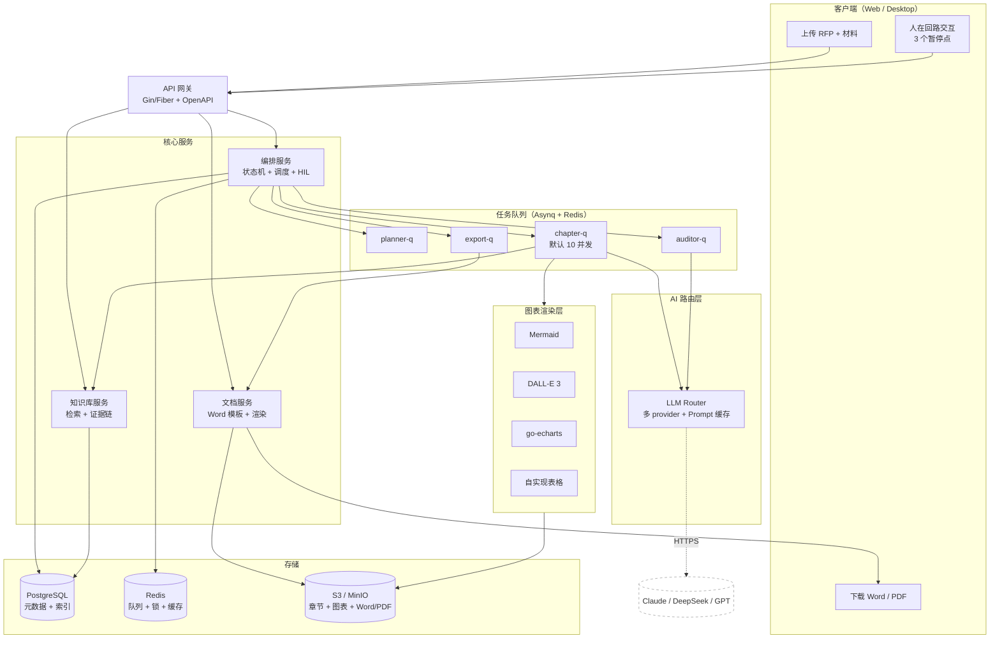

# AI 标书自动生成系统

> 本仓库承载 **AI 标书自动生成系统** 的产品调研、需求分析与设计文档。

## 系统架构



> 主输出格式：**Word（.docx）**，PDF 为衍生品（LibreOffice headless 异步生成）。
> 完整 ASCII 架构图与组件职责详见 [high-level-design.md §2](high-level-design.md)。

## 文档索引

### 需求基线

| 文档 | 内容 |
|---|---|
| [requirements-spec.md](requirements-spec.md) | **需求规格说明书 SRS**（9 节）：术语表 / 痛点 / 8 大功能模块 / 非功能 / 9 大技术难点 / 验收 / 风险 / MVP 优先级。研发需求基线 |
| [diaoyan.md](diaoyan.md) | 调研：行业现状、痛点、机会、目标用户 |

### 设计与架构

| 文档 | 内容 |
|---|---|
| [framework.md](framework.md) | 设计纲要：系统目标、核心三要素（AI/章节任务/图表）、状态机、人在回路点 |
| [tech-selection.md](tech-selection.md) | 技术选型（13 节）：后端 / 队列 / LLM 路由 / 图表 / Word / KB / 编排 / 存储 / 可观测 / 部署 / 成本 / 风险 / 决策 |
| [high-level-design.md](high-level-design.md) | 概要设计 HLD（15 节）：组件架构、核心流程、**章节划分与调度 ★**、**图表设计与实现 ★**、**Word 输出流水线 ★**、数据模型、接口、算法、可观测、安全、部署 |

### HLD 重点章节速查

| 章节 | 解决的问题 |
|---|---|
| [§3 核心流程](high-level-design.md) | 端到端 3 个 POINT（人在回路暂停点）流程 |
| [§4 章节划分与调度](high-level-design.md) | 章节怎么分？优先级？依赖？并发？防饿死？ |
| [§5 图表设计与实现](high-level-design.md) | 图表分几类？怎么定义？怎么渲染？怎么校验？失败怎么办？ |
| [§6 Word 输出流水线](high-level-design.md) | 为什么 Word 为主？模板怎么用？Markdown 怎么变 docx？图表怎么嵌？ |
| [§9 审查模块](high-level-design.md) | 8 维度审计 + 分级 + 与 POINT-2 联动 |
| [§11 合规认证](high-level-design.md) | 等保三级 + ISO/IEC 42001 |
| [§12 部署架构](high-level-design.md) | SaaS + 私有化双模式 + 本地 LLM |

### 需求-设计追溯关系

```
需求书（产品）→ requirements-spec.md（需求基线）
    → framework.md（设计纲要）
        → tech-selection.md（技术选型）
            → high-level-design.md（概要设计）
                → 详细设计 + 实现
```

下游文档变更必须反向检查上游；上游变更需评估对所有下游的影响面。

## 关键决策

- **主输出格式**：Word（.docx），PDF 为衍生品（LibreOffice headless 异步生成）
- **章节任务并发度**：默认 10（章节间并行，章节内串行）
- **人在回路点**：3 个（章节大纲确认 / 审计问题处理 / 样式微调）
- **Prompt 缓存**：Anthropic cache_control（系统前缀强缓存，章节规格章节内复用）
- **双部署模式**：SaaS（云端多租户）+ 私有化（客户内网，本地 LLM）

## 关联仓库

- **bidwriter**（Go 后端）：`growdu/bidwriter`

## CI

| 检查 | 工具 | 严格度 |
|---|---|---|
| 必需文件存在且非空 | shell | 严格（CI 红） |
| Markdown 风格 | markdownlint-cli2 | 严格（CI 红） |
| Mermaid 块渲染 | mermaid.js + Chrome | 严格（CI 红） |
| 链接检查 | lychee | 宽松（仅 Job Summary） |
| GitHub Pages 部署 | mkdocs-material + actions/deploy-pages | 严格 |

工作流：`.github/workflows/ci.yml`（CI）、`.github/workflows/pages.yml`（部署）。

## 本地开发

### 校验 Mermaid 图

CI 会自动渲染 README 与 `docs/` 下所有 `mermaid` 代码块；本地开发可在提交前自检：

```bash
npm install                    # 首次：安装 mermaid + puppeteer-core
npm run lint:mermaid           # 校验默认 docs/**/*.md + README.md
MERMAID_LINT_VERBOSE=1 npm run lint:mermaid   # 打印每个块的行号
node tools/mermaid-lint.mjs README.md         # 只校验某个文件
```

需本机已安装 Chrome / Chromium；非默认路径可用 `MERMAID_LINT_CHROME` 环境变量指定。

### 本地预览 GitHub Pages

```bash
pip install -r requirements.txt    # 首次：安装 mkdocs-material
mkdocs serve                       # 本地预览 http://127.0.0.1:8000
mkdocs build                       # 构建静态站点到 site/
```

## License

Private · 仅供内部使用

---

## 📚 文档导航

| 我想... | 看这个 |
|---|---|
| 登录 / 创建标书 / 审稿 / 导出 | [**用户手册**](user-guide.md) |
| 理解 11 个服务怎么协作 | [**架构详细**](architecture.md) |
| 看需求基线 / 调研 | [需求规格说明书](requirements-spec.md) · [调研报告](diaoyan.md) |
| 选型 / 概要设计 | [设计纲要](framework.md) · [技术选型](tech-selection.md) · [概要设计](high-level-design.md) |
| 部署 / 数据库 / API | [部署架构](deployment.md) · [数据库设计](database.md) · [API 接口规范](api-spec.md) |
| 测试 / 交付 | [测试策略](testing.md) · [交付文档](delivery.md) |
| 文档生成模块 | [概览](doc-gen/index.md) · [架构](doc-gen/architecture.md) · [算法](doc-gen/algorithms.md) |
| 已知问题 | [KNOWN_ISSUES](KNOWN_ISSUES.md) · [CI 与本地开发](ci-and-local-dev.md) |
