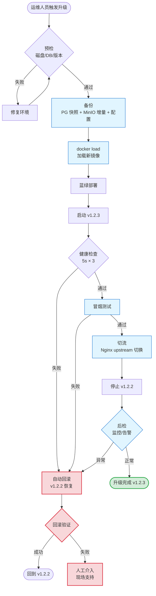

# 技术选型文档

> 本文档基于 `docs/framework.md` 的设计纲要，对每个技术领域给出推荐选型与候选对比。
> 选型原则：MVP 阶段优先成熟度与生态丰富度；后续按性能、成本、可维护性逐项替换。

---

# 〇、选型原则

1. **生态优先**：AI/LLM 生态最丰富的语言是 Python，业务核心用 Python
2. **可替换**：每个组件都要有清晰的抽象边界，便于后续替换
3. **可降级**：AI 调用、图表生成、文档转换都要支持 fallback
4. **可观测**：从第一天起就接日志/指标/追踪
5. **本地优先**：MVP 阶段单机可跑，避免过早分布式

---

# 一、整体架构选型

## 1.1 三种候选

| 方案 | 优点 | 缺点 | 适合场景 |
|---|---|---|---|
| **单体（Python FastAPI）** | 部署简单、AI 生态强、异步支持好 | 单机性能上限 | **MVP 推荐** |
| 微服务（多语言） | 各组件独立扩展 | 复杂度高、AI 生态分裂 | 后期规模化 |
| Serverless | 弹性好、按量付费 | 冷启动、AI 长任务不友好 | 突发场景 |

**推荐：单体 Python FastAPI**，内置异步任务队列。

## 1.2 技术栈全景

```
┌──────────────────────────────────────────────────────────┐
│  客户端（可选）                                           │
│  - Web: React 19 + TypeScript + Vite 7                  │
│  - Desktop: Electron（参考 openbidkit-yibiao）           │
└──────────────────────────────────────────────────────────┘
                          ↓ HTTPS / IPC
┌──────────────────────────────────────────────────────────┐
│  服务端（Python FastAPI）                                │
│  ┌────────────┐  ┌────────────┐  ┌────────────┐         │
│  │ API 层     │  │ 任务层     │  │ AI 编排层  │         │
│  │ FastAPI    │  │ Celery     │  │ LangChain  │         │
│  └────────────┘  └────────────┘  └────────────┘         │
│  ┌────────────┐  ┌────────────┐  ┌────────────┐         │
│  │ 存储层     │  │ 图表层     │  │ 文档层     │         │
│  │ SQLAlchemy │  │ Mermaid/SD │  │ python-docx│         │
│  └────────────┘  └────────────┘  └────────────┘         │
└──────────────────────────────────────────────────────────┘
                          ↓
┌──────────────────────────────────────────────────────────┐
│  基础设施                                                │
│  - PostgreSQL / SQLite  - Redis（broker/cache）          │
│  - S3 兼容对象存储        - Prometheus + Grafana         │
└──────────────────────────────────────────────────────────┘
```

---

# 二、后端语言与框架

## 2.1 候选对比

| 语言 | AI 生态 | 并发模型 | 性能 | 类型系统 |
|---|---|---|---|---|
| **Python** | ⭐⭐⭐⭐⭐ | asyncio + 多进程 | 中 | 动态 + type hints |
| Node.js | ⭐⭐⭐ | 事件循环 | 中高 | TypeScript |
| Go | ⭐⭐ | goroutine | 高 | 静态 |
| Rust | ⭐⭐ | async/await | 极高 | 静态 |

**推荐：Python 3.11+**

理由：
- AI/LLM SDK 最完整（Anthropic / OpenAI / Cohere / DeepSeek 官方 SDK 都是 Python 优先）
- LangChain / LlamaIndex / DSPy 等编排框架是 Python 原生
- 数据处理生态（pandas / pydantic / numpy）成熟
- 异步 IO 已经成熟（asyncio + httpx）

## 2.2 Web 框架

| 框架 | 优点 | 缺点 |
|---|---|---|
| **FastAPI** | 异步原生、自动 OpenAPI、Pydantic 集成 | 生态相对新 |
| Flask | 极简、成熟 | 同步为主，需手动集成 async |
| Django | 全栈、ORM 强 | 太重、AI 集成不便 |

**推荐：FastAPI**

理由：异步原生契合章节级并发的 IO 密集型场景；Pydantic v2 适合章节规格/响应矩阵等结构化数据。

---

# 三、任务调度与并发

## 3.1 任务队列

| 选项 | 优点 | 缺点 |
|---|---|---|
| **Celery** | 成熟、Redis/RabbitMQ broker、丰富的 retry/canvas | 较重、文档分散 |
| Dramatiq | 轻量、Actor 模型 | 生态小 |
| RQ | 极简 | 功能单薄 |
| APScheduler | 定时任务为主 | 不适合长任务链 |
| Temporal | 工作流引擎、状态机友好 | 学习曲线陡、运维重 |
| **arq + Redis** | 异步、轻量、原生 asyncio | 文档少 |

**推荐：Celery**（MVP）/ **arq**（如果纯异步需求）

理由：
- 章节任务有重试/超时/优先级需求，Celery 原生支持
- canvas（chain/group/chord）正好契合章节级并行 + 章节内串行的模式
- broker 用 Redis 起步（同时充当缓存）

## 3.2 任务模式实现

章节级并行 + 章节内串行：

```python
# 章节规划完成后
chapters = [ch1, ch2, ch3, ...]  # 50 个章节
job = celery_group(
    chapter_pipeline.s(ch.id) for ch in chapters  # 每章节独立
)
job.apply_async()

@celery_app.task(bind=True, max_retries=3)
def chapter_pipeline(self, chapter_id):
    # 章节内串行：检索 → 撰写 → 图表 → 内审
    materials = retrieve_materials(chapter_id)            # 串行 1
    content = write_chapter(chapter_id, materials)        # 串行 2
    illustrations = generate_illustrations(chapter_id)    # 串行 3
    audit = chapter_audit(chapter_id, content, illustrations)  # 串行 4
    return {"chapter_id": chapter_id, "audit": audit}
```

## 3.3 任务组锁

Celery 不直接提供任务组锁，可用以下方式实现：
- **Redis SETNX + EX**：每个 chapter_id 一个锁 key
- **PostgreSQL advisory lock**：`pg_advisory_lock(hashtext(chapter_id))`
- **etcd / ZooKeeper**：分布式锁，但太重

**推荐：Redis SETNX**（MVP）→ **PostgreSQL advisory lock**（规模化）

---

# 四、数据库与存储

## 4.1 元数据库

| 选项 | 优点 | 缺点 |
|---|---|---|
| **PostgreSQL** | JSONB、advisory lock、全文检索 | 部署稍重 |
| SQLite | 零运维、单文件 | 并发写弱 |
| MySQL | 成熟 | JSON 支持弱 |

**推荐：PostgreSQL 16+**

理由：
- JSONB 完美契合 chapter_specs / chapter_contents 的结构化字段
- advisory lock 实现任务组锁
- 全文检索（tsvector）可用于知识库章节检索
- LISTEN/NOTIFY 可用于章节状态实时推送

## 4.2 ORM

| 选项 | 优点 | 缺点 |
|---|---|---|
| **SQLAlchemy 2.0** | 异步支持、类型友好、生态最广 | 学习曲线 |
| SQLModel | SQLAlchemy + Pydantic 结合 | 较新、生态小 |
| Tortoise ORM | Django-like、异步 | 生态小 |
| Piccolo | 异步、类型友好 | 太小众 |

**推荐：SQLAlchemy 2.0（async）**

理由：成熟度最高，章节规格等复杂模型用 declarative + relationship 表达清晰。

## 4.3 文件存储

| 选项 | 场景 |
|---|---|
| **本地文件系统** | MVP 单机部署 |
| **S3 兼容**（MinIO / 阿里云 OSS / AWS S3） | 规模化、多副本 |
| 分布式文件系统（cephfs / juicefs） | 大规模、跨节点 |

**目录结构**：
```
storage/
 ├── chapters/{chapter_id}/content_v{n}.md
 ├── illustrations/{illustration_id}/source.{ext}
 ├── illustrations/{illustration_id}/rendered.{png|svg}
 ├── tenders/{tender_id}/rfp.pdf
 └── evidence/{evidence_id}/source.{ext}
```

**推荐：MVP 用本地文件系统 + boto3 抽象**（便于后续切到 S3）

---

# 五、AI / LLM 选型

## 5.1 主力模型

| 模型 | 上下文 | Prompt 缓存 | 中文 | 成本（输入/输出 $/M token） |
|---|---|---|---|---|
| **Claude Sonnet 4.6** | 200K | ✅ cache_control | 优 | 3 / 15 |
| GPT-4o | 128K | ✅ 自动 | 良 | 2.5 / 10 |
| GPT-4o mini | 128K | ✅ 自动 | 良 | 0.15 / 0.6 |
| DeepSeek V3 | 64K | ✅ | 优 | 0.27 / 1.1 |
| Qwen Max | 128K | ✅ | 优 | 0.34 / 1.4 |

**推荐主力：Claude Sonnet 4.6**

理由：
- 200K 上下文可容纳章节规格 + 全部章节素材 + global_facts
- `cache_control` 主动控制缓存前缀，命中率高，**可降本 5-10 倍**
- 写作质量稳定，结构化输出（JSON）容错好
- Tool use 能力强

**推荐备选**：
- 成本敏感场景：DeepSeek V3（中文场景强，价格 1/10）
- 多模态/简单任务：GPT-4o mini（速度最快）

## 5.2 双层模型策略

```
粗稿/规划阶段：便宜模型（DeepSeek V3 / GPT-4o mini）
  → 章节规格、章节大纲、章节素材筛选

精稿/写作阶段：主力模型（Claude Sonnet 4.6）
  → 章节正文、图表描述、响应矩阵

校对阶段：主力模型 + agent 模式
  → 跨章节一致性审计
```

## 5.3 Prompt 缓存实现

Anthropic 的 `cache_control` 关键点：

```python
response = client.messages.create(
    model="claude-sonnet-4-6",
    system=[
        {
            "type": "text",
            "text": GLOBAL_FACTS +  # 系统级共享，放最前
        },
        {
            "type": "text",
            "text": CHAPTER_SPEC,
            "cache_control": {"type": "ephemeral"}  # 标记可缓存
        }
    ],
    messages=[{"role": "user", "content": ...}]
)
```

缓存位置策略：
1. `system` 段 1：global_facts + 术语表（所有章节共享）→ **强缓存**
2. `system` 段 2：章节规格（本章节唯一）→ 章节内复用
3. `messages`：上一轮对话（同章节多轮扩写时复用前缀）

## 5.4 AI 调用抽象

```python
class LLMProvider(Protocol):
    async def chat(self, messages, *, system, max_tokens, temperature,
                   cache_control=None) -> ChatResponse: ...

class AnthropicProvider:
    async def chat(self, ...): ...

class OpenAIProvider:
    async def chat(self, ...): ...

class DeepSeekProvider:
    async def chat(self, ...): ...

# Router：按 task 名选择 provider，支持 fallback
class LLMRouter:
    async def route(self, task_name: str, messages, **kw) -> ChatResponse:
        for provider in self.providers_for(task_name):
            try:
                return await provider.chat(messages, **kw)
            except RetryableError:
                continue  # 下一个 provider
        raise AllProvidersFailed(...)
```

## 5.5 JSON 修复链路

```python
async def parse_json_response(content: str, schema: Type[T]) -> T:
    # 1. 直接解析
    try: return schema.model_validate_json(content)
    except ValidationError: pass

    # 2. 抽取第一个 {...} 块
    extracted = extract_first_json_block(content)
    try: return schema.model_validate_json(extracted)
    except ValidationError: pass

    # 3. 局部修补（不重发）
    repaired = repair_json(extracted, schema)
    try: return schema.model_validate_json(repaired)
    except ValidationError:
        # 4. 重发一次（仅发送错误信息 + 原内容，不发整个 prompt）
        return await retry_with_repair(...)
```

---

# 六、图表生成选型

## 6.1 Mermaid（流程/架构/时序图）

| 渲染方式 | 优点 | 缺点 |
|---|---|---|
| **mermaid.ink（在线 API）** | 零部署 | 依赖外网、有频率限制 |
| **mermaid-cli（本地）** | 无外网依赖 | 需要 Node.js + puppeteer |
| **kroki（统一 API）** | 多图表统一 | 部署重 |

**推荐：mermaid.ink 主用 + mermaid-cli 本地 fallback**

实现：

```python
async def render_mermaid(source: str) -> bytes:
    # 1. 校验语法
    validate_mermaid_syntax(source)

    # 2. 主用：mermaid.ink
    try:
        return await fetch_mermaid_ink(source, timeout=15)
    except (Timeout, NetworkError):
        pass  # 降级

    # 3. 降级：本地 mermaid-cli
    try:
        return await render_mermaid_local(source)
    except MermaidRenderError:
        pass

    # 4. 占位图
    return generate_placeholder_image("Mermaid 渲染失败")
```

## 6.2 AI 图（示意图/封面图/组织架构图）

| 提供商 | 强项 | 成本 |
|---|---|---|
| **DALL-E 3**（OpenAI） | 通用、风格可控 | $0.04/张 |
| **Stable Diffusion 3** | 可本地部署 | GPU 成本 |
| **Midjourney** | 质量最高 | $0.05+/张 |
| **Replicate** | 多模型聚合 | 按模型定价 |
| 国产（通义万相 / 文心一格） | 中文友好 | ¥0.1-0.3/张 |

**推荐：DALL-E 3 主用 + Replicate（备选）**

理由：
- 同一份标书需要风格统一，DALL-E 3 风格可控性最强
- 失败时降级到 Replicate 上的其他模型
- 国产模型作为中文场景补充

### 6.2.1 DALL-E 3 vs FLUX / Stable Diffusion 深度对比（需求 §3.7.6 + D3）

> 需求 §3.7.6 要求"文生图补充方案"，依赖 D3 列出 FLUX / SD。本节对三类模型做系统对比，给出选型矩阵。

| 维度 | DALL-E 3 | Stable Diffusion 3 / 3.5 | FLUX.1 [pro/dev/schnell] |
|---|---|---|---|
| **提供方** | OpenAI（API） | Stability AI / 社区 | Black Forest Labs |
| **接入方式** | 云端 API | 本地 / Replicate | 云端 API 或本地 |
| **质量** | 高（写实风） | 中-高（写实偏弱） | 极高（写实+艺术） |
| **风格可控性** | ★★★★ | ★★★ | ★★★★★ |
| **中文支持** | 良好（prompt 英文效果更好） | 取决于底模 | 良好 |
| **分辨率** | 1024×1024 / 1792×1024 | 可自定义（512-2048） | 可自定义（1024+） |
| **生成速度** | 5-10s | 10-30s（GPU） | 10-20s（GPU） |
| **成本** | $0.04/张 | GPU 电费（≈$0.005/张） | API $0.05/张 或本地 |
| **私有化** | ❌ 仅 API | ✅ 本地部署 | ✅ 本地部署 |
| **数据合规** | 数据回流 OpenAI | 本地无回流 | 本地无回流 |
| **风格模板** | 通过 prompt 实现 | LoRA / ControlNet | LoRA / ControlNet |
| **版权风险** | 商业可用（OpenAI 条款） | 模型许可证（SD3.5 商业可用） | 商业可用 |

**选型矩阵（按场景）**：

| 场景 | 推荐 | 理由 |
|---|---|---|
| **SaaS 模式 + 高质量** | DALL-E 3 主、FLUX API 备 | 质量稳定、API 简单、降级有 |
| **SaaS 模式 + 成本敏感** | SD 3.5 + Replicate | $0.005/张，成本降 8x |
| **私有化模式** | SD 3.5 本地 + FLUX 本地 | 无外网，必须本地推理 |
| **中文场景** | 通义万相 + Qwen 文生图 | 中文 prompt 友好 |
| **风格统一** | SD 3.5 + 训练 LoRA | LoRA 锁定企业风格 |
| **封面图** | FLUX.1 pro | 写实 + 艺术质量最高 |
| **示意图（架构 / 组织）** | Mermaid 优先 | 矢量、可编辑、零成本 |

**推荐最终方案**：

| 部署模式 | 主力 | 备选 | 兜底 |
|---|---|---|---|
| **SaaS 模式** | DALL-E 3（云端 API） | FLUX.1 [schnell]（Replicate） | 简化 prompt 重试 → 占位图 |
| **私有化模式** | SD 3.5（本地 + LoRA） | FLUX.1 [dev]（本地） | 简化 prompt → 占位图 |

**LoRA 风格锁定**（私有化推荐做法）：
```python
# 训练企业专属 LoRA
lora_config = {
    "base_model": "stabilityai/stable-diffusion-3.5-large",
    "lora_rank": 32,
    "training_data": "企业历史标书封面 200 张 + 行业模板 100 张",
    "training_steps": 5000,
    "output": "models/lora/enterprise_style_v1.safetensors",
}

# 推理时挂载
pipe.load_lora_weights("models/lora/enterprise_style_v1.safetensors")
image = pipe(prompt=prompt, lora_scale=0.8).images[0]
```

**风格一致性保证**（跨标书）：
- SaaS：DALL-E 3 用统一 style prefix（"professional Chinese government bid cover, blue corporate style, vector illustration style"）
- 私有化：LoRA 锁定 + 固定 seed + 负向 prompt（"low quality, watermark, text"）

**性能与成本**（单标书约 30 张 AI 图）：

| 方案 | 单图成本 | 单标书总成本 | 单图延迟 |
|---|---|---|---|
| DALL-E 3 | $0.04 | $1.2 | 5-10s |
| SD 3.5（本地） | GPU 电费 $0.005 | $0.15 | 10-20s |
| FLUX schnell（API） | $0.05 | $1.5 | 8-12s |

---

## 6.3 表格 / 响应矩阵

直接生成 HTML / JSON，自实现 HTML → docx 表格，无需第三方。

## 6.4 数据图表

| 选项 | 优点 | 缺点 |
|---|---|---|
| **matplotlib** | Python 原生、可控 | 样式老 |
| plotly | 交互式、样式现代 | 输出体积大 |
| echarts | 样式丰富 | 需要前端渲染 |

**推荐：matplotlib（生成静态图）+ plotly（需要交互时）**

数据来源走 evidence chain，无数据不生成。

## 6.5 图表占位符协议（章节正文 → 图表解耦）

章节正文采用**结构化占位符**嵌入图表，使正文撰写与图表渲染解耦：

```
正文 Markdown 中嵌入：

   本系统采用分层架构，如 [!figure:arch-overview type=mermaid caption=系统分层架构图] 所示。

渲染器：
   1. 扫描 `\[!figure:(<id>)\s+([^\]]*)\]` 模式
   2. 抽取 id / attributes（type, caption, data, ...）
   3. 按 id 在 illustrations 表查渲染产物
   4. 替换为 docx 图片 + 编号 + 图注
```

占位符的好处：
- 撰写阶段只关心"哪里需要图、要什么图"，不必关心怎么渲染
- 图表生成可异步、可重试、可换实现
- 替换阶段才绑定具体渲染产物（PNG/SVG）
- 同一个 placeholder 在不同输出格式下可走不同渲染路径

## 6.6 章节内图表流水线

```
章节内容（Markdown）
   │
   ↓ 正则扫描
[FigureSpec(id, type, caption, attrs), ...]
   │
   ↓ 串行生成（每张独立任务）
   ├──→ 查 illustrations 表（命中即跳过）
   ├──→ 数据准备（基于 evidence chain）
   ├──→ 调用对应 renderer（mermaid / matplotlib / DALL-E / 自实现表格）
   ├──→ 校验（视觉 + 语义）
   ├──→ 失败 → fallback 链
   └──→ 成功 → 写库 + 落 S3
   │
   ↓
返回 Illustration 列表（含 source_path / rendered_path / status）
```

**章节内图表必须串行**（与第六章 Prompt 缓存策略一致）：
- 章节正文 → 章节正文+图表占位 → 串行渲染
- 因为占位符按出现顺序绑定章节号，串行确保编号稳定
- 图表独立可并发（MVP 用串行简化调试与日志）

## 6.7 失败回退链（按图表类型）

| 图表类型 | 主路径 | 降级 1 | 降级 2 | 最终兜底 |
|---|---|---|---|---|
| Mermaid | mermaid.ink | mermaid-cli 本地 | 语法修正重试 | 占位图 + 文字描述 |
| AI 图 | DALL-E 3 | Replicate SDXL | 国产模型 | 简化 prompt 重试 → 占位图 |
| 数据图 | matplotlib | plotly（PNG 导出） | 表格替代 | 占位图 + 数据表 |
| 表格 | 自实现 HTML→docx | pandoc | 纯文本对齐 | 强制输出 |

所有失败记录到 `illustrations.status='failed'` 和 `audit.illustration_issues`，由人在回路点 2 统一处理。

---

# 七、文档导出选型

## 7.1 Word（.docx）—— 主输出格式

| 库 | 优点 | 缺点 |
|---|---|---|
| **python-docx** | 主流、API 稳定 | 表格/样式处理繁琐 |
| docxtpl | 模板渲染（Jinja2 over docx） | 复杂逻辑不便 |
| pandoc | Markdown → docx 强 | 样式定制弱 |
| LibreOffice headless | 完美兼容 Word | 重、启动慢 |

**推荐：python-docx + docxtpl + 自实现 HTML → docx**

理由：
- 标书样式复杂（页眉页脚、目录、序号、图表编号）
- 走 Markdown → AST → docx，绕过 headless browser
- **docxtpl 用于模板套用**：解析用户提供的 docx 模板，提取样式与占位后填充
- **python-docx 用于精细控制**：自动目录、章节编号、图表编号、交叉引用

**为什么 Word 是主输出（详见 high-level-design.md §6）：**
- 标书交付物 99% 是 docx（甲方要求、可批注、可修订、可签章）
- Word 模板是企业知识资产，复用率高
- docx 是审计、修改、合并的事实标准
- PDF 是 docx 的衍生品（投标准备/打印场景）

## 7.2 PDF —— 衍生输出

| 选项 | 优点 | 缺点 |
|---|---|---|
| **LibreOffice headless** | docx → pdf 一致性最好 | 重 |
| weasyprint | HTML → pdf 灵活 | 与 docx 样式不同 |
| pdfkit（wkhtmltopdf） | 成熟 | 维护停滞 |

**推荐：LibreOffice headless**

理由：docx → pdf 样式一致性最关键（标书格式不能变），其他方案都会有偏差。

PDF 生成在 Word 输出之后异步触发（避免阻塞主流程），并写 PDF 到 S3。

## 7.3 Mermaid → docx 内嵌

```python
def embed_mermaid_in_docx(doc, illustration):
    rendered_path = illustration.rendered_path  # PNG/SVG
    # 1. 插入图片
    doc.add_picture(rendered_path, width=Cm(14))
    # 2. 编号（图 3-2）
    last_paragraph = doc.paragraphs[-1]
    last_paragraph.alignment = WD_ALIGN_PARAGRAPH.CENTER
    # 3. 图注
    caption = doc.add_paragraph(f"图 {illustration.chapter_number}-{illustration.order} {illustration.title}")
    caption.alignment = WD_ALIGN_PARAGRAPH.CENTER
```

---

# 八、知识库与检索

## 8.1 检索方案

framework.md 提出"你不需要 RAG"哲学，技术实现：

| 方案 | 适用 |
|---|---|
| **目录树 + 关键词**（PostgreSQL 全文检索） | MVP 推荐 |
| BM25 + 关键词 | 简单场景 |
| 向量检索（pgvector / Qdrant） | 复杂语义检索 |
| 混合检索（关键词 + 向量） | 规模化 |

**推荐：MVP 用 PostgreSQL tsvector 全文检索；后续加 pgvector 做混合检索**

理由：标书场景召回率 > 相似度，目录树 + 关键词足够。

### 8.1.1 双向语义索引（需求 §4.9-② + HLD §5.10）

> 需求 §4.9-② 要求"文-图双向语义索引"——通过文本检索图表、通过图表反查相关正文段落。MVP 用 PostgreSQL tsvector 是不够的，必须升级到混合检索。

**向量库选型**：

| 方案 | 性能 | 运维 | 适用 |
|---|---|---|---|
| **pgvector** | 百万级 OK | 零运维（复用 PG） | **MVP 推荐** |
| Qdrant | 亿级 | 独立服务 | 规模化 |
| Milvus | 亿级 | 独立集群 | 超大规模 |
| Weaviate | 千万级 | 中等 | 通用场景 |
| Chroma | 百万级 | 轻量 | 本地原型 |

**推荐：pgvector（MVP）+ Qdrant（规模化）**

理由：
- 标书知识库单企业规模 10K-100K 文档，pgvector 完全够用
- 复用 PostgreSQL 主备/备份/快照，省一套独立服务
- 迁移路径平滑：pgvector → Qdrant 仅需换客户端，schema 几乎不变

**Embedding 模型**：

| 模型 | 维度 | 性能 | 适用 |
|---|---|---|---|
| **BGE-large-zh-v1.5** | 1024 | 中文 SOTA | **推荐（中文场景）** |
| BGE-M3 | 1024 | 多语言 + 长文本（8K） | 长文档 |
| M3E-large | 1024 | 中文 | 备选 |
| text-embedding-3-large（OpenAI） | 3072 | 通用 | 私有化不可用 |
| Qwen3-Embedding | 1024+ | 中文 + 多语言 | 备选（国产） |

**私有化部署**：BGE-large-zh-v1.5 + vLLM 推理，1× GPU 16G 即可。

**双向索引的数据模型**：

```sql
-- 1. 文本侧指纹（每段正文 + 章节标题）
CREATE TABLE text_chunks (
    id BIGSERIAL PRIMARY KEY,
    doc_id BIGINT NOT NULL,
    doc_type VARCHAR(32),          -- 'chapter' | 'requirement' | 'evidence' | 'scoring_item'
    chapter_id VARCHAR(64),
    content TEXT NOT NULL,
    content_tsv TSVECTOR,          -- tsvector（全文索引）
    content_vec VECTOR(1024),      -- pgvector（语义索引）
    metadata JSONB,
    created_at TIMESTAMPTZ DEFAULT NOW()
);

CREATE INDEX idx_text_tsv ON text_chunks USING GIN(content_tsv);
CREATE INDEX idx_text_vec ON text_chunks USING ivfflat(content_vec vector_cosine_ops) WITH (lists = 100);

-- 2. 图表侧指纹（图题 + 描述 + caption）
CREATE TABLE figure_chunks (
    id BIGSERIAL PRIMARY KEY,
    figure_id BIGINT NOT NULL,
    chapter_id VARCHAR(64),
    caption TEXT,                  -- 图表标题
    description TEXT,              -- 图表描述/正文片段
    caption_tsv TSVECTOR,
    caption_vec VECTOR(1024),
    image_hash VARCHAR(64),        -- 视觉指纹（pHash）
    metadata JSONB,
    created_at TIMESTAMPTZ DEFAULT NOW()
);

CREATE INDEX idx_figure_tsv ON figure_chunks USING GIN(caption_tsv);
CREATE INDEX idx_figure_vec ON figure_chunks USING ivfflat(caption_vec vector_cosine_ops) WITH (lists = 100);

-- 3. 正向关系（章节 → 图表）+ 反向关系（图表 → 章节）
CREATE TABLE chunk_figure_links (
    text_chunk_id BIGINT REFERENCES text_chunks(id),
    figure_chunk_id BIGINT REFERENCES figure_chunks(id),
    link_type VARCHAR(32),         -- 'contains' | 'describes' | 'evidence_for' | 'derived_from'
    similarity_score FLOAT,        -- 双向索引的相似度
    created_at TIMESTAMPTZ DEFAULT NOW(),
    PRIMARY KEY (text_chunk_id, figure_chunk_id)
);
```

**混合检索实现**：

```python
async def hybrid_search(
    query: str,
    top_k: int = 10,
    text_weight: float = 0.5,
    vec_weight: float = 0.5,
) -> list[SearchResult]:
    # 1. 关键词检索（tsvector）
    keyword_results = await db.execute("""
        SELECT id, content, ts_rank_cd(content_tsv, query) AS score
        FROM text_chunks, plainto_tsquery('simple', $1) query
        WHERE content_tsv @@ query
        ORDER BY score DESC LIMIT $2 * 3
    """, query, top_k)
    
    # 2. 语义检索（pgvector）
    query_vec = await embed(query)  # BGE-large-zh
    semantic_results = await db.execute("""
        SELECT id, content, 1 - (content_vec <=> $1) AS score
        FROM text_chunks
        ORDER BY content_vec <=> $1
        LIMIT $2 * 3
    """, query_vec, top_k)
    
    # 3. 倒数排名融合（RRF）
    fused = reciprocal_rank_fusion(
        [keyword_results, semantic_results],
        weights=[text_weight, vec_weight]
    )
    return fused[:top_k]
```

**双向查询示例**：

```python
# 查询 1: 文本 → 相关图表（图题检索）
async def find_related_figures(text_chunk_id: int, top_k: int = 5):
    return await db.execute("""
        SELECT f.*, l.similarity_score
        FROM chunk_figure_links l
        JOIN figure_chunks f ON l.figure_chunk_id = f.id
        WHERE l.text_chunk_id = $1
        ORDER BY l.similarity_score DESC
        LIMIT $2
    """, text_chunk_id, top_k)

# 查询 2: 图表 → 相关正文（图反查文）
async def find_related_text(figure_id: int, top_k: int = 5):
    return await db.execute("""
        SELECT t.*, l.similarity_score
        FROM chunk_figure_links l
        JOIN text_chunks t ON l.text_chunk_id = t.id
        WHERE l.figure_chunk_id = $1
        ORDER BY l.similarity_score DESC
        LIMIT $2
    """, figure_id, top_k)

# 查询 3: 跨模态（用图查图、用文查文）
async def cross_modal_search(figure_id: int, top_k: int = 5):
    """给一张图，找语义最相关的 5 张其他图"""
    return await db.execute("""
        WITH anchor AS (SELECT caption_vec FROM figure_chunks WHERE id = $1)
        SELECT id, caption, 1 - (caption_vec <=> (SELECT caption_vec FROM anchor)) AS score
        FROM figure_chunks
        WHERE id != $1
        ORDER BY caption_vec <=> (SELECT caption_vec FROM anchor)
        LIMIT $2
    """, figure_id, top_k)
```

**索引构建流程**：

```python
# 文档入库时双写
async def index_chapter(chapter_id: str, content: str):
    chunks = split_into_chunks(content, chunk_size=512, overlap=64)
    for chunk in chunks:
        # 写入正文指纹
        await db.execute("""
            INSERT INTO text_chunks (doc_id, doc_type, chapter_id, content, content_tsv, content_vec)
            VALUES ($1, 'chapter', $2, $3, to_tsvector('simple', $3), $4)
        """, chapter_id, chapter_id, chunk.text, await embed(chunk.text))
        
        # 解析并关联图表占位符
        figures = extract_figure_placeholders(chunk.text)
        for fig in figures:
            fig_id = await upsert_figure(fig)
            # 写入图表指纹
            await db.execute("""
                INSERT INTO figure_chunks (figure_id, chapter_id, caption, description, caption_tsv, caption_vec)
                VALUES ($1, $2, $3, $4, to_tsvector('simple', $3), $5)
                ON CONFLICT (figure_id) DO UPDATE SET caption_vec = $5
            """, fig_id, chapter_id, fig.caption, chunk.text, await embed(fig.caption))
            
            # 关联
            await db.execute("""
                INSERT INTO chunk_figure_links (text_chunk_id, figure_chunk_id, link_type, similarity_score)
                VALUES ($1, $2, 'describes', $3)
                ON CONFLICT DO NOTHING
            """, chunk.id, fig_id, cosine_similarity(chunk.vec, fig.vec))
```

**性能指标**（10 万条文本 + 5 万张图）：

| 操作 | 延迟 | 备注 |
|---|---|---|
| 单次混合检索 | < 100ms | 关键词 + 向量并行 |
| 文本→图表查询 | < 50ms | 索引命中 |
| 图表→文本查询 | < 50ms | 索引命中 |
| 跨模态查询 | < 200ms | 纯向量 |
| 入库（每 chunk） | < 80ms | 含 embedding |

**成本**（私有化部署）：
- Embedding 推理：1× A100 16G，500 chunks/秒
- pgvector 内存：100K × 1024 × 4B = 400MB
- 索引构建：首次全量 ~30 分钟，增量 < 5 分钟

## 8.2 文档预处理

```python
# 文档统一走 doc2markdown 中间态
async def ingest_document(path: str) -> Document:
    if path.endswith('.pdf'):
        content = await pdf_to_markdown(path)
    elif path.endswith('.docx'):
        content = await docx_to_markdown(path)
    else:
        content = read_file(path)
    return Document(
        path=path,
        content=content,
        chunks=split_into_chunks(content),
        metadata=extract_metadata(path)
    )
```

## 8.3 行业适配策略（需求 §4.9-④ + HLD §5.12）

> 需求 §4.9-④ 要求"行业适配深度（聚焦 2-3 个行业）"。MVP 阶段我们聚焦以下 3 个行业，提供差异化模板与领域词典。

### 8.3.1 聚焦行业

**行业优先级**（按招标频次 + 单项目金额）：

| 行业 | 招标频次 | 平均金额 | 模板成熟度 | MVP 优先级 |
|---|---|---|---|---|
| **信息技术（软件开发 / 集成）** | 极高 | 中-高 | 高 | **P0** |
| **建筑工程（房建 / 市政）** | 极高 | 高 | 中 | **P0** |
| **政府采购（货物 / 服务）** | 高 | 中 | 高 | **P1** |
| **能源（电力 / 化工）** | 中 | 高 | 低 | P2 |
| **医疗（设备 / 信息化）** | 中 | 中 | 中 | P2 |
| **金融（系统 / 数据）** | 中 | 高 | 低 | P2 |

**MVP 重点**：信息技术 + 建筑工程 + 政府采购

### 8.3.2 行业模板

每个行业提供独立的：
- 章节模板（章节类型 + 推荐顺序）
- 评分项映射规则
- 资质门槛清单
- 常见图表类型
- 行业术语词典

```yaml
# config/industry/it.yaml
industry: it
display_name: "信息技术"
chapter_templates:
  - type: "技术方案"
    sections: ["系统架构", "技术选型", "接口设计", "性能指标", "安全方案", "部署方案"]
    weight: 0.40          # 占总分 40%
  - type: "实施方案"
    sections: ["项目组织", "实施计划", "培训方案", "运维方案"]
    weight: 0.20
  - type: "商务方案"
    sections: ["公司简介", "资质证书", "类似业绩", "报价说明"]
    weight: 0.30
  - type: "售后方案"
    sections: ["质保期", "响应时间", "服务团队"]
    weight: 0.10
qualifications:
  - "ISO 9001 质量管理体系认证"
  - "CMMI 3 级（或以上）认证"
  - "软件企业认定证书"
  - "近 3 年同类项目业绩（≥3 个）"
common_figures:
  - "系统架构图"
  - "网络拓扑图"
  - "数据流程图"
  - "ER 图"
  - "接口时序图"
```

### 8.3.3 领域词典

**作用**：让 Embedding 和关键词检索更精准，理解行业黑话。

```yaml
# config/industry/it_terms.yaml
synonyms:
  - "中间件" -> ["消息队列", "MQ", "Kafka", "RabbitMQ", "RocketMQ"]
  - "数据库" -> ["MySQL", "PostgreSQL", "Oracle", "达梦", "人大金仓"]
  - "云服务" -> ["阿里云", "华为云", "腾讯云", "AWS", "Azure"]
  - "等保" -> ["等级保护", "等保2.0", "等保三级", "等保2.0三级"]
  - "信创" -> ["国产化", "自主可控", "国产芯片", "麒麟", "统信"]
  - "CMMI" -> ["CMMI 3", "CMMI 4", "CMMI 5", "能力成熟度"]
  - "DevOps" -> ["CI/CD", "持续集成", "持续部署", "Jenkins", "GitLab CI"]

stopwords:
  - "本项目"
  - "本公司"
  - "投标人"

entity_types:
  PRODUCT: ["系统", "平台", "软件", "中间件", "数据库"]
  STANDARD: ["等保三级", "CMMI 3", "ISO 9001", "ISO 27001"]
  CERT: ["软件著作权", "专利", "软件企业认定", "高新技术企业"]
```

### 8.3.4 行业适配的实施路径

**MVP 阶段**（M0-M3）：
1. 落地信息技术 + 建筑工程 + 政府采购 3 个行业的 YAML 模板
2. 准备 3 套行业词典（BGE embedding 微调或拼接到 prompt）
3. 准备 3 套行业评分项映射规则
4. 准备 100+ 个行业模板标书样本（用于评测）

**v1.0 阶段**（M3-M6）：
1. 加入能源 / 医疗 2 个行业
2. 行业词典自动学习（从历史标书抽取）
3. 行业级微调 LLM（针对 Top 2 行业）

**v2.0 阶段**（M6+）：
1. 行业知识图谱（招标方-行业-业绩-人员多维关系）
2. 行业级 LoRA（每个行业一个 LoRA）
3. 客户自定义行业（上传历史标书自动学习）

### 8.3.5 行业识别

**自动识别流程**：

```python
async def detect_industry(parsed_rfp: ParsedRFP) -> IndustryTag:
    """从招标文件文本中识别行业"""
    # 1. 关键词匹配
    keyword_scores = {}
    for industry, config in INDUSTRY_CONFIGS.items():
        score = sum(1 for kw in config['keywords'] if kw in parsed_rfp.raw_text)
        keyword_scores[industry] = score
    
    # 2. LLM 二次确认（低置信度时）
    top_industry = max(keyword_scores, key=keyword_scores.get)
    top_score = keyword_scores[top_industry]
    
    if top_score < 3:  # 关键词不足，让 LLM 判断
        industry = await llm_classify_industry(parsed_rfp)
        return industry
    
    return top_industry
```

**用户可手动覆盖**：解析完成后 UI 展示识别结果，允许切换。

---

# 九、客户端（可选）

## 9.1 桌面客户端（参考 openbidkit-yibiao）

| 技术 | 用途 |
|---|---|
| **Electron 41+** | 跨平台桌面壳 |
| React 19 + TypeScript 5.9 | UI |
| Vite 7 | 构建 |
| Radix UI / shadcn/ui | 组件库 |
| Zustand / Redux Toolkit | 状态管理 |

## 9.2 Web 客户端

| 技术 | 用途 |
|---|---|
| **React 19 + Vite 7** | SPA |
| TanStack Query | 服务端状态 |
| React Router | 路由 |
| Radix UI | 组件 |

**推荐：MVP 用 Web 优先**（开发快），后续加桌面壳。

---

# 十、基础设施

## 10.1 部署

| 阶段 | 推荐 |
|---|---|
| MVP | Docker Compose 单机 |
| 中期 | K8s（minikube → 生产） |
| 大规模 | 多区域 K8s + CDN |

## 10.2 反向代理

**推荐：Nginx**（成熟）或 **Caddy**（自动 HTTPS）

## 10.3 监控与可观测性

| 维度 | 工具 |
|---|---|
| **指标** | Prometheus + Grafana |
| **日志** | Loki / ELK |
| **追踪** | OpenTelemetry + Jaeger |
| **错误** | Sentry |

## 10.4 CI/CD

**GitHub Actions**（推荐）：
- PR 检查：lint + type check + test
- main 合并：自动构建 Docker 镜像 + 部署

## 10.5 配置管理

| 选项 | 场景 |
|---|---|
| 环境变量 | 简单 |
| **Pydantic Settings** | Python 项目推荐 |
| Consul / etcd | 分布式 |

## 10.6 合规认证路径（需求 FR-3.8-C / E + HLD §11.5）

> 投标系统必须满足 **等保三级 + ISO/IEC 42001** 两项硬性合规。本节说明技术组件选型与认证实施路径。

### 10.6.1 身份鉴别与访问控制

| 组件 | 选型 | 适用 |
|---|---|---|
| **Keycloak** | 开源 OIDC + SAML + RBAC | **推荐（自托管）** |
| Authentik | 轻量自托管 | 备选 |
| Ory Hydra / Kratos | 云原生 | 复杂场景 |
| 阿里云 RAM / 华为云 IAM | 云 SaaS | 仅 SaaS 模式 |

**Keycloak 部署**：
- 单实例 2 vCPU / 4GB，PostgreSQL 后端
- 内置 OAuth2 / OIDC / SAML 2.0
- 支持 MFA（TOTP、SMS、Email）
- 角色继承 + 细粒度权限

**多租户隔离**：
- Keycloak Realm 隔离（每客户一个 Realm）
- 或同 Realm + Group 隔离（适合多子部门）
- ABAC 通过 Protocol Mapper 注入用户属性到 JWT

### 10.6.2 密钥管理

| 方案 | 适用 |
|---|---|
| **HashiCorp Vault** | 私有化推荐 |
| 云 KMS（AWS KMS / 阿里云 KMS） | SaaS 模式 |
| SOPS + age | 轻量加密 |

**Vault 用法**：
```bash
# 启用 Transit 引擎（应用层加密）
vault secrets enable transit
vault write -f transit/keys/bid-data

# 应用层加密
vault write transit/encrypt/bid-data plaintext=$(echo "敏感数据" | base64)
vault write transit/decrypt/bid-data ciphertext="vault:v1:..."
```

### 10.6.3 数据加密

| 层 | 方案 |
|---|---|
| 传输 | TLS 1.3（ACME 自动证书） |
| 磁盘 | LUKS（Linux）/ cloud KMS 加密 EBS / 阿里云盘 |
| 应用层 | AES-256-GCM（敏感字段：身份证、银行卡、报价） |
| 备份 | GPG 加密 + 异地存储 |

**应用层加密示例**：
```python
from cryptography.hazmat.primitives.ciphers.aead import AESGCM
import os

def encrypt_field(plaintext: str, key: bytes) -> str:
    aesgcm = AESGCM(key)
    nonce = os.urandom(12)
    ct = aesgcm.encrypt(nonce, plaintext.encode(), None)
    return f"{nonce.hex()}:{ct.hex()}"

def decrypt_field(ciphertext: str, key: bytes) -> str:
    nonce_hex, ct_hex = ciphertext.split(":")
    nonce = bytes.fromhex(nonce_hex)
    ct = bytes.fromhex(ct_hex)
    return AESGCM(key).decrypt(nonce, ct, None).decode()
```

### 10.6.4 审计日志

**Loki + 结构化 JSON**：

```python
import structlog
import logging
import sys

# 业务日志全结构化
structlog.configure(
    processors=[
        structlog.processors.add_log_level,
        structlog.processors.TimeStamper(fmt="iso"),
        structlog.processors.JSONRenderer(),   # 输出 JSON 给 Loki 抓取
    ],
    logger_factory=structlog.PrintLoggerFactory(file=sys.stdout),
)

log = structlog.get_logger()
log.info("bid_created", bid_id="b-001", user_id="u-001", industry="it", chapters=50)
```

**审计日志要求**（等保三级）：
- 保留 ≥ 180 天在线 + 3 年归档
- 防篡改：append-only S3 + Object Lock
- 全覆盖：登录、CRUD、LLM 调用、文件下载、权限变更

**Loki 部署**：
- 单实例 2 vCPU / 4GB（百万级日志/天）
- 启用 S3 后端
- Promtail 收集容器日志

### 10.6.5 WAF / DDoS

| 部署模式 | 方案 |
|---|---|
| SaaS | **Cloudflare**（含 WAF + DDoS） |
| 私有化（公网） | ModSecurity + Nginx + 长亭雷池 |
| 私有化（内网） | 仅 Nginx ACL |

### 10.6.6 ISO 42001 专项

**AI 决策可追溯**（ISO 42001 核心要求）：
- LLM 调用必须留痕：prompt + response + model_version + temperature
- 章节级 traceability：每段正文可追溯到 evidence_id
- 决策可回放：审计员可重放任意时刻的 AI 决策

**数据治理**：
- 训练数据（如有）标注来源（招股书 / 公开标书 / 客户授权数据）
- 推理数据：客户上传的招标文件 → 严格客户隔离
- 模型版本控制：MLflow 或 DVC

**第三方管理**（LLM Provider）：
- 多个 provider 备选（Claude / DeepSeek / 通义千问）
- 熔断降级：provider 不可用时切换
- SLA 监控：可用性 ≥ 99.5%、P99 延迟 < 30s

### 10.6.7 认证时间表

| 阶段 | 时间 | 工作 |
|---|---|---|
| **M0-M3** 准备 | 3 个月 | 差距分析、补齐控制、文档 |
| **M3-M6** 试运行 | 3 个月 | 内部审计 + 模拟测评 |
| **M6-M9** 认证 | 3 个月 | 等保三级测评 + ISO 42001 第三方认证 |
| **M9+** 监督 | 年度 | 复审 + 持续改进 |

## 10.7 私有化部署与本地 LLM 推理（需求 D4 + HLD §12.3）

> 私有化模式必须 100% 离线运行，LLM / Embedding / 文生图全部本地推理。

### 10.7.1 本地 LLM 推理引擎

| 引擎 | 优势 | 适用 |
|---|---|---|
| **vLLM** | 吞吐量最高（连续批处理） | **推荐（主）** |
| SGLang | 复杂 prompt 结构优化 | 备选 |
| Ollama | 易用、本地原型 | 轻量场景 |
| llama.cpp | 纯 CPU 推理 | 无 GPU 环境 |
| TensorRT-LLM | NVIDIA 优化 | 高性能 GPU |

**vLLM 部署示例**：
```bash
# Qwen2.5-72B-Instruct-AWQ
python -m vllm.entrypoints.api_server \
    --model Qwen/Qwen2.5-72B-Instruct-AWQ \
    --quantization awq \
    --tensor-parallel-size 2 \
    --gpu-memory-utilization 0.85 \
    --max-model-len 8192 \
    --port 8001

# Qwen2.5-7B-Instruct（快速任务）
python -m vllm.entrypoints.api_server \
    --model Qwen/Qwen2.5-7B-Instruct \
    --port 8002
```

### 10.7.2 本地图表渲染

| 图表类型 | 工具 | 替代（公网） |
|---|---|---|
| 流程图 / 架构图 | **Mermaid CLI**（本地） | mermaid.ink |
| 数据图 | **matplotlib + ECharts**（本地导出 PNG/SVG） | - |
| 文生图（可选） | **SD 3.5 + diffusers**（本地 LoRA） | DALL-E 3 |
| OCR | **PaddleOCR**（本地） | 云 OCR |

**Mermaid CLI 离线安装**：
```bash
# 安装 mmdc（Node.js）
npm install -g @mermaid-js/mermaid-cli

# 离线渲染
mmdc -i input.mmd -o output.svg -p puppeteerConfig.json
```

### 10.7.3 模型量化与降级

| 客户硬件 | 推荐配置 | 性能 |
|---|---|---|
| **充足**（2× A100 80G） | Qwen2.5-72B AWQ | 100% 质量 |
| **中等**（1× A100 40G） | Qwen2.5-32B AWQ | 95% 质量 |
| **紧张**（1× RTX 4090 24G） | Qwen2.5-7B INT4 | 80% 质量 |
| **极简**（CPU 32 核） | Qwen2.5-1.5B + llama.cpp | 60% 质量 |

**自适应调度**：
```python
def select_model(task_complexity: str, available_gpus: list) -> str:
    if task_complexity == "high" and len(available_gpus) >= 2:
        return "qwen2.5-72b-awq"
    elif task_complexity == "medium":
        return "qwen2.5-32b-awq"
    else:
        return "qwen2.5-7b-int4"
```

### 10.7.4 离线升级包

```bash
# 升级包结构
bid-system-upgrade-v1.2.3/
├── manifest.yaml              # 版本、checksum
├── images/
│   ├── api-v1.2.3.tar
│   ├── worker-v1.2.3.tar
│   ├── frontend-v1.2.3.tar
│   └── llm-qwen2.5-72b-v1.tar  # 模型权重
├── configs/
│   └── default.yaml
├── scripts/
│   ├── pre-check.sh
│   ├── backup.sh
│   ├── upgrade.sh
│   └── rollback.sh
└── README.md
```

**升级流程**：
```bash
# 1. 预检
./scripts/pre-check.sh
  ✓ 磁盘空间 ≥ 100GB
  ✓ 数据库连接正常
  ✓ 当前版本 v1.2.2

# 2. 备份
./scripts/backup.sh
  → 数据库快照（pg_dump）
  → MinIO 增量备份
  → 配置文件备份

# 3. 加载镜像
docker load -i images/api-v1.2.3.tar
docker load -i images/worker-v1.2.3.tar

# 4. 启动新版本
./scripts/upgrade.sh
  → 蓝绿部署：先启 v1.2.3，验证健康，切流，停 v1.2.2

# 5. 验证
./scripts/post-check.sh
  ✓ 健康检查通过
  ✓ 冒烟测试通过

# 6. 失败回滚
./scripts/rollback.sh
```

### 10.7.4.1 离线升级流程（mermaid 版）



### 10.7.5 数据隔离

**单租户数据库实例**：
- 每客户独立 PostgreSQL 实例（不同容器 / 不同主机）
- 数据库连接串含 customer_id 标识
- 应用层强制 customer_id 过滤

**文件存储隔离**：
- MinIO 桶命名：`bid-customer-{customer_id}-*`
- 桶 ACL 严格按客户隔离
- 跨客户访问 0 容忍

**审计**：
- 所有跨客户访问尝试 → 立即告警 + 阻断
- 季度安全审计 + 渗透测试

---

# 十一、成本预估

按 50 章节、每章节 2000 字、每章节 3 张图、Claude Sonnet 4.6 计算：

| 项 | 单价 | 用量 | 小计 |
|---|---|---|---|
| 章节规划 | $3 / 1M tok in | 50K input + 5K output | $0.15 |
| 章节撰写 | $3 / 1M tok in + $15 / 1M tok out | 50 × (30K in + 4K out) = 1.5M in + 200K out | $4.5 + $3 = $7.5 |
| 图表描述 | 同上 | 50 × (10K in + 1K out) | $1.5 + $0.75 |
| AI 图生成 | $0.04/张 | 150 张 | $6 |
| Mermaid 渲染 | 免费（在线 API） | 100 张 | $0 |
| 跨章节审计 | 同章节撰写 | 1 × (200K in + 20K out) | $0.6 + $0.3 |
| **合计** | | | **~$16 / 份标书** |

使用 Prompt 缓存 + DeepSeek 粗稿：可降至 **~$5-8 / 份标书**。

---

# 十二、风险与备选

| 风险 | 备选方案 |
|---|---|
| Claude API 不可用 | DeepSeek → GPT-4o → 本地模型 |
| mermaid.ink 不可用 | 本地 mermaid-cli |
| AI 图风格不一致 | 缓存相似图、固定 prompt 模板 |
| PostgreSQL 单点 | 主从 + PgBouncer |
| Celery broker 单点 | Redis Sentinel / Cluster |

---

# 十三、关键决策记录

| 决策 | 选择 | 理由 |
|---|---|---|
| 后端语言 | Python 3.11+ | AI 生态最强 |
| Web 框架 | FastAPI | 异步原生、Pydantic 集成 |
| 任务队列 | Celery | 成熟、retry/canvas 完整 |
| 数据库 | PostgreSQL 16 | JSONB + advisory lock + tsvector |
| 主力模型 | Claude Sonnet 4.6 | 200K 上下文 + cache_control |
| 成本模型 | DeepSeek 粗稿 + Claude 精稿 | 双层降本 |
| 文档导出 | python-docx + LibreOffice | 样式一致性 |
| 部署 | Docker Compose MVP → K8s 后期 | 渐进式 |
| CI/CD | GitHub Actions | 与仓库集成最好 |

---

文档完成。下游 `docs/high-level-design.md` 将基于本选型给出组件、数据流、接口的具体设计。